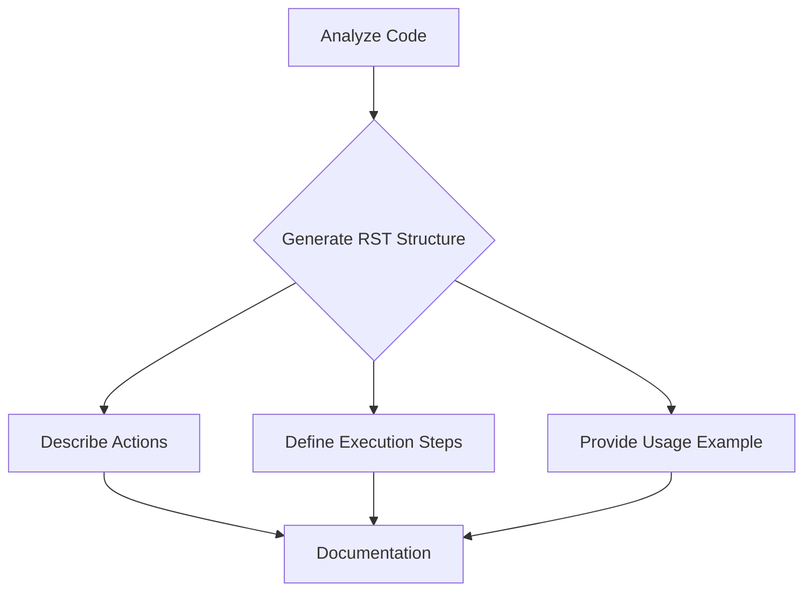

```MD
# <explanation>

**1. <input code>**

```
Here's the translated prompt in English:

---

**Prompt for generating `how to` documentation for code blocks**

1. You need to analyze the current block of code and all previously loaded code blocks in the project. Based on this analysis, you will create a step-by-step instruction that describes what actions need to be taken to execute the given code block.

2. For each code block, you should create a detailed instruction in reStructuredText (RST) format, following these steps:

    - **Description**: Explain what this code block does, for example, what task it solves or what validation it performs.
    - **Execution steps**: Describe the sequence of actions that need to be performed for the code to execute. For each step, explain in detail what happens during the process.
    - **Usage example**: Provide an example of how this code can be used in the project, including possible function or method calls.

3. The structure of the documentation for each code block should be as follows:

```rst
How to use this code block
=========================================================================================

Description
-------------------------
This code block performs [describe the actions of the code block, for example, "a validation check on input data"].

Execution steps
-------------------------
1. [First step, for example, "Retrieve data by calling the `get_data()` function."
2. [Second step, for example, "Validate the data using the `validate_data()` method."
3. [Third step, for example, "If the data is valid, further processing is performed."
4. [Continue as needed...]

Usage example
-------------------------
An example of how to use this code block in a project:

.. code-block:: python

    <example_code_usage>
```

4. When writing documentation, be sure to:

    - If the code block performs a check, describe how it works and what data is being validated.
    - If the code block calls other functions or methods, be sure to specify which functions are called and with what parameters.
    - Use precise wording, avoiding vague terms like "getting" or "doing." Instead, describe what the code specifically does: "the code checks," "the code sends a request," and so on.

5. Example for a code block that performs a variable check:

```rst
How to use this code block
=========================================================================================

Description
-------------------------
This code block performs a validation check on the `value` variable before further processing.

Execution steps
-------------------------
1. Retrieve the value of the `value` variable by calling the `get_value()` method.
2. Check if the value is empty or invalid. If so, log an error message and halt execution.
3. If the value is valid, pass it to the next function for further processing.

Usage example
-------------------------
An example of how to use this code block:

.. code-block:: python

    value = get_value()
    if value:
        process_value(value)
    else:
        logger.error('Invalid value')
```

6. Each code block should be documented in this format, with clear and understandable steps explaining what the code does and with an example of how it can be used.

---

This prompt gives you the instructions to create detailed documentation for each code block based on its analysis. You will generate documentation that explains the sequence of actions for executing the code, as well as provide usage examples.
```

**2. <algorithm>**

The provided code is not executable code.  It's a description of a *process* for generating documentation for other code.  Therefore, no algorithm can be described in a step-by-step manner. The process involves analyzing code, creating RST documentation structure, detailing execution steps, and providing usage examples.


**3. <mermaid>**



This `mermaid` code illustrates the sequence of steps.  `Analyze Code` feeds into the generation of the rest of the documentation structure.


**4. <explanation> (detailed)**

The provided text is a prompt, not code.  It describes a *process* of creating reStructuredText (RST) documentation for code blocks.  It outlines the requirements for:

*   **Code Analysis**: Examining code blocks to understand their purpose and functionality.
*   **Documentation Structure**: Using a predefined RST template.
*   **Step-by-Step Instructions**: Detailing the actions required to execute the code block.
*   **Usage Examples**: Providing concrete instances of how to use the code within a project.

The prompt focuses on clarity, precision, and detailed explanations within the generated documentation.  It targets creating easily understandable documentation for developers seeking to use specific code blocks in a project.

**Relationships to other parts of the project:**

This prompt is independent of any specific project code. Its output (the generated documentation) will be helpful for developers using code within the project to understand how to correctly use it.  The generated documentation would be integrated into the project's documentation.


**Possible Errors/Improvements:**

*   The prompt is very generic and lacks specific constraints or guidelines. This could be improved by adding particular requirements for the targeted project, e.g., specific libraries used.
*   There's no mention of specific validation rules that should be followed in documentation generation, which may help increase reliability.