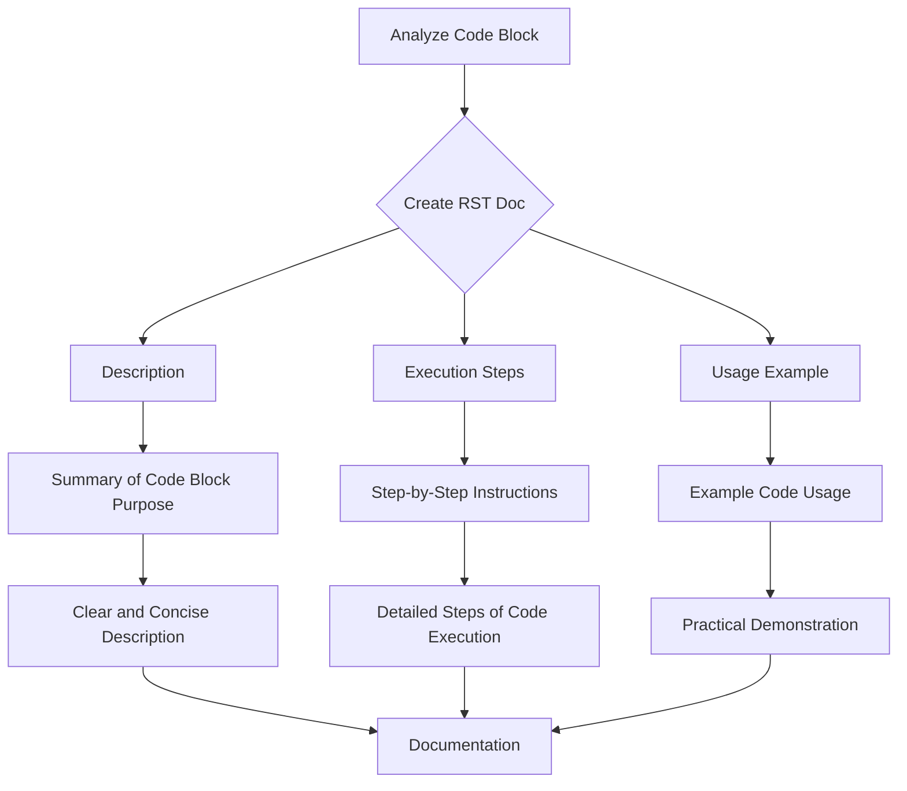

```MD
# <algorithm>

This prompt describes a process for generating "how-to" documentation for code blocks.  It doesn't contain any code to analyze.  The algorithm focuses on creating reStructuredText (RST) documentation to explain how to use code blocks.  Here's a breakdown of the steps:

1. **Analyze the code block:**  The prompt instructs the recipient to analyze the code block in question (and potentially prior code blocks).

2. **Create RST documentation:**  This step outlines the structure of the documentation:
    * **Description:** A summary of the code block's purpose.
    * **Execution steps:** A detailed list of steps involved in executing the code block, explaining what happens at each stage.  Each step should be clear and precise.
    * **Usage example:**  A practical example of how to use the code block in a project, including sample function calls.

3. **Format the documentation:**  The structure is crucial.  The documentation should follow the provided RST template, including specific formatting like `.. code-block:: python`.


# <mermaid>



**Explanation of Dependencies:**

This algorithm doesn't depend on specific code libraries or frameworks. It's a generic instruction for generating documentation. The code in the `Usage example` section might depend on the specific code being documented, using functions and methods defined elsewhere in the project.

# <explanation>

The prompt provides instructions for creating "how-to" documentation in reStructuredText format for code blocks.  It doesn't contain any code to analyze.

* **Imports:** There are no imports. The prompt is focused on *generating* documentation, not on using a specific codebase.
* **Classes:**  There are no classes defined within the prompt itself.  The prompt describes the *structure* of how documentation should be generated, not the content of the documentation that will be based on a piece of source code.
* **Functions:**  The prompt instructs on how to document functions (and potentially methods) within a code block.  The prompt doesn't define any specific functions or describe how to use them, it merely outlines how to document them.
* **Variables:** The prompt mentions variables that may be checked in the code to be documented (like `value` from the example), but it doesn't define these variables.

**Possible Errors/Improvements:**

* **Code Analysis:** This prompt is missing the actual code block it needs to analyze.
* **Specificity:**  The instructions could be more specific by providing a set of rules or templates for different types of code blocks (e.g., validation routines, function definitions, loops).
* **Context:**  Understanding the context in which the code runs (environment, dependencies, purpose) would be beneficial for providing more complete documentation.