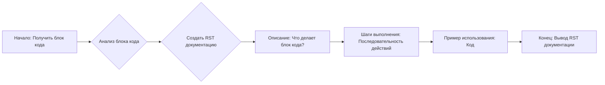

## Анализ кода для генерации документации "как использовать"

### 1. <алгоритм>

**Описание:**
Задача этого кода - создать пошаговую инструкцию в формате reStructuredText (RST) для каждого блока кода, объясняя, как его использовать. Инструкция включает описание блока, шаги выполнения и пример использования.

**Блок-схема:**


**Примеры для каждого логического блока:**

*   **A: Получить блок кода**:
    Пример: `code_block = "value = get_value()\nif value:\n process_value(value)\n else:\n logger.error('Invalid value')"`

*   **B: Анализ блока кода**:
    Пример: Анализ `code_block` выявляет операции: вызов `get_value()`, условная проверка `if value`, вызов `process_value(value)`, вывод ошибки `logger.error()`.
*   **C: Создать RST документацию**:
    Создаётся структура RST для описания блока.
*  **D: Описание: Что делает блок кода?**:
    Пример: "Этот блок кода выполняет проверку переменной `value` перед дальнейшей обработкой."
*   **E: Шаги выполнения: Последовательность действий**:
    Пример:
        1. "Получить значение переменной `value` вызовом метода `get_value()`."
        2. "Проверить, является ли значение пустым или неверным. Если да, то записать сообщение об ошибке и остановить выполнение."
        3. "Если значение корректно, передать его в следующую функцию для дальнейшей обработки."
*   **F: Пример использования: Код**:
    Пример:
```rst
.. code-block:: python

    value = get_value()
    if value:
        process_value(value)
    else:
        logger.error('Invalid value')
```
*   **G: Конец: Вывод RST документации**:
    Результат - готовая документация в формате RST.

### 2. <mermaid>
```mermaid
graph LR
    A[Получить блок кода] --> B(Анализировать блок кода);
    B --> C{Создать RST документацию};
    C --> D[Описание];
    D --> E[Шаги выполнения];
    E --> F[Пример использования];
    F --> G[Вывести RST документацию];

    classDef stepFill fill:#f9f,stroke:#333,stroke-width:2px;
    class A,B,C,D,E,F,G stepFill;

    linkStyle 0,1,2,3,4,5,6 stroke:#333,stroke-width:2px;
```

**Зависимости:**

Диаграмма не зависит от внешних библиотек или классов, поскольку она представляет собой абстрактный процесс создания документации. Она описывает последовательность шагов, необходимых для преобразования блока кода в RST-документ.

*   **A[Получить блок кода]** - Начальная точка, входной параметр - блок кода в виде строки.
*   **B(Анализировать блок кода)** - Анализ кода для определения его функциональности, зависимостей и необходимых шагов выполнения.
*   **C{Создать RST документацию}** - Процесс создания структуры RST документа, включающий описание, шаги выполнения и пример использования.
*   **D[Описание]** - Генерация текстового описания, что делает блок кода.
*   **E[Шаги выполнения]** - Генерация последовательности действий, необходимых для выполнения кода.
*   **F[Пример использования]** - Создание фрагмента кода, демонстрирующего использование анализируемого блока кода.
*  **G[Вывести RST документацию]** - Конечный этап, вывод сформированного RST-документа.
### 3. <объяснение>

**Импорты:**
В предоставленном коде нет импортов. Это описание процесса, а не код для выполнения.

**Классы:**
В коде нет классов.

**Функции:**
В коде нет явных функций. Однако можно выделить логические операции, которые можно представить в виде функций:
*   `analyze_code(code_block)`: Анализирует блок кода и определяет его функциональность.
*   `create_rst_documentation(description, steps, example)`: Создает RST документ из описания, шагов и примера.
*   `generate_description(code_block)`: Генерирует описание, что делает блок кода.
*   `generate_steps(code_block)`: Генерирует последовательность шагов для выполнения кода.
*   `generate_example(code_block)`: Генерирует пример использования кода.

**Переменные:**
*   `code_block` (строка):  Представляет блок кода, для которого создаётся документация.
*   `description` (строка): Описание блока кода.
*  `steps` (строка): Последовательность шагов выполнения.
* `example` (строка): Пример использования кода.

**Потенциальные ошибки и области для улучшения:**
*   **Обработка ошибок:**  В коде не предусмотрена обработка ошибок при анализе кода или генерации документации.
*   **Сложный код**:  Если блок кода слишком сложный, анализ может быть затруднён.
*   **Точность описания:**  Точность генерируемого описания и шагов зависит от качества анализа. Необходимо добавить логику для более точного определения назначения и действий кода.
*   **Автоматизация**: Процесс можно автоматизировать, если анализ кода будет выполняться программно.

**Взаимосвязи с другими частями проекта:**
Этот код, по сути, определяет процесс, который должен выполняться для каждого блока кода в проекте. В реальном приложении он будет взаимодействовать с:
*   **Модулем загрузки кода**: Модуль, который предоставляет блоки кода для обработки.
*   **Модулем генерации RST**: Модуль, который будет генерировать RST документ.
*   **Хранилищем документации**: Место, куда будут сохраняться сгенерированные RST документы.