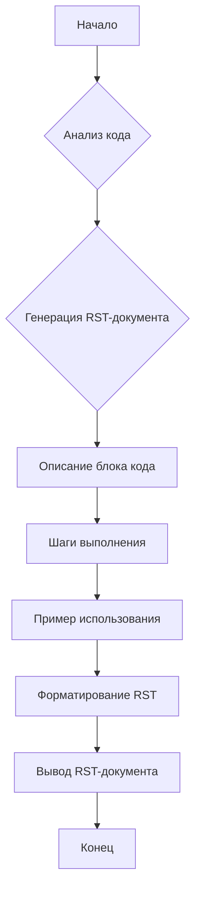
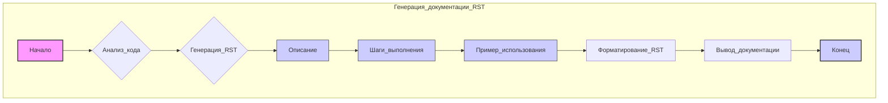

## ИНСТРУКЦИЯ:

Анализ предоставленного кода показывает, что он предназначен для генерации документации в формате reStructuredText (RST) для блоков кода. Инструкция предписывает анализировать текущий и предыдущие блоки кода для создания пошаговых руководств по их выполнению.

## <алгоритм>

1.  **Анализ кода:** Получается текущий блок кода и все предыдущие блоки кода.
2.  **Генерация документации (RST):** Для каждого блока кода формируется RST-документ, состоящий из:
    *   **Описание:** Краткое описание назначения блока кода (например, "проверка валидности данных").
    *   **Шаги выполнения:** Детальные шаги, необходимые для выполнения кода. Каждый шаг описывает действие, которое происходит, а не просто "получение" или "делание". Например, "Вызов функции `get_data()` для получения данных".
    *   **Пример использования:** Приводится пример кода, показывающий, как данный блок кода может использоваться в проекте.
3.  **Форматирование RST:** Документ формируется в формате RST, включая заголовки, разделители и блоки кода.
4.  **Специфичность описания:** Используются точные формулировки, описывающие, что именно делает код (например, "код проверяет", "код отправляет запрос").
5.  **Учет зависимостей:** Указывается, какие функции и методы вызываются, и с какими параметрами.
6.  **Примеры:** Приведен пример для проверки переменной, где описываются шаги проверки на пустоту и отправки в следующую функцию, если данные валидны.

**Пример потока данных:**

## <mermaid>

**Объяснение:**

*   Диаграмма отображает процесс генерации документации RST для блока кода.
*   **Начало** и **Конец** — стартовая и конечная точки процесса.
*   **Анализ кода** — это шаг анализа текущего и предыдущих блоков кода.
*   **Генерация RST** — основной этап генерации документации, который включает в себя три шага: Описание, Шаги выполнения, и Пример использования.
*   **Форматирование RST** — этап приведения документа к требуемому формату RST.
*   **Вывод документации** — вывод готовой документации.
*   **style** определяет стили для отображения узлов диаграммы.
*   **classDef** и **class** используются для группировки узлов и назначения общего стиля.

**Зависимости:**
Данная диаграмма описывает внутреннюю логику процесса генерации документации, не имея внешних импортов или зависимостей. Вся логика содержится в рамках предоставленного описания.

**Дополнительно**:
В предоставленном коде нет импорта `import header`, поэтому дополнительный блок `mermaid` не требуется.

## <объяснение>

*   **Импорты:** В предоставленном коде нет импортов. Это означает, что вся необходимая логика содержится в описании.

*   **Классы:** Классы не используются.
*   **Функции:** Функции не используются, однако описывается логика, по которой они должны быть использованы.
    *   `get_data()` - функция, которая получает данные.
    *   `validate_data()` - функция, которая валидирует данные.
    *   `get_value()` - функция, которая получает значение переменной.
    *   `process_value()` - функция, которая обрабатывает значение переменной.
*   **Переменные:** Переменные используются в контексте примеров, например:
    *   `value` - переменная, чье значение проверяется.
    *   Ожидаются переменные для полученных данных `data`.
    *   `logger` - это экземпляр логгера, используемый для вывода сообщений об ошибках.

*   **Общее описание:** Описанная инструкция предназначена для автоматизированного создания документации для кода. Она гарантирует, что каждая часть кода будет иметь подробное описание, пошаговые инструкции по использованию и примеры.

**Потенциальные ошибки и области для улучшения:**

1.  **Сложность автоматизации**: Полностью автоматизировать генерацию описания на основе анализа кода может быть непросто, особенно если код содержит сложную логику.
2.  **Ограничения описания**: Инструкция концентрируется на описании последовательности действий и упускает контекст. Например, не ясно, откуда берется `logger`, а также неясно, что происходит с переменной `data` после вызова `get_data`.
3.  **Уровень абстракции**: В описании может не хватать уровня абстракции. Например, `validate_data()` может выполнять разные проверки, и это не отражено в описании.

**Взаимосвязи с другими частями проекта:**
Эта инструкция явно предполагает интеграцию в систему, где есть код для анализа, логгер и возможность использования сгенерированной документации. Эта система могла бы включать в себя модули для обработки и анализа кода, например абстрактные синтаксические деревья (AST), а также модуль для работы с форматом RST.