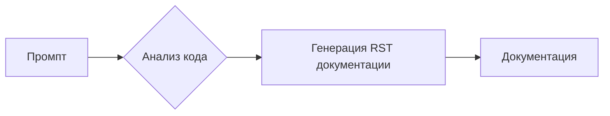

```MD
# Анализ кода: Генерация документации `how to`

## 1. <input code>

```
Понял, вот промпт в первом лице, с командами для модели:

---

**Промпт для генерации `how to` документации для блоков кода**

1. Ты должен проанализировать текущий блок кода и все ранее загруженные блоки кода в проекте. На основе этого анализа ты сформулируешь пошаговую инструкцию, которая описывает, какие действия нужно выполнить для исполнения данного блока кода.

2. Для каждого блока кода ты должен создать подробную инструкцию в формате reStructuredText (RST), следуя следующим шагам:

    - **Описание**: Объясни, что делает этот блок кода, например, какую задачу решает или какую проверку выполняет.
    - **Шаги выполнения**: Описывай последовательность действий, которые нужно выполнить для того, чтобы код исполнился. Для каждого шага подробно укажи, что именно происходит в процессе.
    - **Пример использования**: Приведи пример того, как этот код можно использовать в проекте, в том числе с возможными вызовами функций или методов.

3. Структура документации для каждого блока кода должна быть следующей:

```rst
Как использовать блок кода
=========================================================================================

Описание
-------------------------
Этот блок кода выполняет [описание действий блока кода, например, "проверку на валидность ввода данных"].

Шаги выполнения
-------------------------
1. [Первый шаг выполнения, например, "Получение данных через вызов функции `get_data()`."].
2. [Второй шаг выполнения, например, "Проверка данных на валидность с использованием метода `validate_data()`."].
3. [Третий шаг выполнения, например, "Если данные валидны, выполняется дальнейшая обработка."].
4. [И так далее...]

Пример использования
-------------------------
Пример того, как можно использовать данный блок кода в проекте:

.. code-block:: python

    <пример_кода_с_использованием>
```

4. При написании документации обязательно учитывай:

    - Если блок кода выполняет проверку, то опиши, как она работает и какие данные проверяются.
    - Если блок кода включает в себя вызовы других функций или методов, обязательно укажи, какие именно функции вызываются и с какими параметрами.
    - Важно использовать точные формулировки, избегая общих терминов типа "получаем" или "делаем". Вместо этого опиши, что конкретно делает код: "код проверяет", "код выполняет отправку запроса", и так далее.

5. Пример для блока кода, который выполняет проверку переменной:

```rst
Как использовать блок кода
=========================================================================================

Описание
-------------------------
Этот блок кода выполняет проверку на валидность значения переменной `value` перед дальнейшей обработкой.

Шаги выполнения
-------------------------
1. Получение значения переменной `value` через вызов метода `get_value()`.
2. Проверка, является ли значение пустым или невалидным. Если да, то логируется сообщение об ошибке и выполнение кода прекращается.
3. Если значение валидно, оно передается в следующую функцию для дальнейшей обработки.

Пример использования
-------------------------
Пример того, как можно использовать данный блок кода:

.. code-block:: python

    value = get_value()
    if value:
        process_value(value)
    else:
        logger.error('Невалидное значение')
```

6. Каждый блок кода должен быть документирован в этом формате, с четкими и понятными шагами, поясняющими, что именно делает код, и с примером того, как его можно использовать.

---

Этот промпт даст тебе команду для создания подробной документации для каждого блока кода на основе его анализа. Ты будешь генерировать документацию, которая объяснит последовательность действий для исполнения кода, а также приведет примеры использования.
```

## 2. <algorithm>

Этот код представляет собой промпт, а не блок кода.  Алгоритм работы заключается в генерации инструкций `how to` для других блоков кода.  Промпт задает шаги, которые должна выполнить модель:

1. **Анализ:** Модель анализирует текущий и предыдущие блоки кода.
2. **Формирование RST:** Модель генерирует документацию в формате reStructuredText (RST).
3. **Структура RST:** Документация должна включать: описание блока, шаги выполнения, примеры использования, и рекомендации по использованию точных формулировок.
4. **Примеры:** Промпт содержит примеры того, как структурировать документацию, включая шаги проверки данных и вызова функций.


## 3. <mermaid>



**Объяснение диаграммы:**

Промпт (A) запускает процесс анализа кода (B).  Результатом анализа является генерация документации в формате RST (C), которая затем используется для создания документации (D).

## 4. <explanation>

Этот код не является исполняемым кодом. Это  промпт (набор инструкций), который описывает, как должна вести себя модель при генерации документации `how to` для блоков кода.  Промпт содержит:

- **Инструкции:** Пошаговые инструкции для генерации документации, описывающие, что должна делать модель (анализ кода, формирование RST).
- **Формат:** Определение структуры генерируемой документации в формате reStructuredText (RST) с примерами.
- **Рекомендации:**  Советы по написанию понятной и структурированной документации, акцент на точных формулировках, описании проверок и вызовов функций.
- **Примеры:**  Показывают, как должна быть написана документация `how to` для фрагментов кода, описывающих проверки и последовательность действий.


**Возможные ошибки/улучшения**:

- Промпт не содержит специфической информации о формате кода (язык, структура).  Для обработки разных языков и структур кода, необходимо ввести дополнительные уточнения в промпт.

- Промпт не указывает как обрабатывать сложные логические конструкции. Необходимо расширить его для случаев с циклами и условными операторами.


**Взаимосвязи с другими частями проекта**:

Промпт служит руководством для создания документации к блокам кода, которые являются частью проекта.  Он предполагает, что в проекте уже есть блоки кода, к которым необходимо добавить `how to` документацию.