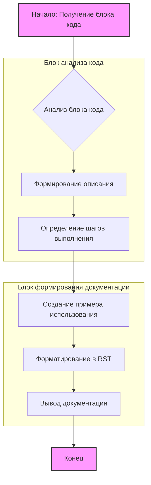

## Анализ кода

### <алгоритм>

1.  **Анализ блока кода:**
    *   Начало: Получаем блок кода для анализа.
    *   Пример: `value = get_value(); if value: process_value(value) else: logger.error('Невалидное значение')`
2.  **Формирование описания:**
    *   Определяем назначение блока кода, например, "проверка на валидность данных" или "вызов функции".
    *   Пример: "Этот блок кода выполняет проверку на валидность значения переменной `value` перед дальнейшей обработкой."
3.  **Определение шагов выполнения:**
    *   Разбиваем код на последовательные шаги.
    *   Пример:
        1.  "Получение значения переменной `value` через вызов метода `get_value()`."
        2.  "Проверка, является ли значение пустым или невалидным. Если да, то логируется сообщение об ошибке и выполнение кода прекращается."
        3.  "Если значение валидно, оно передается в следующую функцию для дальнейшей обработки."
4.  **Создание примера использования:**
    *   Генерируем пример кода, который демонстрирует, как данный блок можно использовать.
    *   Пример:

        ```python
        value = get_value()
        if value:
            process_value(value)
        else:
            logger.error('Невалидное значение')
        ```
5.  **Форматирование в RST:**
    *   Создаем структуру RST, включающую описание, шаги выполнения и пример использования.
    *   Пример:

        ```rst
        Как использовать блок кода
        =========================================================================================

        Описание
        -------------------------
        Этот блок кода выполняет проверку на валидность значения переменной `value` перед дальнейшей обработкой.

        Шаги выполнения
        -------------------------
        1. Получение значения переменной `value` через вызов метода `get_value()`.
        2. Проверка, является ли значение пустым или невалидным. Если да, то логируется сообщение об ошибке и выполнение кода прекращается.
        3. Если значение валидно, оно передается в следующую функцию для дальнейшей обработки.

        Пример использования
        -------------------------
        Пример того, как можно использовать данный блок кода:

        .. code-block:: python

            value = get_value()
            if value:
                process_value(value)
            else:
                logger.error('Невалидное значение')
        ```
6.  **Вывод документации:**
    *   Выводим сгенерированную документацию в формате RST.

### <mermaid>



**Зависимости:**

*   Диаграмма показывает последовательность шагов от получения блока кода до вывода документации.
*   `Начало: Получение блока кода` - входная точка.
*   `Анализ блока кода` - анализирует входной код.
*   `Формирование описания`, `Определение шагов выполнения`, `Создание примера использования` - этапы создания документации.
*   `Форматирование в RST` - форматирует документацию в RST формат.
*   `Вывод документации` - выводит итоговую документацию.
*   `Конец` - конечная точка.
*   Подграфы: `Блок анализа кода` и `Блок формирования документации` группируют логически связанные шаги.

### <объяснение>

**Импорты:**

*   В данном коде импорты отсутствуют, так как это псевдокод, а не реальный python-код. Однако в реальном проекте могут быть импорты, связанные с логированием (`logger`) или обработкой данных.

**Классы:**

*   В данном коде классы не используются. В реальном проекте, классы могут использоваться для представления объектов, таких как `DataValidator` или `CodeAnalyzer`, которые выполняли бы анализ кода или валидацию данных.

**Функции:**

*   `get_value()`:
    *   Аргументы: Отсутствуют.
    *   Возвращает: Значение переменной `value`.
    *   Назначение: Извлекает значение, которое будет проверяться.
    *   Пример: `value = get_value()`.
*   `process_value(value)`:
    *   Аргументы: `value` - значение, которое нужно обработать.
    *   Возвращает: Нет явного возвращаемого значения (может выполнять действия, не возвращающие значения, или возвращать None).
    *   Назначение: Обрабатывает значение, если оно валидно.
    *   Пример: `process_value(value)`.
*   `logger.error(message)`:
    *   Аргументы: `message` - сообщение об ошибке (строка).
    *   Возвращает: Нет явного возвращаемого значения.
    *   Назначение: Записывает сообщение об ошибке в лог.
    *   Пример: `logger.error('Невалидное значение')`.

**Переменные:**

*   `value`:
    *   Тип: Может быть любым типом данных (зависит от контекста), но чаще всего число, строка, список или объект.
    *   Использование: Хранит значение, которое нужно проверить.

**Объяснения:**

1.  **Описание:** Код предназначен для автоматизации процесса создания документации для блоков кода. Он анализирует код, выделяет ключевые шаги и предоставляет их в структурированном формате RST, включая описание, шаги выполнения и примеры использования.
2.  **Формат RST:** Использование reStructuredText позволяет генерировать читаемую и формализованную документацию, которую можно использовать для генерации HTML, PDF или других форматов документации.
3.  **Детализация:** Особое внимание уделяется подробному описанию каждого шага, а не общим фразам, что позволяет лучше понять, что именно делает код.
4.  **Пример использования:** Предоставление примеров кода помогает понять, как использовать данный блок кода в контексте проекта.
5.  **Проверка на ошибки:** Код включает проверку на валидность данных и логирование ошибок, что позволяет обрабатывать исключительные ситуации.

**Потенциальные ошибки и области для улучшения:**

1.  **Автоматизация:** Текущий код — это псевдокод, а не полноценная реализация. Для реальной работы требуется более сложная реализация анализа кода и преобразования в RST.
2.  **Анализ зависимостей:** Нужно добавить анализ зависимостей между блоками кода, чтобы понимать, какие функции вызывают другие.
3.  **Обработка исключений:** Необходимо продумать обработку исключений, которые могут возникнуть при анализе кода.
4.  **Универсальность:** В реальном проекте код должен быть адаптирован к различным типам блоков кода (не только проверки переменных, но и более сложные алгоритмы).

**Взаимосвязь с другими частями проекта:**

1.  **Анализатор кода:** Этот код может быть частью большего модуля, который анализирует код и автоматически генерирует документацию.
2.  **Система логирования:** Код использует систему логирования (`logger`), которая может быть частью общего модуля логирования проекта.
3.  **Интеграция с CI/CD:** Документацию, генерируемую этим кодом, можно использовать в рамках CI/CD для автоматического создания обновлений документации.

Таким образом, этот код представляет собой промпт для модели, чтобы она генерировала подробную документацию для блоков кода, обеспечивая четкое понимание работы кода и его использования.