## <алгоритм>

**Описание алгоритма:**

Этот текст предоставляет общее руководство по написанию тестов для Python-модулей с использованием `pytest`. Он не содержит конкретного кода, а описывает процесс тестирования и дает пример.

1. **Анализ функциональности:**
   - Изучается модуль, выявляются функции и методы, их входные и выходные данные, а также возможные ошибки.
   - Тесты делятся на основные сценарии, граничные случаи и обработку исключений.
   * _Пример:_
     - Функция `save_data_to_file` принимает `data` (строка) и `file_path` (строка).
     - Ожидается, что она запишет `data` в файл по пути `file_path` и вернет `True` при успехе.
     - Если возникнет ошибка при записи, она вернет `False`.

2. **Подготовка тестовых случаев:**
   - Для каждой функции или метода создаются тесты.
   - Тестируются различные типы данных (строки, списки, словари), а также пустые значения.
   - Проверяются граничные случаи, такие как пустой ввод, несуществующие пути или неверные значения.
   * _Пример:_
     - Тест должен проверить, что `save_data_to_file` правильно записывает строку в файл.
     - Тест должен проверить, что `save_data_to_file` корректно обрабатывает ситуацию, когда запись в файл не удается.

3. **Обработка ошибок:**
   - Имитируются ситуации, когда могут возникнуть исключения.
   - Проверяется, что исключения обрабатываются и логируются корректно.
   - Используется `pytest.raises` для тестирования обработки исключений.
   * _Пример:_
     - Тест должен проверить, что при ошибке записи в файл, исключение логируется и функция возвращает `False`.

4. **Изоляция тестов:**
   - Используется mocking для замены реальных операций.
   - Тесты должны быть независимыми друг от друга и от внешней среды.
   * _Пример:_
     - Вместо реального взаимодействия с файловой системой, мокируются операции открытия и записи файла.

5. **Структура тестов:**
   - Для тестов используются понятные имена.
   - Код тестов структурируется для читаемости.
   - Используются фикстуры `pytest` для настройки данных.

**Пример тестового случая `test_save_data_to_file`:**

1.  **Настройка моков:**
    -   Мокируются `module_name.Path.open`, `module_name.Path.mkdir` и `module_name.logger`.
2.  **Тестирование успешного сохранения:**
    -   Вызывается `save_data_to_file` со строкой и путем к файлу.
    -   Проверяется, что `mkdir` был вызван с параметрами `parents=True, exist_ok=True`.
    -   Проверяется, что `open` был вызван с параметром `'w'`.
    -   Проверяется, что `write` был вызван с переданной строкой.
    -   Проверяется, что функция вернула `True`.
3.  **Тестирование обработки исключений:**
    -   Для `open` устанавливается `side_effect` вызывающий исключение.
    -   Снова вызывается `save_data_to_file`.
    -   Проверяется, что `logger.error` был вызван.
    -   Проверяется, что функция вернула `False`.

```mermaid
graph LR
    A[Начать тест test_save_data_to_file] --> B{Мокирование Path.open, Path.mkdir, logger};
    B --> C{Тестирование успешного сохранения};
    C --> D{Вызов save_data_to_file};
    D --> E{Проверка вызова mkdir};
    E --> F{Проверка вызова open};
    F --> G{Проверка вызова write};
    G --> H{Проверка возврата True};
    H --> I{Тестирование обработки исключений};
    I --> J{Установка side_effect для open};
    J --> K{Вызов save_data_to_file};
    K --> L{Проверка вызова logger.error};
    L --> M{Проверка возврата False};
    M --> N[Завершить тест];
    
    style A fill:#f9f,stroke:#333,stroke-width:2px
    style N fill:#ccf,stroke:#333,stroke-width:2px
    style B fill:#eee,stroke:#333,stroke-width:1px
     style I fill:#eee,stroke:#333,stroke-width:1px
```

## <mermaid>

**Анализ зависимостей:**

-   Диаграмма описывает последовательность действий в тестовой функции `test_save_data_to_file`.
-   Зависимости здесь представляют собой порядок выполнения действий внутри функции:
    1.  **Мокирование:** Сначала необходимо замокировать (заменить) реальные объекты файловой системы и логгера. Это обеспечивает изоляцию теста и предотвращает внешние зависимости.
    2.  **Успешное сохранение:** После мокирования, вызывается функция `save_data_to_file` с тестовыми данными. Далее идёт ряд проверок:
        *   Вызов `mkdir` для создания директории (если необходимо).
        *   Вызов `open` для открытия файла.
        *   Вызов `write` для записи данных в файл.
        *   Проверка, что функция вернула `True`, что означает успешное выполнение.
    3.  **Обработка исключений:** На следующем этапе моделируется ситуация, когда запись в файл вызывает ошибку, это делается установкой исключения `side_effect` для мока `open`. После чего снова вызывается функция `save_data_to_file`, и проверяется:
        *   Вызов `logger.error` для проверки, что ошибка залогирована.
        *   Возврат `False`, что означает, что функция корректно обработала ошибку.
-   Диаграмма не показывает импорты, но из текста видно, что используются модули `pytest` и `unittest.mock`.

## <объяснение>

**Импорты:**

-   `import pytest`: Импортируется библиотека `pytest` для написания и запуска тестов. Она предоставляет функции для параметризации, моков, обработки исключений и многое другое.
-   `from unittest.mock import patch, mock_open`: Импортируется из библиотеки `unittest` модуль `mock`, который используется для замены объектов (функций, классов, методов) на моки, позволяя изолировать тестируемый код от внешних зависимостей.
    -   `patch`: Декоратор для замены объекта моком во время теста.
    -   `mock_open`: Специальный мок для замены функций открытия и записи файлов.

**Классы:**

-   В данном фрагменте кода явные классы не определены, но подразумевается, что тестируется некий модуль `module_name` (указан как `module_name.Path.open` и т.д.).
-   Предполагается, что `module_name` содержит классы и методы, работающие с файловой системой и логгированием.

**Функции:**

-   `test_save_data_to_file`: Функция, являющаяся тестовым случаем. Она принимает мокированные объекты в качестве параметров (при помощи декораторов `patch`).
    -   `mock_logger`: Мокированный объект логгера.
    -   `mock_mkdir`: Мокированный метод создания директории.
    -   `mock_file_open`: Мокированный метод открытия файла.
    -   Функция тестирует `save_data_to_file` (которая не описана в этом фрагменте), проверяя ее поведение при успешной записи данных и при возникновении ошибки.
    -   Возвращаемое значение у тестовой функции не используется, но она вызывает `assert`, чтобы убедиться в корректности работы `save_data_to_file`.
-   `save_data_to_file(data, file_path)`: Функция, которую тестируют. (ее нет в данном фрагменте, но предполагается ее наличие)
    -   `data` (строка): Данные, которые нужно записать в файл.
    -   `file_path` (строка): Путь к файлу.
    -   Возвращает `True`, если запись успешна, и `False` в случае ошибки.

**Переменные:**

-   `file_path` (строка): Путь к файлу, который используется в тесте.
-   `data` (строка): Тестовые данные для записи в файл.
-   `result`: Переменная, в которую сохраняется результат вызова тестируемой функции `save_data_to_file`.

**Потенциальные ошибки и области для улучшения:**

1.  **Зависимость от имени модуля:** В примерах используется `module_name`, который не определен. Следует заменить его на имя фактического модуля.
2.  **Недостаточное количество тестов:** В примере показан только один основной сценарий и один сценарий обработки исключений. Необходимо добавить тесты для различных входных данных и граничных случаев.
3.  **Отсутствие тестируемой функции:** Функция `save_data_to_file` не определена в этом фрагменте кода. Её реализацию также следует тестировать.
4.  **Слабая параметризация:** Тесты можно параметризовать, чтобы проверять функцию с разными входными значениями, используя `pytest.mark.parametrize`.
5.  **Возможна утечка ресурсов:** В примере не предусмотрена проверка закрытия файла. Можно использовать контекстный менеджер для работы с файлами (`with open(...) as f:`), что обеспечивает автоматическое закрытие файла.
6.  **Отсутствие ассертов:** Для каждой проверки нужно использовать `assert`, чтобы убедиться в корректности работы функции.

**Взаимосвязь с другими частями проекта:**

-   Этот фрагмент кода является частью тестового набора, который проверяет работоспособность модуля (`module_name`).
-   Он зависит от библиотеки `pytest` для запуска тестов и от библиотеки `unittest.mock` для мокирования зависимостей.
-   Тесты должны располагаться в директории, выделенной для тестов, и иметь имена файлов, соответствующие правилам `pytest`.
-   При изменении функциональности модуля (`module_name`), необходимо будет внести изменения и в тесты, чтобы они по-прежнему покрывали все сценарии.
-   Тесты, по сути, являются спецификацией для модуля, обеспечивая надлежащее качество и функциональность.

Таким образом, этот анализ предоставляет подробное описание процесса тестирования и понимания кода для создания качественных тестов с использованием `pytest`.