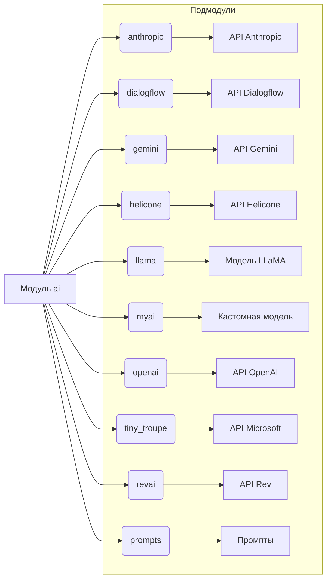

# Анализ кода модуля src.ai

## <input code>

```rst
.. module: src.ai
```
<TABLE >
<TR>
<TD>
<A HREF = 'https://github.com/hypo69/hypo/blob/master/readme.ru.md'>[Root ↑]</A>
</TD>
<TD>
<A HREF = 'https://github.com/hypo69/hypo/blob/master/src/readme.ru.md'>src</A> /
<A HREF = 'https://github.com/hypo69/hypo/blob/master/src/ai/readme.ru.md'>ai</A> 
</TD>

<TD>
<A HREF = 'https://github.com/hypo69/hypo/blob/master/src/ai/README.MD'>English</A>
</TD>
</TABLE>

### **Модуль ai**
Модуль **ai** - это интерфейс управления различными моделями ИИ, 
инфифцирующий взаимодействие с внешними API и обработку различных конфигураций для анализа данных и обработки языка. 
Он включает следующие подмодули:

1. **anthropic**  
   Обеспечивает интеграцию с моделями ИИ Anthropic, что позволяет выполнять задачи, связанные с продвинутым пониманием языка и генерацией ответов.
   [Перейти к модулю](https://github.com/hypo69/hypo/blob/master/src/ai/anthropic/readme.ru.md)
2. **dialogflow**  
   Интегрируется с Google Dialogflow, поддерживает обработку естественного языка (NLU) и функции разговорного ИИ для создания интерактивных приложений.
   [Перейти к модулю](https://github.com/hypo69/hypo/blob/master/src/ai/dialogflow/readme.ru.md)
3. **gemini**  
   Управляет соединениями с моделями ИИ Gemini, предоставляя поддержку для приложений, которые требуют уникальных возможностей ИИ Gemini.
   [Перейти к модулю](https://github.com/hypo69/hypo/blob/master/src/ai/gemini/readme.ru.md)
4. **helicone**  
   Подключается к моделям Helicone, предоставляя доступ к специализированным функциям для настройки решений на базе ИИ.
      [Перейти к модулю](https://github.com/hypo69/hypo/blob/master/src/ai/helicone/readme.ru.md)
5. **llama**  
   Интерфейс для LLaMA (Large Language Model Meta AI), предназначен для задач, связанных с пониманием и генерацией естественного языка в различных приложениях.
      [Перейти к модулю](https://github.com/hypo69/hypo/blob/master/src/ai/llama/readme.ru.md)
6. **myai**  
   Кастомный подмодуль ИИ, разработанный для специализированных конфигураций моделей и реализации, обеспечивающий уникальные функции ИИ, специфичные для проекта.
      [Перейти к модулю](https://github.com/hypo69/hypo/blob/master/src/ai/myai/readme.ru.md)
7. **openai**  
   Интегрируется с API OpenAI, предоставляя доступ к их набору моделей (например, GPT) для таких задач, как генерация текста, классификация, перевод и другие.
      [Перейти к модулю](https://github.com/hypo69/hypo/blob/master/src/ai/openai/readme.ru.md)
8. **tiny_troupe**  
   Обеспечивает интеграцию с моделями ИИ от Microsoft, предлагая решения для обработки естественного языка и задач анализа данных с использованием маленьких моделей, оптимизированных для производительности.
      [Перейти к модулю](https://github.com/hypo69/hypo/blob/master/src/ai/tiny_troupe/readme.ru.md)
9. **revai**  
    Интегрируется с моделью от rev.com, которая специализируется на работе с аудиофайлами, такими как записи переговоров, совещаний, звонков и других аудио-материалов.
    [Перейти к модулю](https://github.com/hypo69/hypo/blob/master/src/ai/revai/readme.ru.md)
    <HR>
10. **prompts**  
   Системные и командные промпты в формате `markdown`, для моделей ИИ.

### Вклад
Вклад приветствуется! Не стесняйтесь отправлять pull request или открывать issue, если вы столкнулись с какими-либо проблемами или имеете предложения по улучшению.

### Лицензия
Этот проект лицензирован под MIT License. Подробности смотрите в файле [LICENSE](../../LICENSE).
```

## <algorithm>

Данный код не содержит алгоритма в традиционном смысле. Это описание структуры модуля `ai`,  представляющее собой таблицу и список подмодулей.  Алгоритмы реализованы в коде подмодулей, которые упомянуты.  Блок-схема не применима, так как нет конкретного алгоритма.


## <mermaid>



## <explanation>

Этот код представляет собой описание модуля `src.ai` в формате reStructuredText (RST). Он не содержит  никакого программного кода, а описывает структуру и функциональность данного модуля, описывая связанные подмодули и предоставляя ссылки на их документацию.

**Импорты:**  В данном коде отсутствуют импорты. Это чисто текстовое описание, не связанное с конкретным кодом на языке программирования.

**Классы:** Отсутствуют классы. Код описывает подмодули, которые скорее всего содержат классы и функции, ответственные за взаимодействие с различными API и моделями ИИ.

**Функции:** Функциональность описанных подмодулей предполагается в их документации. Например, подмодуль `openai` скорее всего содержит функции для взаимодействия с API OpenAI.

**Переменные:** Переменные также не присутствуют. В описании указывается лишь структура и связи между подмодулями модуля `ai`.

**Возможные ошибки/улучшения:**

* Отсутствие конкретного кода затрудняет оценку наличия ошибок или возможностей улучшения.  Для оценки кода необходим исходный код подмодулей.
* Не описаны общие принципы архитектуры, например, как подмодули `ai` взаимодействуют друг с другом.

**Цепочка взаимосвязей:**  Модуль `ai` является частью проекта `hypo`, как видно из ссылок на `src/` и корневой каталог.  Он предоставляет интерфейс для взаимодействия с различными моделями ИИ, которые, в свою очередь, взаимодействуют с внешними API. Подмодули  `anthropic`, `dialogflow`, `gemini` и другие, являются частями модуля `ai`, и, соответственно, частями проекта `hypo`.  Каждая из этих частей скорее всего реализует логику взаимодействия с соответствующими API.