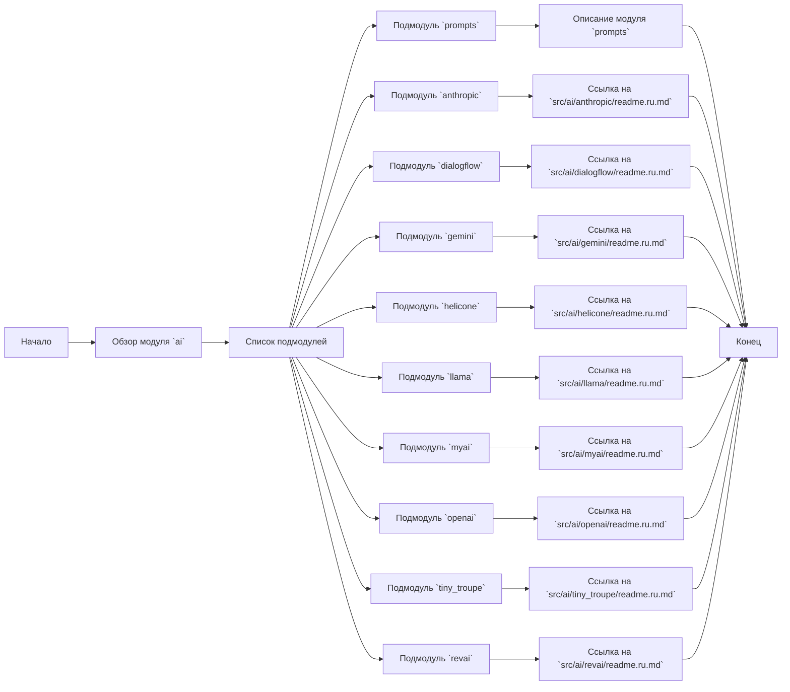
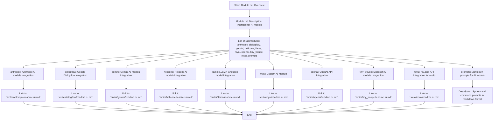

## Анализ кода `src/ai/readme.ru.md`

### 1. <алгоритм>

Файл `readme.ru.md` в директории `src/ai/` является обзорным документом, описывающим структуру и назначение модуля `ai` в проекте. Он не содержит исполняемого кода, а скорее служит точкой входа для понимания архитектуры и функциональности подмодулей, предоставляя ссылки на их документацию.

**Блок-схема:**

**Примеры блоков:**

1.  **Начало:** Документ открывается и дает общее представление о `src/ai`.
2.  **Обзор модуля `ai`:** Дается описание назначения модуля `ai`, его цели и задач.
3.  **Список подмодулей:** Перечисляются подмодули: `anthropic`, `dialogflow`, `gemini`, `helicone`, `llama`, `myai`, `openai`, `tiny_troupe`, `revai` и `prompts`.
4.  **Подмодули:** Каждый подмодуль представлен отдельной ссылкой на `readme.ru.md` в соответствующей директории. Описано назначение каждого из модулей.
5.  **Завершение:** Документ заканчивается информацией о вкладе и лицензии.

**Поток данных:**

*   Основной поток данных в этом документе — это навигация. Пользователь начинает с обзора модуля `ai`, затем переходит к конкретным подмодулям по ссылкам.
*   Нет прямого потока данных между функциями или классами, поскольку это не исполняемый код.

### 2. <mermaid>

**Анализ зависимостей:**

Диаграмма `mermaid` представляет структуру модуля `ai`, его подмодули и их взаимосвязи в виде потока, показывающего навигацию пользователя по файлам.

*   **Module `ai` Overview:** Начальная точка, описывает модуль `ai`.
*   **Module `ai` Description:** Описывает, что модуль является интерфейсом для управления различными моделями ИИ.
*   **List of Submodules:** Перечисляет все подмодули в составе модуля `ai`.
*   **Submodule nodes**: Каждый из узлов  `AnthropicSubmodule` ,`DialogflowSubmodule` ,`GeminiSubmodule` , `HeliconeSubmodule` ,`LlamaSubmodule`, `MyaiSubmodule`, `OpenaiSubmodule`, `TinyTroupeSubmodule`, `RevaiSubmodule`, `PromptsSubmodule`  представляет один из подмодулей модуля `ai`, описывая его краткое назначение.
*   **Link nodes:** Каждый из узлов `AnthropicLink`, `DialogflowLink`, `GeminiLink`, `HeliconeLink`, `LlamaLink`, `MyaiLink`, `OpenaiLink`, `TinyTroupeLink`, `RevaiLink`  содержит ссылку на соответствующий файл `readme.ru.md`.
*  **PromptsDescription**: Описание модуля `prompts`.
*  **End**: Конечная точка для каждого из подмодулей, символизирующая окончание обзора конкретного подмодуля.
 
### 3. <объяснение>

**Импорты:**

*   В этом файле нет явных импортов, так как это файл `markdown`, содержащий текст и ссылки. Файл служит документацией, а не исполняемым кодом. Он организует структуру проекта и предоставляет пользовательский интерфейс для навигации по различным подмодулям.

**Классы:**

*   В этом файле не определены классы, так как это `markdown` документ.

**Функции:**

*   В этом файле не определены функции, так как это `markdown` документ.

**Переменные:**

*   В этом файле нет переменных.

**Подробное объяснение:**

*   `src/ai/readme.ru.md` является корневым файлом документации для модуля `ai`. Этот модуль служит интерфейсом для управления различными моделями ИИ.
*   Файл содержит описание модуля и список всех его подмодулей. Каждый подмодуль отвечает за интеграцию с конкретным сервисом или моделью ИИ (Anthropic, Google Dialogflow, Gemini, Helicone, LLaMA, OpenAI, Microsoft Tiny Troupe, rev.com, кастомный  `myai`). Также есть подмодуль `prompts` для хранения промптов.
*   Каждый подмодуль имеет отдельную страницу `readme.ru.md` в своей директории, на которую есть ссылка в этом файле. Это обеспечивает модульную структуру и облегчает навигацию по проекту.
*   Структура файла построена таким образом, чтобы обеспечить последовательное и логичное знакомство пользователя с возможностями модуля `ai`.
*   Раздел `Вклад` приглашает разработчиков к участию в развитии проекта, а раздел `Лицензия` информирует о условиях использования проекта.

**Потенциальные ошибки и области для улучшения:**

*   Файл сам по себе не содержит ошибок, так как это описательный документ.
*   Возможные области для улучшения: 
    *   Можно добавить краткое описание каждого подмодуля в самом этом `readme.ru.md`  для более быстрого понимания предназначения каждого модуля.
    *   Можно было бы добавить матрицу совместимости различных моделей ИИ, чтобы указать, какие задачи лучше решать с использованием каждого подмодуля.

**Цепочка взаимосвязей с другими частями проекта:**

*   Модуль `ai` является частью проекта `hypo` и находится в директории `src`.
*   Файл `readme.ru.md` связан с каждым из подмодулей `ai`, поскольку он является их корневым описанием и предоставляет ссылки на их документацию.
*   Модуль `ai` предназначен для интеграции с различными моделями ИИ, и его функциональность влияет на другие части проекта, которые могут использовать его для выполнения задач обработки естественного языка, анализа данных и т.д.