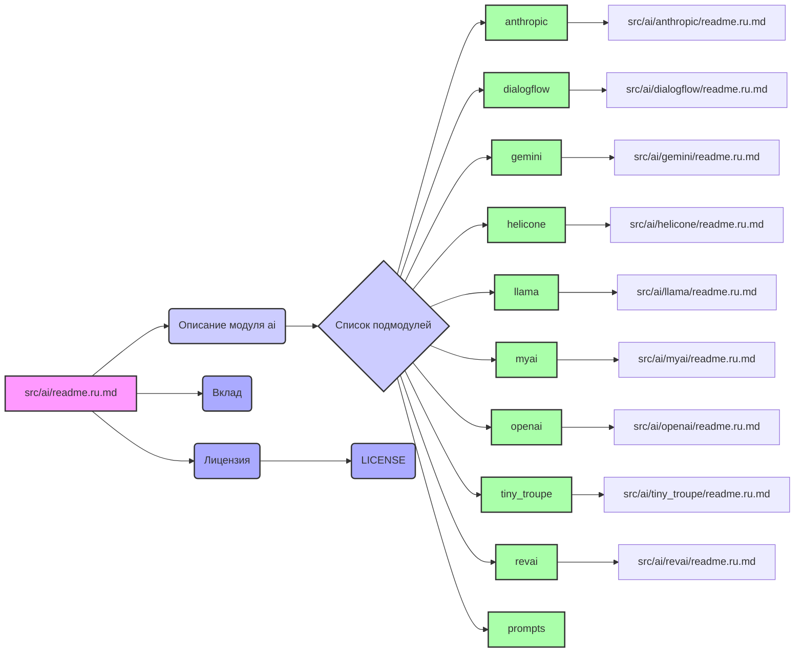

## Анализ кода `readme.ru.md` из `src/ai`

### 1. <алгоритм>

Данный документ представляет собой README-файл для модуля `ai` в проекте `hypo`. Он служит вводной странице для модуля, описывает его назначение и перечисляет подмодули, предоставляя ссылки на их подробные описания.

**Блок-схема:**

1. **Начало:** Пользователь открывает файл `readme.ru.md` в директории `src/ai`.
2. **Заголовок:** Отображается заголовок "Модуль ai".
3. **Описание:** Пользователь читает общее описание модуля `ai`, которое заключается в предоставлении интерфейса управления различными моделями ИИ, а также взаимодействия с внешними API и обработки конфигураций.
4. **Список подмодулей:** Отображается нумерованный список подмодулей (anthropic, dialogflow, gemini, helicone, llama, myai, openai, tiny_troupe, revai, prompts), каждый из которых представляет отдельную функциональность, связанную с конкретной моделью ИИ или типом задач.
    - **Пример:** Пользователь читает описание подмодуля `anthropic`, который обеспечивает интеграцию с моделями ИИ Anthropic для продвинутого понимания языка.
    - **Пример:** Пользователь читает описание подмодуля `openai`, который обеспечивает интеграцию с API OpenAI для решения задач по генерации текста и т.д.
    - **Пример:** Пользователь читает описание подмодуля `revai`, который обеспечивает интеграцию с API rev.com для работы с аудиофайлами.
5. **Ссылки:**  Каждый подмодуль имеет ссылку на свой `readme.ru.md` файл, который содержит более подробную информацию о его реализации.
    - **Пример:** Пользователь нажимает на ссылку "Перейти к модулю" для `anthropic` и переходит к файлу `src/ai/anthropic/readme.ru.md`.
6. **Завершение:** Пользователь завершает чтение файла, понимая структуру и назначение модуля `ai`, а также его подмодулей.
7. **Вклад:** Пользователю предлагается вносить вклад в проект посредством pull request'ов или issue.
8. **Лицензия:** Указана лицензия проекта (MIT License) и дана ссылка на файл лицензии.

### 2. <mermaid>

**Анализ зависимостей `mermaid`:**

*   `A` (src/ai/readme.ru.md) - Начальная точка, представляющая текущий файл. Зависит от других блоков и от файлов подмодулей,  содержит общую информацию о модуле `ai` и ссылки на его подмодули.
*   `B` (Описание модуля ai) - Содержит текст общего описания модуля `ai`.
*   `C` (Список подмодулей) - Содержит список подмодулей.
*   `D-L` - Перечисление подмодулей модуля `ai` (anthropic, dialogflow, gemini, helicone, llama, myai, openai, tiny_troupe, revai, prompts),  каждый из которых является отдельной сущностью в рамках модуля `ai`.
*   `D1-L1` -  Указывают на  файлы `readme.ru.md` каждого из подмодулей `ai`, таким образом устанавливая связь с  файлами подмодулей.
*   `N` (Вклад) - Информация о внесении вклада в проект.
*   `O` (Лицензия) - Информация о лицензии проекта.
*    `P` (LICENSE) -  Указывает на файл `LICENSE` проекта.

### 3. <объяснение>

**Импорты:**

*   В данном файле явные импорты отсутствуют, так как это `readme.ru.md` файл. Он предназначен для описания структуры и назначения модуля `ai` и его подмодулей, а не для выполнения кода. Тем не менее, файл имплицитно связывается с другими частями проекта, через ссылки на другие `readme.ru.md` файлы, таким образом, он является центральным звеном для понимания структуры `ai`.

**Классы:**

*   В данном файле нет определения классов. Он служит описательной странице для модуля `ai`.

**Функции:**

*   В данном файле нет функций.

**Переменные:**

*   В данном файле нет явных переменных, кроме текстовых строк и ссылок, необходимых для описания и навигации по модулю `ai` и его подмодулям.

**Подробное объяснение:**

*   **Назначение:**
    *   Файл `readme.ru.md` в директории `src/ai` служит входной точкой для понимания структуры и функциональности модуля `ai`. Он описывает общую цель модуля и предоставляет ссылки на подмодули, которые выполняют конкретные задачи.
    *   Этот `readme` файл действует как оглавление, позволяющее пользователям быстро ориентироваться в модуле `ai`, который в свою очередь, является важной частью проекта `hypo`.
*   **Структура:**
    *   Файл разделен на несколько разделов: заголовок, общее описание модуля `ai`, список подмодулей с их описаниями и ссылками, призыв к участию в проекте и информация о лицензии.
    *   Каждый подмодуль имеет свое описание и ссылку на файл `readme.ru.md`, который содержит более подробную информацию о его реализации. Это создает иерархическую структуру, позволяющую пользователю переходить от общего обзора к детальному изучению конкретных подмодулей.
*   **Подмодули:**
    *   Модуль `ai` состоит из нескольких подмодулей, каждый из которых отвечает за интеграцию с конкретными моделями ИИ:
        *   `anthropic`: Интеграция с моделями Anthropic.
        *   `dialogflow`: Интеграция с Google Dialogflow.
        *   `gemini`: Интеграция с моделями Gemini.
        *   `helicone`: Интеграция с моделями Helicone.
        *   `llama`: Интерфейс для LLaMA.
        *   `myai`: Кастомный подмодуль для специализированных задач.
        *   `openai`: Интеграция с API OpenAI.
        *   `tiny_troupe`: Интеграция с моделями Microsoft.
        *   `revai`: Интеграция с моделью rev.com для работы с аудио.
        *   `prompts`: Содержит системные и командные промпты для моделей ИИ.
*   **Взаимосвязь с другими частями проекта:**
    *   Модуль `ai` является ключевым компонентом проекта `hypo`, предоставляя интерфейс для различных моделей ИИ. Он взаимодействует с другими частями проекта через API и обеспечивает функциональность, связанную с обработкой естественного языка и анализом данных.
    *   Ссылки на `readme.ru.md` каждого подмодуля формируют иерархическую структуру проекта, обеспечивая навигацию между различными компонентами.
*   **Потенциальные ошибки или области для улучшения:**
    *   В текущем виде файл `readme.ru.md` является информативным и структурированным.
    *   Для улучшения можно добавить диаграмму, которая бы наглядно показывала связи между подмодулями, это улучшит наглядность и восприятие структуры модуля.
    *   Также, можно добавить более подробные примеры использования каждого подмодуля, хотя это лучше оставить для `readme.ru.md` самих подмодулей.
    *   Стоит следить за актуальностью ссылок на подмодули, особенно при изменении структуры проекта.
*   **Цепочка взаимосвязей:**
    1.  `readme.ru.md` в корне проекта (`hypo/readme.ru.md`) --> содержит общую информацию о проекте.
    2.  `readme.ru.md` в директории `src` (`src/readme.ru.md`) --> представляет модуль `src` проекта.
    3.  `readme.ru.md` в директории `src/ai` (`src/ai/readme.ru.md`) --> описывает модуль `ai` проекта, ссылается на подмодули.
    4.  `readme.ru.md` в директориях подмодулей (`src/ai/<подмодуль>/readme.ru.md`) --> описывают конкретные подмодули, формируя иерархическую структуру проекта.

В заключение, `readme.ru.md` в директории `src/ai` играет важную роль в структуре проекта `hypo`. Он служит отправной точкой для пользователей, которые хотят понять, как интегрируются модели ИИ в проект, и обеспечивает четкое описание подмодулей и их взаимодействия.