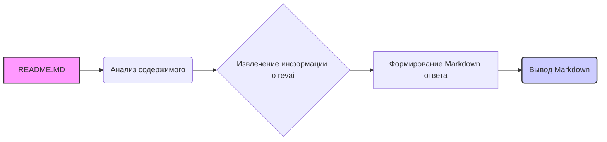

# Анализ кода `hypotez/src/ai/revai/README.MD`

## 1. <алгоритм>

Файл `README.MD` содержит информацию о revai, сервисе от rev.com, который специализируется на обработке аудиофайлов, таких как записи переговоров, совещаний и звонков.  Файл не содержит исполняемого кода, а представляет собой документацию, поэтому алгоритм его обработки довольно простой:

1. **Чтение файла:** Файл `README.MD` открывается и его содержимое считывается.
2. **Анализ содержания:** Текст анализируется для извлечения ключевой информации о revai.
3. **Формирование ответа:** Информация структурируется в виде ответа в формате markdown.

**Пример:**

1.  **Чтение файла:** Содержимое файла, описанное в `input_code`, передается на вход.
2.  **Анализ содержания:** Из текста извлекается информация, что revai - это сервис для обработки аудио от rev.com, предоставляющий API.
3. **Формирование ответа:** Извлеченная информация структурируется в markdown,  согласно шаблону.

## 2. <mermaid>

**Объяснение зависимостей `mermaid`:**

*   `README.MD` (A): Представляет входной файл, который является основным источником информации.
*   `Анализ содержимого` (B): Этот этап анализирует содержимое `README.MD`, чтобы понять его структуру и цель.
*   `Извлечение информации о revai` (C):  Извлекает ключевую информацию о сервисе revai из анализа содержимого.
*   `Формирование Markdown ответа` (D): Структурирует извлеченную информацию в формат Markdown.
*   `Вывод Markdown` (E): Представляет конечный структурированный ответ в Markdown формате.

В данной диаграмме показана последовательность обработки файла. Нет внешних импортов или зависимостей, так как речь идет о анализе документации, а не о коде.

## 3. <объяснение>

**Импорты:**

Файл `README.MD` не содержит никаких импортов, так как это файл документации, а не исполняемый код. Он лишь предоставляет информацию о внешнем сервисе.

**Классы:**

Файл `README.MD` не содержит классов.

**Функции:**

Файл `README.MD` не содержит функций.

**Переменные:**

Файл `README.MD` не содержит переменных в контексте программирования. Содержимое файла это статический текст.

**Объяснения:**

Файл `README.MD` является частью документации проекта `hypotez`, описывающей интеграцию с сервисом revai для обработки аудио.  Он включает в себя:

-   **Название сервиса**: `revai` (rev.com).
-   **Описание**: Сервис, специализирующийся на транскрибировании аудиозаписей переговоров, совещаний и звонков.
-   **Ссылки на документацию**:
    -   `https://www.rev.com/api/docs` -  Ссылка на документацию API сервиса revai.
    -   `https://docs.rev.ai/resources/code-samples/python/` - Ссылка на примеры кода на Python, которые могут быть использованы для интеграции с revai.

**Потенциальные ошибки или области для улучшения:**

-   Файл не имеет кода, поэтому сложно говорить про ошибки,  однако можно добавить более подробное описание:
    -   **Уточнение возможностей revai:** Какие конкретно операции API доступны (транскрибация, диаризация, анализ тональности и т.д.)?
    -   **Примеры использования:** Как именно используется revai в контексте проекта `hypotez` (вызов API, обработка результатов).
    -   **Настройки:** Где и как настраиваются учетные данные для работы с API revai.
    -   **Связь с другими частями проекта:** В каких конкретно модулях `hypotez` используется revai.

**Цепочка взаимосвязей с другими частями проекта:**

Исходя из названия `revai`,  вероятно, этот модуль взаимодействует со следующими частями проекта:

1.  **Модули обработки аудио:** Предположительно, существуют модули, которые подготавливают аудио данные для отправки в revai, а также обрабатывают результаты (например, извлечение текста из транскрипций).
2.  **Конфигурационный модуль:** Модуль, где хранятся API ключи и другие необходимые настройки для работы с сервисом revai.
3.  **Модуль логирования:**  Фиксирование событий, связанных с вызовами revai API (например, ошибки или успешные операции).
4.  **Интефейсные модули:** Может быть, что результаты работы revai визуализируются в каких-либо интерфейсах пользователя (веб или телеграм).

В целом, `README.MD` является важной частью документации, но для полноценного понимания интеграции с revai,  необходимо анализировать код, который реально использует этот сервис.