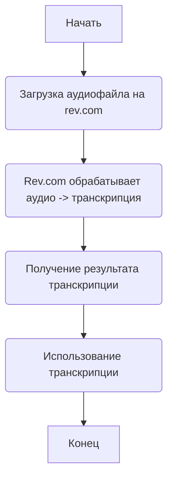
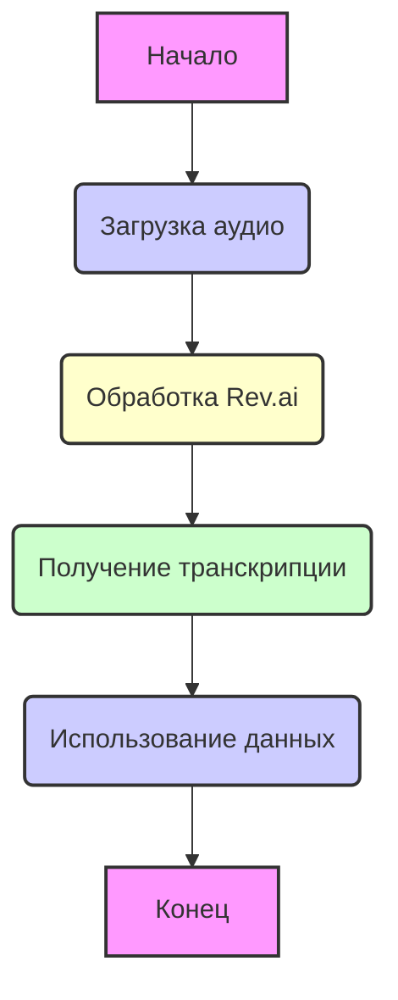

## АНАЛИЗ КОДА: `hypotez/src/ai/revai/README.MD`

### 1. <алгоритм>

Данный файл README.MD не содержит исполняемого кода, а представляет собой документацию или описание. Он предоставляет информацию о revai, сервисе rev.com, который специализируется на работе с аудиофайлами (переговоры, совещания, звонки и т.п.)

**Пошаговая блок-схема не применима для README.MD файла.**

Однако, можно составить блок-схему, описывающую общую идею, как  использовать revai, опираясь на представленные ссылки:

*   **Начать**: Начальная точка.
*   **Загрузка аудиофайла на rev.com**: Пользователь загружает аудиофайл в сервис rev.com.
    *   *Пример:* `curl -X POST -H "Authorization: Bearer <API_KEY>" -F "media=@/path/to/audio.mp3"  "https://api.rev.ai/speechtotext/v1/jobs"`
*   **Rev.com обрабатывает аудио**: rev.com проводит обработку аудиофайла, производя транскрипцию в текст.
    *   *Пример:* Сервис преобразует речь в текст, определяет говорящего, и т.д.
*   **Получение результата транскрипции**: Пользователь получает результат обработки (текст, форматирование, и т.д.)
    *   *Пример:* JSON-ответ от API: `{"id": "job_id", "status": "transcribed", "transcripts": [{"monologue": "текст транскрипции"}]}`.
*   **Использование транскрипции**: Пользователь обрабатывает или использует полученный результат.
    *   *Пример:* Анализ текста на ключевые слова, формирование отчета.
*   **Конец**: Конечная точка.

### 2. <mermaid>

**Объяснение `mermaid` диаграммы:**

*   `flowchart TD`: Определение типа диаграммы как блок-схемы, где стрелки идут сверху вниз.
*   `A[Начало]`: Узел, обозначающий начало процесса.
*   `B(Загрузка аудио)`: Узел, обозначающий процесс загрузки аудиофайла.
*   `C(Обработка Rev.ai)`: Узел, представляющий процесс обработки аудиофайла сервисом rev.ai.
*   `D(Получение транскрипции)`: Узел, обозначающий процесс получения результата транскрипции.
*   `E(Использование данных)`: Узел, представляющий процесс использования полученной транскрипции.
*   `F[Конец]`: Узел, обозначающий конец процесса.
*   `-->`: Стрелки, показывающие поток процесса от одного узла к другому.
*   `style`: Стилизация узлов для лучшей визуализации.

**Зависимости:**

В данном случае, `mermaid` диаграмма не импортирует никакие модули или библиотеки. Она сама по себе является способом визуализации процесса и работает автономно. Она лишь описывает логику использования API revai, опираясь на ссылки в README файле.

### 3. <объяснение>

**Общее описание:**

Файл `README.MD` представляет собой документацию к модулю revai, который, вероятно, является частью более крупного проекта, использующего API rev.com для обработки аудио. Он указывает на то, что модуль предназначен для работы с аудиофайлами и предоставляет ссылки на официальную документацию API rev.com.

**Импорты:**

Файл `README.MD` **не содержит** никаких импортов, так как это не исполняемый код, а документация.

**Классы:**

Файл `README.MD` **не содержит** классов.

**Функции:**

Файл `README.MD` **не содержит** функций.

**Переменные:**

Файл `README.MD` **не содержит** переменных.

**Цепочка взаимосвязей с другими частями проекта:**

Исходя из структуры каталога (`hypotez/src/ai/revai/README.MD`), можно предположить, что модуль `revai` является частью более крупного проекта `hypotez`, возможно, сфокусированного на искусственном интеллекте (`src/ai`). Модуль `revai`, скорее всего, взаимодействует с API rev.com для выполнения своих задач, а результаты его работы передаются другим частям проекта для дальнейшей обработки или анализа.

**Потенциальные ошибки и области для улучшения:**

*   Файл `README.MD` не содержит кода, поэтому не может быть потенциальных ошибок.
*   Однако, было бы полезно добавить в `README.MD` пример использования API Rev.com (например, с использованием Python), а также описать архитектуру модуля `revai` и как он интегрируется в более крупный проект.

**Дополнительно:**
Поскольку в коде нет импорта `header`, то блок `mermaid` для `header.py` не требуется.