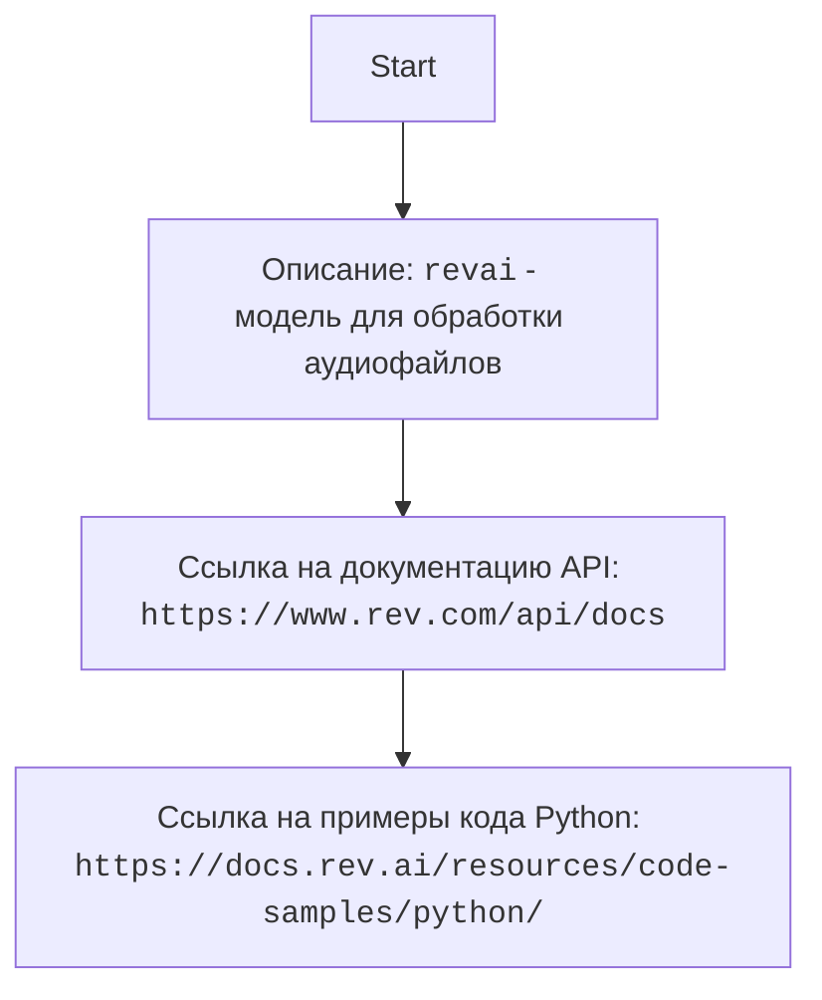

## АНАЛИЗ КОДА: `revai`

### 1. <алгоритм>

Описание:

Этот документ `README.md` не содержит исполняемого кода. Вместо этого он предоставляет описание и ссылки на внешние ресурсы, связанные с использованием API сервиса Rev.com для работы с аудиофайлами (например, транскрибация). Поток данных здесь не подразумевается как в программном коде, а скорее как концептуальный поток, в котором пользователь взаимодействует с API Rev.com.

*   **Блок 1:  Описание и ссылка на API**
    *   Пример: `revai (rev.com - модель, которая умеет работать с звуковыми файлами переговоров, совещаний, звонков и т.п.)`
    *   Действие: Предоставляет информацию о назначении и общей функциональности модели Rev.com. Указывает на то, что она предназначена для обработки аудиофайлов переговоров и т.п.
*   **Блок 2: Ссылка на документацию API**
    *   Пример:  `# https://www.rev.com/api/docs`
    *   Действие:  Даёт ссылку на официальную документацию API Rev.com. Это важный ресурс для разработчиков, желающих использовать API.
*  **Блок 3: Ссылка на примеры кода**
    *   Пример: `# https://docs.rev.ai/resources/code-samples/python/`
    *   Действие:  Даёт ссылку на примеры кода на Python, которые демонстрируют, как можно использовать API Rev.com.

Поток данных:
Поток данных можно представить как процесс, в котором разработчик:
1. Изучает общую информацию о модели `revai`.
2. Обращается к документации API, чтобы узнать, как использовать его функции.
3. Изучает примеры кода на Python, чтобы понять, как конкретно использовать API.

### 2. <mermaid>

**Объяснение диаграммы:**

*   `Start`: Начало процесса.
*   `Description`: Представляет собой общее описание модели `revai`.
*   `APIDocs`: Указывает на ссылку на документацию API Rev.com, где можно найти подробную информацию о методах API.
*   `CodeExamples`:  Указывает на ссылку на примеры кода на Python, которые помогают разработчикам понять, как использовать API.

Диаграмма отображает последовательность получения информации разработчиком для работы с API Rev.com, но не описывает импортируемые зависимости, так как файл README не содержит кода, где есть импорт.

### 3. <объяснение>

**Общее назначение:**

Этот файл `README.md` служит вводной точкой для разработчиков, желающих использовать API Rev.com для работы с аудиофайлами. Он предоставляет необходимую контекстную информацию и ссылки на важные ресурсы.

**Импорты:**

В данном `README.md` нет импортов, так как это не исполняемый код. Импорты будут присутствовать в файлах Python, которые используют API Rev.com, например, в файле `revai.py`.

**Классы:**

Этот файл `README.md` не содержит определений классов.

**Функции:**

Этот файл `README.md` не содержит определений функций.

**Переменные:**

Этот файл `README.md` не содержит переменных.

**Взаимосвязь с другими частями проекта:**
Этот файл `README.md` является вводной документацией к проекту `revai`. Его главная цель — объяснить, как работает  `revai` , какие есть ресурсы для работы и дать ссылки на необходимую документацию. Он связан с файлами `revai.py`, в которых будет реализация работы с API rev.com .

**Потенциальные улучшения:**

1.  **Более подробное описание:** Можно добавить больше информации о том, какие конкретно функции доступны через API Rev.com (транскрибация, анализ аудио и т.д.), какие ограничения есть у API, какие тарифные планы, и о других полезных ресурсах.
2.  **Указание версий:** Можно добавить информацию о версиях используемого API и версиях примеров кода.
3.  **Разделение на секции:** Можно разделить документ на несколько секций для облегчения навигации (например, "Введение", "Использование API", "Примеры").
4.  **Примеры использования:** Можно добавить примеры простого кода в `README`  для быстрого старта (хотя они уже есть по ссылке).
5.   **Описание процесса авторизации**: Добавить раздел по процессу авторизации и получения API ключа.

**Цепочка взаимосвязей:**

1.  `README.md` -> Описание и ссылки для работы с `revai` .
2.  `revai.py` ->  Реализация работы с API Rev.com (будет использовать документацию, указанную в README).
3.  `src.gs` -> Глобальные настройки и зависимости проекта (используется в `revai.py`).