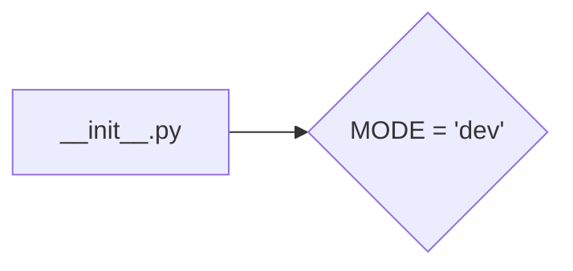
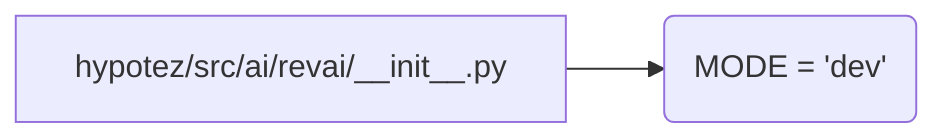

```MD
1. **<input code>**:

```python
## \file hypotez/src/ai/revai/__init__.py
# -*- coding: utf-8 -*-\
#! venv/Scripts/python.exe
#! venv/bin/python/python3.12

"""
.. module: src.ai.revai 
	:platform: Windows, Unix
	:synopsis:

"""
MODE = 'dev'
```

2. **<algorithm>**:

Этот файл `__init__.py` в папке `revai` представляет собой инициализационный модуль.  Он не содержит логики выполнения, а скорее задаёт константу `MODE`, которая, вероятно, будет использоваться в других частях проекта для выбора режима работы (например, `dev` для разработки, `prod` для производства).

Блок-схема крайне проста:



Пример:

В других модулях проекта, импортирующих `revai`, можно получить значение `MODE` так:

```python
from hypotez.src.ai.revai import MODE
print(MODE)  # Выведет 'dev'
```


3. **<mermaid>**:



В данном случае диаграмма простая, так как в файле нет сложных зависимостей или вызовов функций.  Она показывает, что модуль `__init__.py` определяет переменную `MODE`.  Зависимости от других частей проекта отсутствуют в данном коде.


4. **<explanation>**:

- **Импорты**: Нет импортов.  Файл содержит только переменную `MODE`.
- **Классы**: Нет классов.
- **Функции**: Нет функций.
- **Переменные**: `MODE` — строковая переменная, которая устанавливает значение константы. Предполагается, что эта константа будет использована в других модулях проекта для выбора различных режимов работы (разработка, производство, и т.д.).   Тип данных переменной `MODE` - `str`.
- **Возможные ошибки или области для улучшений**:

    * Отсутствие документации к переменной `MODE` (описание ее роли и возможных значений). Неясно, как будут использоваться различные значения этой константы в коде. Желательно добавить к `MODE` документацию, возможно, в виде docstring или комментария.
    * Неясно, где и как используется значение переменной `MODE`.  Было бы полезно увидеть примеры использования этой константы в других частях проекта.


**Цепочка взаимосвязей с другими частями проекта**:

Переменная `MODE` в `__init__.py`  будет использоваться в других модулях `src.ai.revai` или других частях проекта, где требуется выбор между режимами (например, `dev`, `test`, `prod`).  Эти модули будут импортировать `MODE` и использовать ее значение для настройки поведения кода (например, использование разных логгеров, работа с разными базами данных).  Именно поэтому присутствует сама папка `revai` и инициализационный модуль `__init__.py`.