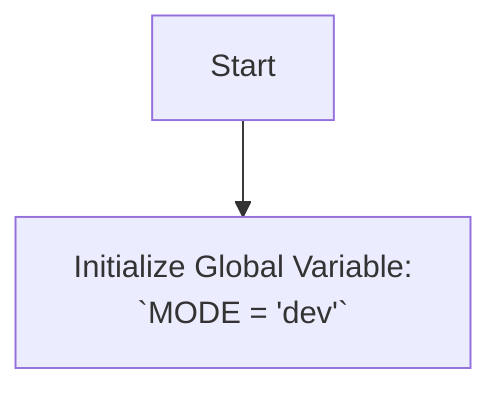

## Анализ кода `hypotez/src/ai/revai/__init__.py`

### <алгоритм>

1. **Инициализация режима:**
   -  Устанавливается глобальная переменная `MODE` в значение `'dev'`.
   -  Пример: `MODE = 'dev'`

### <mermaid>

### <объяснение>

**Импорты:**

-   В предоставленном коде нет импортов. Файл `__init__.py` часто используется для инициализации пакета, а не для импорта других модулей.

**Классы:**

-   В данном коде нет определения классов.

**Функции:**

-   В данном коде нет определения функций.

**Переменные:**

-   `MODE`:
    -   Тип: `str` (строка)
    -   Назначение: Устанавливает режим работы модуля или приложения. В данном случае установлен режим разработки `'dev'`.
    -   Пример:  Если в других модулях или функциях будет проверка `if MODE == 'dev'`, то будут выполняться действия, специфичные для режима разработки.

**Общее описание:**
Файл `__init__.py` в пакете `src.ai.revai` в основном используется для определения глобальных переменных или настройки пакета при его импорте. В данном случае он определяет переменную `MODE` и устанавливает ее в режим `'dev'`. Это может быть использовано для настройки различных параметров приложения в зависимости от режима работы (разработка, тестирование, продакшн и т. д.).

**Потенциальные ошибки или области для улучшения:**

-   Отсутствие документации о том, как именно используется `MODE`.
-   В дальнейшем файл может быть расширен для более сложной инициализации пакета, например, импорта подмодулей или установки переменных среды.
-   Если используется gitflow нужно проверить, что бы `MODE = 'dev'` не попал в релиз.
-   Возможны варианты использования `enum` для перечисления режимов.

**Цепочка взаимосвязей с другими частями проекта:**

-   Этот файл, вероятно, является частью большего пакета `src.ai`. Другие модули в этом пакете или за его пределами могут импортировать этот модуль или напрямую считывать переменную `MODE`, чтобы адаптировать свое поведение к текущему режиму работы. Например, при разработке может выводиться отладочная информация, которая отключается в продакшене.
-   Необходимо проверить использование переменной `MODE` в других файлах проекта, чтобы выявить все точки взаимодействия.