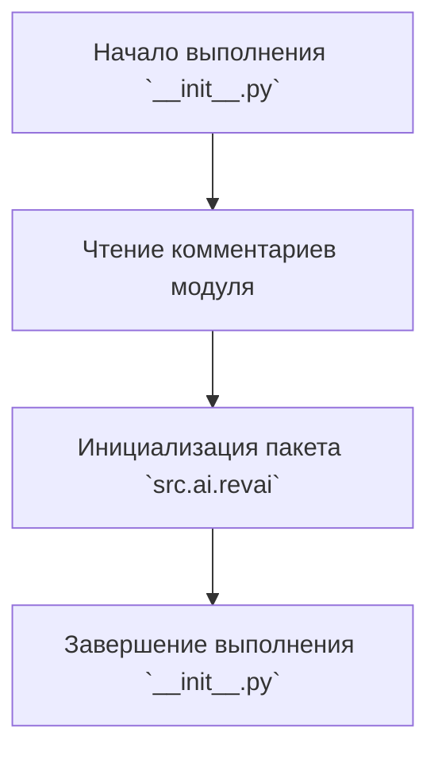

## Анализ кода `src/ai/revai/__init__.py`

### <алгоритм>

1. **Начало**: Исполнение начинается с файла `__init__.py` в каталоге `src/ai/revai`.
2. **Комментарии**: Код содержит метаданные о модуле и его назначении, а также информацию о среде исполнения.
3. **Завершение**: Файл `__init__.py` пуст, поэтому никаких действий не происходит, кроме инициализации пакета `src.ai.revai`.
4. **Примеры**:
    - *Пример входа*: Исполнение файла `__init__.py`.
    - *Пример выхода*: Пакет `src.ai.revai` инициализирован как модуль Python, но никакие дополнительные действия не выполняются.

### <mermaid>

**Объяснение зависимостей `mermaid`:**

- **Start**: Начало выполнения скрипта, не имеет зависимостей.
- **Comments**: Чтение метаданных и комментариев, зависит от начала выполнения.
- **InitPackage**: Инициализация пакета, зависит от прочтения комментариев.
- **End**: Завершение выполнения скрипта, зависит от инициализации пакета.

### <объяснение>

**Импорты**:

- В коде отсутствуют какие-либо явные импорты. `__init__.py` в Python используется для обозначения директории как пакета, и поэтому он может быть пустым или содержать инициализационный код для пакета.
-  `src` подразумевает, что проект структурирован как пакет Python, и этот `__init__.py` находится в подпакете `ai.revai`.

**Классы**:
  - Отсутствуют.

**Функции**:
  - Отсутствуют.

**Переменные**:
  - Отсутствуют.

**Дополнительно**:
  -  Файл `__init__.py` часто используется для импорта других модулей из текущего пакета, но в данном случае он пуст. Это означает, что данный пакет пока не содержит никакой функциональности в виде отдельного модуля и используется только для организации пространства имен в пакете.
  -  Отсутствие импортов в `__init__.py` означает, что нет явных зависимостей с другими частями проекта на этом уровне.  
  -  В данном виде файл не имеет потенциальных ошибок, так как он выполняет свое назначение — отмечает директорию как пакет Python. 
  -  Возможные улучшения: в будущем в этот файл можно добавить импорты других модулей из пакета `revai`, для удобства доступа к ним извне через этот пакет.

**Цепочка взаимосвязей**:
   -  `src/ai/revai/__init__.py` является частью пакетной структуры `src`. Это означает, что другие модули, расположенные в каталоге `src`, могут взаимодействовать с модулями или пакетами, которые расположены внутри `src/ai/revai` после их добавления.