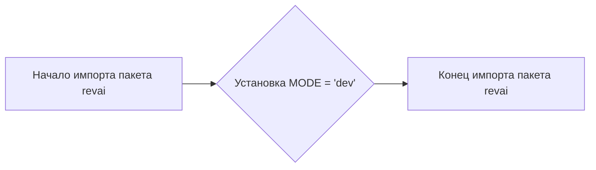

## Анализ кода `hypotez/src/ai/revai/__init__.py`

### <алгоритм>

1.  **Инициализация модуля:**
    *   Устанавливается глобальная переменная `MODE` со значением `'dev'`.
    *   Этот модуль, по сути, является точкой входа для пакета `revai`.
2.  **Примеры:**
    *   При импорте любого модуля или класса из `src.ai.revai`, переменная `MODE` будет доступна.

### <mermaid>

**Разбор диаграммы:**

*   `A` (Начало импорта пакета revai): Представляет начало процесса импорта пакета `revai`.
*   `B` (Установка `MODE = 'dev'`):  Представляет действие установки глобальной переменной `MODE` в значение `'dev'`.
*   `C` (Конец импорта пакета revai): Представляет завершение процесса импорта пакета `revai`.

**Импорты:**
В данном коде отсутствуют явные импорты. Однако стоит отметить, что сам файл `__init__.py` имплицитно импортируется при импорте пакета `src.ai.revai`.

### <объяснение>

**Импорты:**

*   В данном файле нет явных операторов `import`. Однако, файл `__init__.py` играет особую роль в Python: он делает директорию, в которой находится, пакетом. Это означает, что при импорте пакета `src.ai.revai`, этот файл автоматически выполняется. В результате, переменная `MODE` будет определена и доступна в рамках этого пакета.

**Классы:**

*   В данном коде нет определений классов.

**Функции:**

*   В данном коде нет определений функций.

**Переменные:**

*   `MODE`:
    *   Тип: `str` (строка).
    *   Назначение: Глобальная переменная, устанавливающая режим работы пакета. В данном случае, она имеет значение `'dev'`, что, вероятно, означает режим разработки. Эта переменная может использоваться для управления поведением различных частей пакета в зависимости от текущего режима.
    *   Использование: Значение `MODE` может использоваться в различных модулях пакета `revai` для определения логики работы, например, переключения между различными уровнями логирования или настройками.

**Потенциальные ошибки или области для улучшения:**

*   В данном коде нет явных ошибок, однако, если файл `__init__.py` не содержит ничего, кроме установки переменной `MODE`, можно рассмотреть вопрос о том, нужно ли его оставлять, или же можно просто установить переменную `MODE` непосредственно в том модуле, где она используется, если это не требуется во многих частях пакета.
*   Отсутствует документация к переменной `MODE`. Необходимо в будущем документировать её цель и значения.
*   В комментариях указаны пути для shebang (`#!`), но они указывают на разные виртуальные окружения, что может привести к проблемам. Необходимо унифицировать путь к shebang.
*   Отсутствует описание пакета. Стоит добавить краткое описание пакета в докстринге модуля.

**Цепочка взаимосвязей с другими частями проекта:**

*   Данный файл является частью пакета `src.ai.revai`. Его главной задачей является инициализация пакета и установка глобальных переменных, таких как `MODE`, которая может быть использована другими модулями пакета.
*   Модули, расположенные внутри `src.ai.revai`, могут импортировать `MODE` и использовать его для управления своим поведением.
*   Таким образом, `__init__.py` является отправной точкой и центром конфигурации для пакета `revai`.