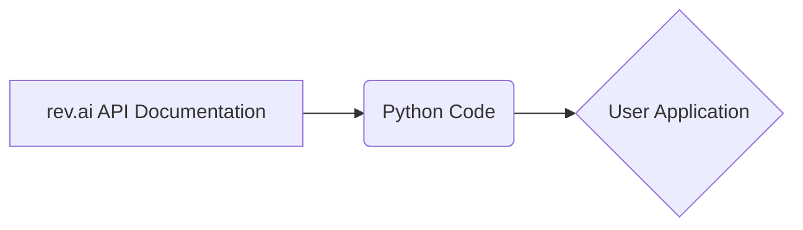

# Анализ кода из rev.ai

**1. <input code>**

```revai (rev.com - модель, которая умеет работать с звуковыми файлами переговоров, совещаний, звонков и т.п.)
# https://www.rev.com/api/docs
# https://docs.rev.ai/resources/code-samples/python/
```

**2. <algorithm>**

Код не содержит конкретного алгоритма. Он представляет собой лишь комментарии, ссылающиеся на API и документацию сервиса rev.com для работы с аудиозаписями. Алгоритм работы будет зависеть от конкретной программы, которая будет использовать эти ссылки для взаимодействия с API.  В связи с этим, пошаговая блок-схема невозможна.

**3. <mermaid>**



**Описание диаграммы:**

* **A:** Документация API rev.ai, содержащая информацию о методах и параметрах для взаимодействия.
* **B:**  Python код (который не представлен), который будет использовать эту документацию.
* **C:** Приложение пользователя, использующее Python код для взаимодействия с API.

**4. <explanation>**

Код представляет собой комментарии, указывающие на ресурсы rev.com, которые содержат API-документацию и примеры кода для работы с их сервисом.  Сам по себе код не представлен, поэтому нет возможности проанализировать импорты, классы, функции, переменные.  


**Цепочка взаимосвязей:**

* Документация API rev.com (rev.com/api/docs) содержит описание доступных методов и параметров для работы со звуковыми файлами.
* Пользовательский код на Python (который отсутствует в запросе) использует API, используя описанные в документации методы и структуры данных.
* Данный код вероятно будет использовать `requests` или `rev.ai` библиотеку для взаимодействия с API rev.com.

**Возможные ошибки/улучшения:**

* Отсутствует конкретный код, что не позволяет проанализировать возможные ошибки и предложить улучшения. Для качественного анализа кода необходим его фрагмент.
* Необходима конкретная задача для приложения.  Использование API предполагает знание запросов, ожидаемых ответов и обработки ошибок.

**Заключение:**

В представленном коде нет достаточно информации для подробного анализа.  Комментарии указывают на внешние ресурсы, описывающие способы работы с API rev.com. Для более глубокого анализа требуется предоставление полного кода Python.