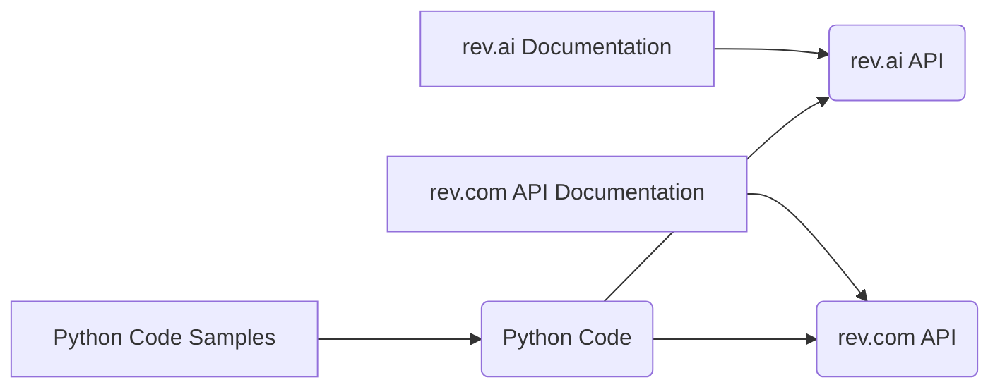

# Анализ кода проекта revai

## <input code>

```revai (rev.com - модель, которая умеет работать с звуковыми файлами переговоров, совещаний, звонков и т.п.)
# https://www.rev.com/api/docs
# https://docs.rev.ai/resources/code-samples/python/
```

## <algorithm>

Из-за отсутствия кода, алгоритм работы невозможно описать в виде блок-схемы. Данный код представляет собой только комментарии и ссылки на документацию, не содержащие исполняемого кода.  Поэтому блок-схема и примеры не применимы.

## <mermaid>



**Описание диаграммы:**

Диаграмма показывает связи между разными ресурсами.  rev.com API Documentation и rev.ai Documentation служат в качестве источников информации для понимания API и работы с этими сервисами. Эти документации приводят к описанию rev.com API и rev.ai API соответственно.  Python Code Samples предлагают примеры использования API.  Python Code в свою очередь, будет опираться на эти API для выполнения задач.


## <explanation>

**Комментарии:**

Код содержит только комментарии, которые ссылаются на API документацию.  Эти комментарии указывают на необходимость использования сторонних библиотек rev.com и rev.ai для работы с аудиозаписями.  Они содержат ссылки на ресурсы, предоставляющие информацию о работе с API.  Без фактического кода невозможно проанализировать импорты, классы, функции, переменные и их взаимосвязь.

**Возможности улучшения:**

Этот код не содержит кода для анализа. Для построения полноценного анализа требуется представить сам Python код, использующий библиотеки rev.com и rev.ai, включая импорты, функции и т.д.


**Цепочка взаимосвязей:**

Цепочка взаимосвязей с другими частями проекта не может быть определена, так как отсутствует код.  Предполагается, что проект будет использовать API rev.com и rev.ai для обработки аудиозаписей.  Использование этих API будет определять остальные части проекта.

**Заключение:**

Данный фрагмент представляет собой некий «план» или «инструкцию» о том, какие ресурсы нужны для работы с озвученным проектом.  Для полноценного анализа требуется предоставить сам код.