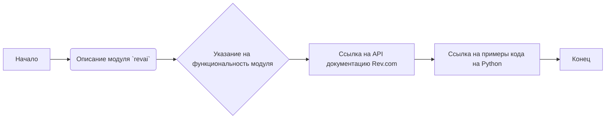
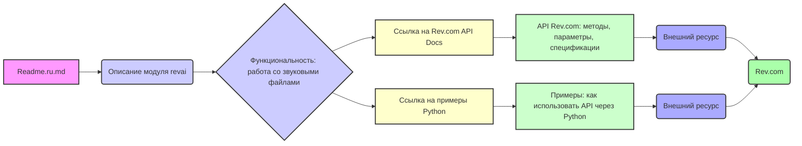

## Анализ кода `revai/readme.ru.md`

### 1. <алгоритм>

**Описание:**

Файл `readme.ru.md` содержит вводную информацию о модуле `revai`, который предназначен для взаимодействия с API Rev.com. Rev.com предоставляет сервисы для обработки аудиофайлов, в частности, транскрипцию и анализ.  Файл указывает на ссылки на официальную документацию Rev.com API и на примеры кода на Python.

**Блок-схема:**

**Пояснения к блокам:**
* **A (Начало):** Начало процесса анализа readme-файла.
* **B (Описание модуля `revai`):** Описание того, что это модуль `revai`  (адаптер) для работы с API сервиса rev.com
* **C (Указание на функциональность модуля):**  Указание на то, что данный модуль предназначен для работы с аудиофайлами (переговоры, совещания, звонки и т.п.)
* **D (Ссылка на API документацию Rev.com):** Предоставление ссылки на официальную документацию Rev.com API для понимания доступных методов и параметров.
* **E (Ссылка на примеры кода на Python):** Предоставление ссылки на примеры кода на языке Python, которые демонстрируют использование API Rev.com.
* **F (Конец):** Конец процесса.

### 2. <mermaid>

**Анализ зависимостей (mermaid):**

* `Readme.ru.md` (A): Главный узел, представляющий файл readme.md, который является точкой входа для понимания модуля revai.
* `Описание модуля revai` (B): Содержит текстовое описание назначения модуля revai.
* `Функциональность: работа со звуковыми файлами` (C): Определяет основную функциональность модуля revai как работу с аудиофайлами.
* `Ссылка на Rev.com API Docs` (D): Ссылка на официальную документацию Rev.com API.
* `Ссылка на примеры Python` (E): Ссылка на примеры кода на Python для использования Rev.com API.
* `API Rev.com: методы, параметры, спецификации` (F): Описывает содержание API документации, включая методы, параметры и спецификации.
* `Примеры: как использовать API через Python` (G): Описывает содержание примеров кода на Python, демонстрирующих использование API.
* `Внешний ресурс` (H, I):  Указатель на то что D и E ведут на внешние ресурсы.
* `Rev.com` (J): Отображает внешний ресурс (Rev.com), с которым взаимодействует модуль.
Взаимосвязи в диаграмме отображают поток информации: от описания модуля к его функциональности, а затем к внешним ресурсам, обеспечивающим взаимодействие с сервисом Rev.com.

### 3. <объяснение>

**Импорты:**

В данном файле нет импортов. Это README файл, который предназначен для документации модуля.  Импорты будут находиться в файлах Python, которые будут реализовывать функциональность, описанную в данном README.  В будущих частях кода могут появиться импорты такие как:
* `requests`: для отправки HTTP-запросов к API Rev.com.
* `json`: для работы с данными в формате JSON, которые возвращает API.
* `os`:  для работы с файловой системой (например, для чтения аудиофайлов).

**Классы:**

В данном файле классы не определены.  Классы, вероятно, будут определены в будущих частях кода в  Python, такие как:

*   `RevAIClient`:  Основной класс для взаимодействия с API Rev.com.  Может содержать методы для отправки аудиофайлов на транскрипцию, получения статуса транскрипции и получения результата.
    Атрибуты могут включать API-ключ.
*   `Transcript`: Класс, представляющий транскрипцию, которая может включать текст и время.

**Функции:**

В данном файле функции не определены. Функции будут определены в коде на Python:

*   `upload_audio(filepath: str)`: Загрузка аудиофайла на Rev.com.  
    *   `filepath`: Путь к аудиофайлу.
    *   Возвращает: `job_id` для отслеживания процесса.
*   `get_transcript(job_id: str)`: Получение транскрипции.
    *   `job_id`: Идентификатор задания на транскрипцию.
    *   Возвращает: `Transcript` объект.
*   `get_job_status(job_id: str)`: Получение статуса задания.
    *  `job_id`: Идентификатор задания на транскрипцию.
    *  Возвращает: `status` - статус задания.

**Переменные:**

В данном файле переменные не определены. В будущих частях кода в Python могут быть переменные, такие как:
*   `api_key`: API-ключ для доступа к Rev.com API (строка).
*   `job_id`: Идентификатор задания на транскрипцию (строка).
*   `transcript_text`: Текст транскрипции (строка).
*   `audio_filepath`: Путь к аудиофайлу (строка).
*   `status`: Статус задания (строка).

**Цепочка взаимосвязей с другими частями проекта:**

*   Модуль `revai` будет частью более крупного проекта, который может включать в себя другие модули для работы с разными сервисами.
*   Модуль `revai` может использоваться в модулях для обработки данных, например, для анализа текста транскрипции.
*   API Rev.com является внешним ресурсом, поэтому `revai` будет зависим от его доступности.

**Потенциальные ошибки и области для улучшения:**

* Отсутствие обработки ошибок: Код должен включать обработку ошибок API Rev.com (например, ошибки аутентификации, лимиты запросов, неверный формат данных).
* Отсутствие асинхронности: Загрузка больших аудиофайлов может быть медленной. Необходимо предусмотреть асинхронную обработку.
* Добавление поддержки форматов:  Нужно явно описать, какие форматы файлов поддерживаются API Rev.com.
* Управление API ключом:  Необходимо организовать безопасное хранение и передачу API-ключа.
* Документация: Документация должна быть более полной и описывать, как установить, использовать и расширять модуль `revai`.
* Добавление примера использования: README должно включать в себя примеры как использовать данный модуль.
* Добавление тестов: Необходимо создать тесты, для проверки корректности работы модуля.

**Дополнительно:**

Данный README файл предоставляет базовое понимание модуля `revai`. Для полноценной работы модуля необходимо реализовать код на Python, учитывая описанные выше замечания.