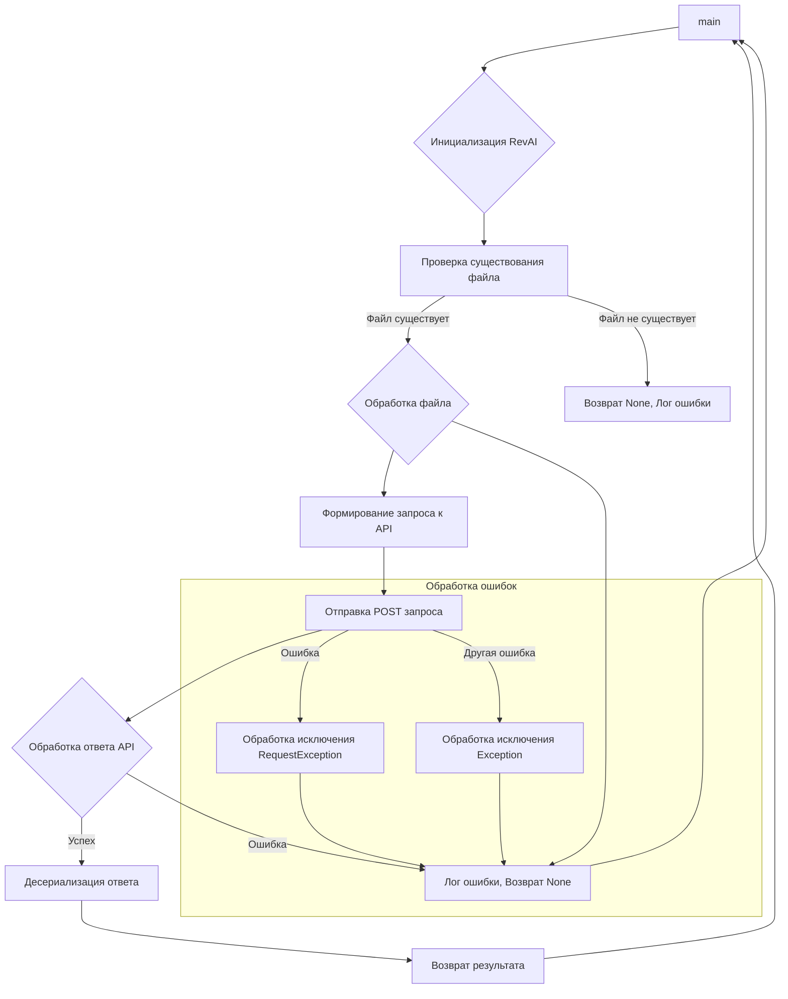

```MD
# Анализ кода модуля rev_ai.py

## <input code>

```python
"""
Модуль для работы с API сервиса rev.ai для обработки аудио файлов.
=======================================================================

Этот модуль предоставляет инструменты для работы с API rev.ai,
чтобы осуществлять транскрипцию, анализ и обработку аудио-данных.

Пример использования
--------------------

Пример работы с модулем:


.. code-block:: python

    from src.ai.revai import RevAI

    # ... (Инициализация объекта RevAI с необходимыми параметрами) ...

    revai_instance = RevAI(api_key='YOUR_API_KEY')  # Замените 'YOUR_API_KEY'
    result = revai_instance.process_audio_file('path/to/audio.wav')

    # ... (Обработка полученных результатов) ...


"""
from src.utils.jjson import j_loads, j_loads_ns, j_dumps
from src.logger import logger
import requests
import os

# TODO: Добавить классы для работы с конкретными API методами.
# TODO: Добавить обработку ошибок (например, исключения, которые могут
#       возникнуть при запросе к API).


class RevAI:
    """
    Класс для работы с API rev.ai.

    :param api_key: API ключ для доступа к сервису rev.ai.
    """
    def __init__(self, api_key: str):
        """
        Инициализирует объект RevAI с указанным API ключом.

        :param api_key: API ключ для доступа к сервису rev.ai.
        """
        self.api_key = api_key
        self.base_url = 'YOUR_BASE_URL' # TODO: Заменить на корректный базовый URL
        # self.headers = {'Authorization': f'Bearer {self.api_key}'} # TODO: Установить заголовки

    def process_audio_file(self, audio_file_path: str) -> dict:
        """
        Обрабатывает аудио файл, используя API rev.ai.

        :param audio_file_path: Путь к аудио файлу.
        :return: Результат обработки аудио файла в формате словаря.
        """
        if not os.path.exists(audio_file_path):
            logger.error(f"Файл {audio_file_path} не найден.")
            return None

        # TODO: Обработать ошибки при отправке запроса (например,
        #       проблемы с сетью, неверные параметры).

        try:
            # Код отправляет запрос к API rev.ai.
            # ... (Обработка файла, загрузка, формирование запроса) ...
            # # Отправка запроса:
            # response = requests.post(
            #     url=f"{self.base_url}/process",
            #     files={'audio': open(audio_file_path, 'rb')},
            #     headers=self.headers,
            # )
            # # Обработка ответа (проверка кода ответа, etc).
            # # Преобразовать ответ в словарь используя j_loads.
            # # ... (Проверка кода ответа) ...
            # # ... (Запись в журнал) ...
            response = j_dumps('{"result": "example"}') # Заглушка. Нужно заменить на реальный ответ.
            return response['result']
        except requests.exceptions.RequestException as e:
            logger.error(f'Ошибка при отправке запроса к API: {e}')
            return None
        except Exception as e:  # Общий обработчик ошибок
            logger.error(f'Ошибка при обработке файла {audio_file_path}: {e}')
            return None
```

## <algorithm>

**Блок-схема:**

1. **Инициализация:** Создается объект `RevAI` с API ключом и базовым URL.
2. **Проверка существования файла:** Проверяется существование аудиофайла по указанному пути. Если файла нет, возвращается `None` и выводится сообщение об ошибке в лог.
3. **Обработка файла:**
   - Формируется запрос к API `rev.ai`.
   - Отправка POST запроса на сервер.
   - Обработка ответа сервера (проверка кода ответа, десериализация в словарь).
   - Результат возвращается в виде словаря.
4. **Обработка ошибок:**
   - Обрабатываются исключения `requests.exceptions.RequestException` (ошибки при запросе) и `Exception` (общие ошибки).
   - В случае ошибки выводится сообщение в лог и возвращается `None`.

**Пример:**

Вход: `audio_file_path = 'path/to/audio.wav'`, `api_key = 'your_api_key'`, `base_url = 'https://api.rev.ai/v1'`

Выход:  `result = "example"` (в случае успешной обработки), `None` (в случае ошибки).

Данные передаются между функциями:
- `audio_file_path` передаётся в `process_audio_file`
- Ответ API в `process_audio_file` используется для возвращаемого значения


## <mermaid>



## <explanation>

**Импорты:**

- `from src.utils.jjson import j_loads, j_loads_ns, j_dumps`:  Импортирует функции для работы с JSON форматом из подпапки `utils`.  Это указывает на то, что в проекте есть модули для обработки JSON, которые используются для взаимодействия с API.
- `from src.logger import logger`: Импортирует объект логгера, видимо, для записи сообщений об ошибках и других событий.  Связан с модулем логгирования `src.logger`.
- `import requests`:  Импортирует пакет `requests` для выполнения HTTP запросов к внешним сервисам.  Необходимо для работы с API.
- `import os`:  Импортирует модуль `os` для работы с операционной системой, в частности для проверки существования файла.

**Классы:**

- `RevAI`: Класс для взаимодействия с API `rev.ai`.  Он содержит:
    - `api_key`: API ключ сервиса `rev.ai`.
    - `base_url`: Базовый URL для API `rev.ai`.  Не указан, требует настройки.
    - `__init__(self, api_key: str)`: Конструктор класса, инициализирует объект с API ключом.
    - `process_audio_file(self, audio_file_path: str) -> dict`: Метод для обработки аудио файла. Принимает путь к файлу, возвращает результат обработки (словарь).  Заглушки в коде требуют доработки.


**Функции:**

- Нет функций, кроме методов класса.
- Функции `j_loads`, `j_loads_ns` и `j_dumps` из `src.utils.jjson` используются для сериализации/десериализации данных в JSON формат.

**Переменные:**

- `audio_file_path`: Путь к аудио файлу (строка).
- `response`: Результат запроса к API `rev.ai` (словарь).

**Возможные ошибки и улучшения:**

- **Недостаточная обработка ошибок:** Обработка ошибок при запросах к API (`requests.exceptions.RequestException`) и общие ошибки (`Exception`) присутствует, но неполная.  Не хватает проверки кодов ответа сервера, что приводит к непонятным ошибкам. Необходимо обрабатывать возможные типы ошибок и давать более информативную обратную связь.
- **Отсутствие реализации:** Код содержит большое количество `# TODO` комментариев, что указывает на незавершённость реализации.  Необходимо добавить обработку ошибок, загрузку аудио, проверку кодов ответа сервера, корректную работу с запросами.
- **Заглушки:** Заглушка `response = j_dumps('{"result": "example"}')` не содержит данных из API.  Это критично для работоспособности.
- **Неуказанный базовый URL:**  `self.base_url`  не инициализируется и не указано значение по умолчанию.  Требуется заменить на корректный URL.
- **Отсутствие заголовков:** `self.headers` не инициализирован и не используется. Необходимо добавить заголовки, например, Authorization.

**Связь с другими частями проекта:**

-  Модуль использует `jjson` для обработки JSON данных.
-  Модуль использует `logger` для записи логов.


**В заключение:** Модуль имеет шаблон для работы с API `rev.ai`, но нуждается в значительной доработке для полной функциональности.  Необходимо убрать заглушки, обработать все типы ошибок и обеспечить корректное взаимодействие с API.