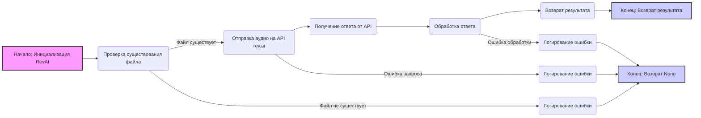

## Анализ кода `hypotez/src/ai/revai/rev_ai.py`

### 1. <алгоритм>

**Описание работы модуля:**

Модуль `rev_ai.py` предназначен для взаимодействия с API сервиса rev.ai, используемого для обработки аудиофайлов (например, транскрибации). Основная функциональность заключается в отправке аудиофайла на сервер rev.ai и получении результата обработки.

**Блок-схема:**



**Пояснения к блок-схеме:**

1.  **Начало: Инициализация `RevAI`**: Создание экземпляра класса `RevAI` с указанием API-ключа.
    *   *Пример*: `revai_instance = RevAI(api_key='YOUR_API_KEY')`

2.  **Проверка существования файла**: Проверяет, существует ли файл по указанному пути.
    *   *Пример*: Если `audio_file_path` равен `path/to/audio.wav` и этот файл существует, переходим к следующему шагу.

3.  **Отправка аудио на API `rev.ai`**: Отправляет запрос на API rev.ai с аудиофайлом для обработки. (В текущей версии закомментировано, используется заглушка).
    *   *Пример*: В реальной версии кода, тут был бы POST запрос к API rev.ai с отправкой файла и заголовками авторизации.

4.  **Логирование ошибки (файл не найден)**: Если файл не найден, записывает ошибку в лог.

5.  **Конец: Возврат `None`**: Возвращает `None` в случае ошибки (файл не найден, ошибка запроса, ошибка обработки).

6.  **Получение ответа от API**: Получает ответ от API rev.ai. (В текущей версии это заглушка).

7.  **Обработка ответа**: Разбирает ответ API (в текущей версии извлекает значение из заглушки).
    *   *Пример*: Из ответа `{"result": "example"}` извлекается `"example"`.

8.  **Возврат результата**: Возвращает обработанный результат.

9.  **Конец: Возврат результата**: Возвращает результат.

10. **Логирование ошибки (ошибка запроса)**: В случае ошибки при запросе к API rev.ai записывает ошибку в лог.

11. **Логирование ошибки (ошибка обработки)**: В случае ошибки при обработке файла записывает ошибку в лог.

### 2. <mermaid>

```mermaid
graph LR
    subgraph src.ai.revai
    RevAI(RevAI Class)
    end
    subgraph src.utils
    j_loads(j_loads)
    j_loads_ns(j_loads_ns)
    j_dumps(j_dumps)
    end
    subgraph src.logger
    logger(logger)
    end
    requests(requests)
    os(os)
    
    RevAI --> j_dumps: Использует для преобразования ответа
    RevAI --> logger: Использует для логирования ошибок
    RevAI --> os: Использует для проверки файла
    RevAI --> requests: Использует для запросов к API
    
    
    style RevAI fill:#f9f,stroke:#333,stroke-width:2px
    style j_loads fill:#ccf,stroke:#333,stroke-width:2px
    style j_loads_ns fill:#ccf,stroke:#333,stroke-width:2px
    style j_dumps fill:#ccf,stroke:#333,stroke-width:2px
    style logger fill:#ccf,stroke:#333,stroke-width:2px
    style requests fill:#ccf,stroke:#333,stroke-width:2px
    style os fill:#ccf,stroke:#333,stroke-width:2px
    
```

**Анализ зависимостей `mermaid`:**

*   **`src.ai.revai.RevAI`**: Основной класс, который инкапсулирует логику взаимодействия с API rev.ai.
*   **`src.utils.j_loads`, `src.utils.j_loads_ns`, `src.utils.j_dumps`**: Функции из модуля `jjson` для работы с JSON (загрузка и выгрузка). Используется только j_dumps в данной версии.
*   **`src.logger.logger`**: Объект логгера для записи информации о работе программы (ошибки, предупреждения).
*   **`requests`**: Библиотека Python для отправки HTTP-запросов.
*   **`os`**: Модуль Python для работы с операционной системой (используется для проверки существования файла).

**Объяснение зависимостей:**

*   `RevAI` использует `j_dumps` для преобразования данных (заглушка),  `logger` для логирования ошибок, `os` для проверки существования файла и `requests` (в закомментированном коде) для отправки запросов к API rev.ai.
*   Все импорты находятся в начале файла.

### 3. <объяснение>

**Импорты:**

*   `from src.utils.jjson import j_loads, j_loads_ns, j_dumps`:
    *   Импортирует функции для работы с JSON из модуля `jjson` в пакете `src.utils`. В данной версии используется только `j_dumps`.
    *   `j_loads`:  преобразует JSON строку в Python объект (не используется в текущей версии).
    *   `j_loads_ns`:  преобразует JSON строку в Python объект, также учитывая namespaces (не используется в текущей версии).
    *   `j_dumps`: преобразует Python объект в JSON строку (используется в текущей версии как заглушка).
    *   Взаимосвязь: `src.utils` - это внутренний пакет проекта, предоставляющий утилиты, такие как работа с JSON.
*   `from src.logger.logger import logger`:
    *   Импортирует объект `logger` для логирования из модуля `logger` в пакете `src.logger`.
    *   Взаимосвязь: `src.logger` - это внутренний пакет проекта, предоставляющий функциональность логирования.
*   `import requests`:
    *   Импортирует библиотеку `requests` для отправки HTTP-запросов.
    *   Взаимосвязь: используется для взаимодействия с API rev.ai (закомментировано в текущей версии).
*   `import os`:
    *   Импортирует модуль `os` для работы с операционной системой.
    *   Взаимосвязь: используется для проверки существования файла.

**Классы:**

*   `class RevAI`:
    *   **Роль**: Инкапсулирует логику взаимодействия с API rev.ai.
    *   **Атрибуты**:
        *   `api_key` (str): API-ключ для доступа к сервису rev.ai.
        *   `base_url` (str): Базовый URL для API rev.ai (требуется замена `YOUR_BASE_URL`).
        *   `headers` (dict): Заголовки HTTP-запросов (требуется настройка, закомментировано в текущей версии).
    *   **Методы**:
        *   `__init__(self, api_key: str)`: Конструктор класса, инициализирует атрибуты `api_key`, `base_url` и `headers`.
        *   `process_audio_file(self, audio_file_path: str) -> dict`: Обрабатывает аудиофайл, отправляя его на API rev.ai, и возвращает результат.
    *   **Взаимодействие**: Использует `requests` для отправки запросов к API rev.ai (в текущей версии это закомментировано). Использует `logger` для логирования, `os` для проверки существования файла и `j_dumps` для преобразования данных (заглушка).

**Функции:**

*   `__init__(self, api_key: str)`:
    *   **Аргументы**:
        *   `api_key` (str): API ключ для доступа к сервису rev.ai.
    *   **Возвращаемое значение**: Нет (конструктор).
    *   **Назначение**: Инициализирует объект `RevAI` с заданным API ключом.
    *   **Пример**: `revai_instance = RevAI(api_key='YOUR_API_KEY')`
*   `process_audio_file(self, audio_file_path: str) -> dict`:
    *   **Аргументы**:
        *   `audio_file_path` (str): Путь к аудиофайлу.
    *   **Возвращаемое значение**:
        *   `dict`: Результат обработки аудиофайла в формате словаря или `None` при ошибке.
    *   **Назначение**: Обрабатывает аудиофайл, отправляя его на API rev.ai, и возвращает результат.
    *   **Пример**: `result = revai_instance.process_audio_file('path/to/audio.wav')`

**Переменные:**

*   `self.api_key` (str): API ключ для доступа к сервису rev.ai.
*   `self.base_url` (str): Базовый URL для API rev.ai (требует замены).
*   `self.headers` (dict): Заголовки HTTP-запросов (требуют настройки).
*   `audio_file_path` (str): Путь к аудио файлу.
*   `response` (dict): Результат обработки аудио файла в формате словаря.
*  `e` (Exception): Объект исключения в блоке try-except.

**Потенциальные ошибки и области для улучшения:**

1.  **Заглушка вместо API запроса**:
    *   Текущая реализация использует заглушку `response = j_dumps('{"result": "example"}')` вместо реального API запроса. Это необходимо заменить на корректную реализацию запроса к API rev.ai с использованием `requests`.
2.  **Отсутствует обработка ответа от API**:
    *   В коде присутствует TODO комментарий, что необходима обработка ответа API. После отправки запроса необходимо проверить код ответа, обработать его и вернуть корректный результат в формате словаря.
3.  **Неполная обработка ошибок**:
    *   Присутствуют обработчики ошибок, но они могут быть более детальными, например, специфичные для разных кодов ответа API.
4.  **Не установлены базовый URL и заголовки**:
    *   Необходимо заменить `YOUR_BASE_URL` на корректный базовый URL для API rev.ai, а также настроить заголовки `self.headers`.
5.  **Нет обработки ошибок при отправке запроса**:
    *   Необходимо обрабатывать ошибки при отправке запроса (например, проблемы с сетью, неверные параметры).
6. **Нет обработки ошибок при чтении файла**
    *   Необходимо обрабатывать ошибки при чтении файла (например, файл недоступен, отсутствует)
7. **Нет проверки типа возвращаемых данных**
    *   Необходимо проверять тип возвращаемых данных, и при необходимости приводить к нужному типу.

**Взаимосвязь с другими частями проекта:**

*   Модуль `rev_ai.py` является частью пакета `src.ai`, который предназначен для работы с искусственным интеллектом.
*   Модуль использует логирование через `src.logger.logger`, что обеспечивает централизованное управление логами.
*   Использует `j_loads, j_dumps` из пакета `src.utils`, для работы с JSON.

**Цепочка взаимосвязей:**

`src.ai.revai` -> `src.utils.jjson` -> `src.logger.logger` -> `requests` -> `os`