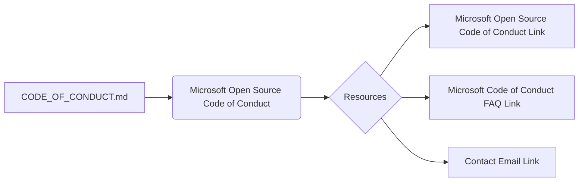

```MD
# Анализ файла CODE_OF_CONDUCT.md

1. **<input code>**

```
# Microsoft Open Source Code of Conduct

This project has adopted the [Microsoft Open Source Code of Conduct](https://opensource.microsoft.com/codeofconduct/).

Resources:

- [Microsoft Open Source Code of Conduct](https://opensource.microsoft.com/codeofconduct/)
- [Microsoft Code of Conduct FAQ](https://opensource.microsoft.com/codeofconduct/faq/)
- Contact [opencode@microsoft.com](mailto:opencode@microsoft.com) with questions or concerns
```

2. **<algorithm>**

Данный код не содержит алгоритма в классическом понимании. Он представляет собой текстовый файл, описывающий принятие кодекса поведения для открытого исходного кода, разработанного Microsoft.  Пошаговая блок-схема не применима.  Данные не передаются между функциями или классами.

3. **<mermaid>**



4. **<explanation>**

* **Импорты:**  Нет импортов. Данный файл - это статический текст, не связанный с другими файлами проекта, за исключением косвенной связи с проектом Microsoft.

* **Классы:** Нет классов.

* **Функции:** Нет функций.

* **Переменные:** Нет переменных.

* **Возможные ошибки или области для улучшений:**  Нет ошибок.  Можно было бы добавить краткое описание конкретных правил кодекса поведения, относящихся к данному проекту.

**Цепочка взаимосвязей с другими частями проекта:**

Файл `CODE_OF_CONDUCT.md` является документом, описывающим правила поведения для проекта.  Связь с другими частями проекта - косвенная, через общие принципы этики, принятые в рамках разработки и поддержания open-source проектов Microsoft.  Он не содержит функций или данных, используемых другими частями кода проекта `tiny_troupe`.  Этот файл скорее служит справочным документом, описывающим рамки поведения разработчиков проекта.  Он необходим для поддержания надлежащих стандартов для разработчиков и пользователей.

**Вывод:**

Данный файл представляет собой документ, а не программный код. Он задаёт правила поведения в рамках проекта и не содержит функциональности в классическом понимании.  Он служит важной частью репозитория, определяя этические рамки для разработки и использования проекта.