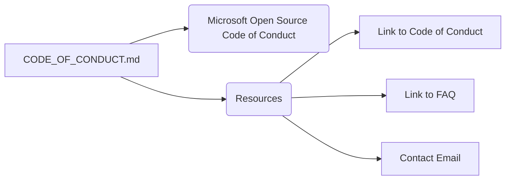

```MD
# Анализ файла CODE_OF_CONDUCT.md

1. **<input code>**:

```
# Microsoft Open Source Code of Conduct

This project has adopted the [Microsoft Open Source Code of Conduct](https://opensource.microsoft.com/codeofconduct/).

Resources:

- [Microsoft Open Source Code of Conduct](https://opensource.microsoft.com/codeofconduct/)
- [Microsoft Code of Conduct FAQ](https://opensource.microsoft.com/codeofconduct/faq/)
- Contact [opencode@microsoft.com](mailto:opencode@microsoft.com) with questions or concerns
```

2. **<algorithm>**:

Этот код не содержит алгоритма в традиционном понимании. Он представляет собой текстовый файл с описанием политики поведения для проекта.  Алгоритм отсутствует, так как нет вычислений или последовательности действий.  Все происходит в рамках отображения информации.

3. **<mermaid>**:



4. **<explanation>**:

* **Импорты**: Нет импортируемых модулей или библиотек. Файл — это просто текстовый документ, описывающий политику поведения.

* **Классы**: Нет классов.

* **Функции**: Нет функций.

* **Переменные**: Нет переменных.

* **Укажите возможные ошибки или области для улучшений**:

    * **Нехватка контекста**:  Файл сам по себе неполный. Он не описывает контекст проекта, к которому относится.  Желательно указать имя проекта или ссылку на репозиторий.
    * **Возможность автоматизации**: Если список ресурсов регулярно обновляется, то использование инструментов для автоматического обновления документации (например, с помощью `README.md` генерации) было бы целесообразно.

* **Цепочка взаимосвязей**:

Файл `CODE_OF_CONDUCT.md` является частью проекта. Его взаимосвязь с другими частями проекта проявляется в том, что он описывает политику поведения для участников проекта.  Он напрямую связан с репозиторием GitHub (или аналогичным) проекта, являясь его частью.  Отсутствие кода на языке программирования означает, что этот файл непосредственно не взаимодействует с другими скриптами или модулями проекта на функциональном уровне.  Связь основана на сообщении о принятой политике.