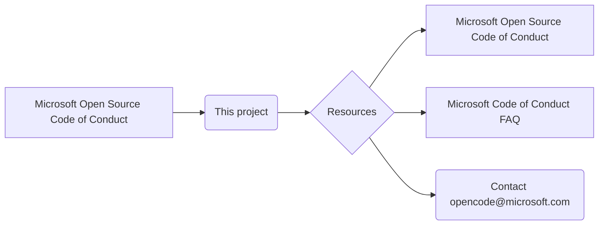

# <input code>

```
# Microsoft Open Source Code of Conduct

This project has adopted the [Microsoft Open Source Code of Conduct](https://opensource.microsoft.com/codeofconduct/).

Resources:

- [Microsoft Open Source Code of Conduct](https://opensource.microsoft.com/codeofconduct/)
- [Microsoft Code of Conduct FAQ](https://opensource.microsoft.com/codeofconduct/faq/)
- Contact [opencode@microsoft.com](mailto:opencode@microsoft.com) with questions or concerns
```

# <algorithm>

Данный код представляет собой текстовый документ, описывающий принятый кодекс поведения для проекта с открытым исходным кодом.  Алгоритма как такового нет, так как нет управляющих структур (циклов, условий) и вычислений.  Все состоит из текстовых строк, ссылок и контактов.

# <mermaid>



# <explanation>

**Импорты**:  Нет импортов, так как это текстовый документ, а не код на языке программирования.

**Классы**: Нет классов.

**Функции**: Нет функций.

**Переменные**: Нет переменных.

**Подробное объяснение:**

Документ представляет собой стандартный файл README.md или подобный, описывающий принятый этим проектом (по всей видимости, открытым исходным кодом) кодекс поведения, согласованный с Microsoft Open Source Code of Conduct.  В нем содержится ссылка на полную версию кодекса поведения Microsoft, ссылку на часто задаваемые вопросы и электронный адрес для контактов в случае возникновения вопросов.

**Цепочка взаимосвязей с другими частями проекта**:

Документ является частью документации проекта.  Он, вероятнее всего, находится в корневом каталоге проекта (например, в папке `hypotez/src/ai/tiny_troupe/TinyTroupe/`) и играет роль руководства по этике для всех участников проекта.  Это стандартная практика для проектов с открытым исходным кодом для обеспечения прозрачности и четких правил поведения.

**Возможные ошибки или области для улучшений**:

* **Нет проверки корректности ссылок.** Необходимо убедиться, что все ссылки актуальны и работают.
* **Не указан конкретный проект.**  Если это отдельный проект, было бы полезно указать его название.
* **Не хватает контекста.** Непонятно, как этот кодекс поведения применяется в процессе работы с этим проектом.

**В целом**: документ правильно оформлен и соответствует ожиданиям, необходимым в подобном контексте. Он выполняет свою задачу – устанавливает стандарт поведения и предоставляет необходимые контакты и ссылки.