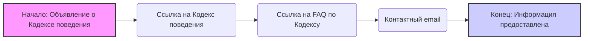

## Анализ кода: CODE_OF_CONDUCT.md

### 1. <алгоритм>

Этот файл не содержит исполняемого кода, а является документом, устанавливающим Кодекс поведения для проекта. Его цель - предоставить руководство по этичному и уважительному взаимодействию участников проекта.

**Блок-схема:**

1. **Начало:** Файл начинается с объявления, что проект использует Кодекс поведения Microsoft Open Source.
    * Пример: `# Microsoft Open Source Code of Conduct`

2. **Ссылка на Кодекс поведения:** Предоставляется гиперссылка на сам Кодекс поведения Microsoft Open Source.
    * Пример: `[Microsoft Open Source Code of Conduct](https://opensource.microsoft.com/codeofconduct/)`

3. **Дополнительные ресурсы:** Даются ссылки на часто задаваемые вопросы (FAQ) о Кодексе и контактный адрес электронной почты для связи с вопросами или проблемами.
    * Пример:
        * `[Microsoft Code of Conduct FAQ](https://opensource.microsoft.com/codeofconduct/faq/)`
        * `Contact [opencode@microsoft.com](mailto:opencode@microsoft.com) with questions or concerns`

4. **Конец:** Файл завершается предоставлением всей необходимой информации.

**Поток данных:**

Файл `CODE_OF_CONDUCT.md` не передает данные в другие компоненты системы. Он является статичным документом. Его предназначение - информировать участников проекта о принятых нормах поведения и предоставить необходимые ресурсы.

### 2. <mermaid>

**Анализ зависимостей:**

В диаграмме `mermaid` нет импортов и зависимостей. Она описывает логическую последовательность блоков, представленных в документе `CODE_OF_CONDUCT.md`, а не взаимодействие программных компонентов.
-   **A**: Начальная точка, которая представляет собой объявление о использовании Кодекса поведения Microsoft Open Source.
-   **B**: Гиперссылка на сам Кодекс поведения.
-   **C**: Гиперссылка на страницу часто задаваемых вопросов (FAQ) о Кодексе.
-   **D**: Адрес электронной почты для связи по вопросам или проблемам, связанным с Кодексом.
-   **E**: Конечная точка, обозначающая завершение предоставления информации.

### 3. <объяснение>

**Импорты:**
Этот файл не содержит импортов, поскольку это Markdown-файл, а не исполняемый код.

**Классы:**
Этот файл не содержит определения классов.

**Функции:**
Этот файл не содержит определения функций.

**Переменные:**
Этот файл не содержит переменных.

**Объяснение:**

Файл `CODE_OF_CONDUCT.md` - это документ, который информирует участников проекта о том, что используется Кодекс поведения Microsoft Open Source. Он предоставляет ссылки на полный текст Кодекса поведения, на FAQ и на контактный адрес электронной почты для сообщений о проблемах.

*   **Назначение:** Основная цель документа - создать безопасную и уважительную среду для всех участников проекта.
*   **Формат:** Файл написан на языке Markdown, что позволяет его легко читать и обрабатывать, и просматривать.
*   **Содержание:** Содержит ссылки на ресурсы, которые помогают участникам понимать и соблюдать правила поведения в проекте.

**Потенциальные ошибки и области для улучшения:**

*   В данном файле нет ошибок.
*   Потенциальные улучшения связаны с динамическим обновлением ссылок на внешние ресурсы, если они изменятся. Однако, этот файл статичен и изменение ссылок должно происходить вручную.

**Взаимосвязь с другими частями проекта:**

*   `CODE_OF_CONDUCT.md` является важным компонентом любого открытого проекта, поскольку определяет правила взаимодействия между участниками. Этот файл взаимодействует с общей документацией проекта, а также используется для информирования и привлечения участников.
*   Этот файл важен для `README.md`, и любого другого файла документации где могут упоминаться условия участия в проекте.
*  Сам `CODE_OF_CONDUCT.md` не зависит от других файлов в проекте, он является самостоятельной сущностью.

В целом, файл `CODE_OF_CONDUCT.md` - это стандартная часть открытого проекта, предоставляющая важную информацию для его участников.