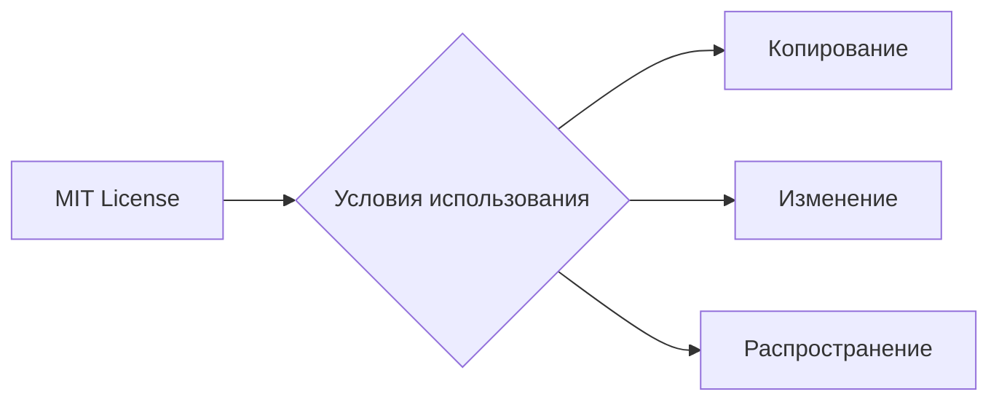

```MD
# Анализ кода

**1. <input code>**

```
    MIT License

    Copyright (c) Microsoft Corporation.

    Permission is hereby granted, free of charge, to any person obtaining a copy
    of this software and associated documentation files (the "Software"), to deal
    in the Software without restriction, including without limitation the rights
    to use, copy, modify, merge, publish, distribute, sublicense, and/or sell
    copies of the Software, and to permit persons to whom the Software is
    furnished to do so, subject to the following conditions:

    The above copyright notice and this permission notice shall be included in all
    copies or substantial portions of the Software.

    THE SOFTWARE IS PROVIDED "AS IS", WITHOUT WARRANTY OF ANY KIND, EXPRESS OR
    IMPLIED, INCLUDING BUT NOT LIMITED TO THE WARRANTIES OF MERCHANTABILITY,
    FITNESS FOR A PARTICULAR PURPOSE AND NONINFRINGEMENT. IN NO EVENT SHALL THE
    AUTHORS OR COPYRIGHT HOLDERS BE LIABLE FOR ANY CLAIM, DAMAGES OR OTHER
    LIABILITY, WHETHER IN AN ACTION OF CONTRACT, TORT OR OTHERWISE, ARISING FROM,
    OUT OF OR IN CONNECTION WITH THE SOFTWARE OR THE USE OR OTHER DEALINGS IN THE
    SOFTWARE
```

**2. <algorithm>**

Данный код не содержит алгоритма в традиционном смысле. Это лицензионный текст, описывающий условия использования программного обеспечения под лицензией MIT.  Алгоритм работы отсутствует.

**3. <mermaid>**



**4. <explanation>**

Этот код — лицензионное соглашение MIT. Он не содержит кода в смысле программных инструкций, а определяет условия, при которых можно использовать, копировать, изменять и распространять программное обеспечение, созданное Microsoft и выпущенное под этой лицензией.

* **Импорты:**  Отсутствуют. Код - это сам по себе лицензионный текст.
* **Классы:** Отсутствуют.
* **Функции:** Отсутствуют.
* **Переменные:** Отсутствуют.
* **Возможные ошибки/улучшения:**  Нет ошибок в смысле программного кода.  Можно рассмотреть вопрос о документировании особенностей лицензии, если это часть документации к проекту.

**Цепочка взаимосвязей:**

Лицензионный файл `LICENSE` находится в репозитории проекта (`hypotez/src/ai/tiny_troupe/TinyTroupe/LICENSE`). Он определяет условия использования программного обеспечения, которое входит в состав проекта.  Связь с другими частями проекта - косвенная: все файлы и код проекта должны подчиняться условиям данной лицензии.