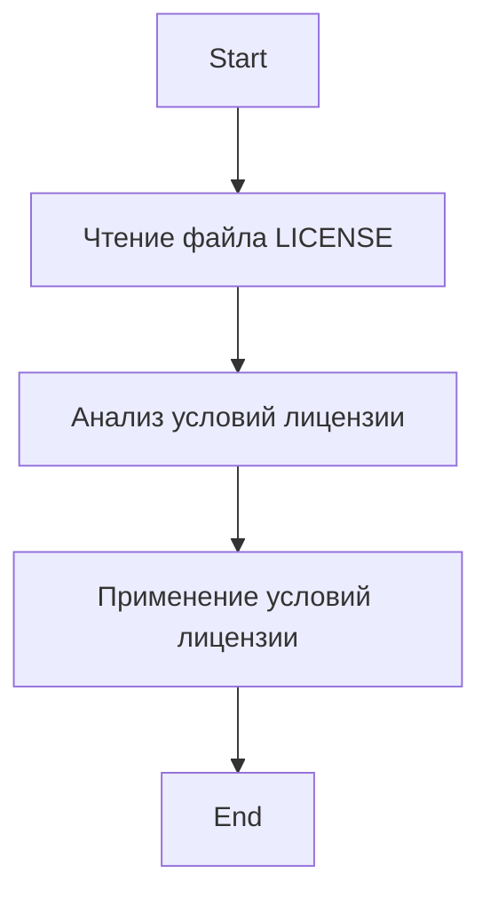

## Анализ файла лицензии `LICENSE`

### 1. **<алгоритм>**

Файл `LICENSE` не содержит исполняемого кода, а представляет собой текст лицензионного соглашения. Алгоритм его "обработки" прост:

1.  **Чтение файла:** Файл читается текстовым редактором или другим программным обеспечением.
2.  **Ознакомление:** Пользователь или программа ознакамливается с условиями лицензии.
3.  **Применение:** Пользователь или программа применяет условия лицензии к использованию, копированию, модификации и распространению программного обеспечения.

**Примеры:**

*   **Чтение файла:** Программа для просмотра текста (например, `cat` в Linux) может открыть и отобразить содержимое файла.
*   **Ознакомление:** Разработчик читает лицензию, чтобы понять свои права и обязанности при использовании кода.
*   **Применение:** Программа, использующая код из этого проекта, должна распространяться с указанием авторских прав и условий лицензирования.

### 2. **<mermaid>**

Диаграмма `mermaid` показывает последовательность действий, связанных с файлом лицензии. 
`ReadFile` представляет чтение файла, `AnalyzeLicense` – анализ его условий, а `ApplyLicense` – применение этих условий к использованию кода.

### 3. **<объяснение>**

Файл `LICENSE` содержит текст лицензионного соглашения MIT License. Рассмотрим его основные аспекты:

*   **Авторские права:**
    *   Указывается, что авторские права принадлежат Microsoft Corporation.
*   **Разрешения:**
    *   Разрешается использовать, копировать, модифицировать, объединять, публиковать, распространять, сублицензировать и/или продавать копии программного обеспечения.
*   **Условия:**
    *   Включение данного уведомления об авторских правах и разрешениях во все копии или существенные части программного обеспечения.
*   **Отказ от ответственности:**
    *   Программное обеспечение предоставляется "как есть", без каких-либо гарантий, выраженных или подразумеваемых.
    *   Авторы или правообладатели не несут ответственности за какие-либо претензии, ущерб или иную ответственность, возникающие в связи с программным обеспечением.

**Цепочка взаимосвязей:**

*   **`LICENSE`** – определяет условия использования проекта `TinyTroupe`.
*   **Использование проекта** – Пользователь или организация, использующая код из проекта `TinyTroupe`, обязаны соблюдать условия, определенные в файле `LICENSE`.
*   **Распространение проекта** – Любое распространение проекта или его частей должно сопровождаться включением текста лицензии.

**Импорты:**

Файл не содержит импортов, поскольку это текст, а не код.

**Классы:**
Файл не содержит классов.

**Функции:**
Файл не содержит функций.

**Переменные:**
Файл не содержит переменных, так как это лицензия, а не программный код.

**Потенциальные ошибки или области для улучшения:**

*   **Недопонимание лицензии:** Самая распространенная ошибка — игнорирование условий лицензии. Пользователи должны убедиться, что они понимают условия и выполняют их.
*   **Отсутствие лицензии:** Если файл лицензии отсутствует, могут возникнуть проблемы с использованием кода. Поэтому этот файл всегда должен присутствовать при распространении.

В целом, файл `LICENSE` не требует детального разбора с точки зрения алгоритмизации, но является ключевым элементом проекта, определяющим права и обязанности пользователей и разработчиков. Он обеспечивает легитимное использование и распространение кода.