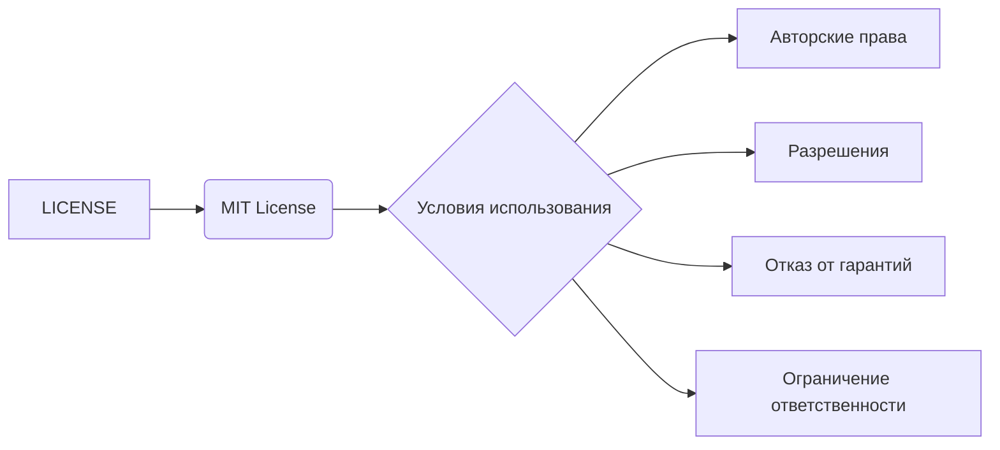

```MD
# Анализ кода (LICENSE)

**1. <input code>**

```
MIT License

Copyright (c) Microsoft Corporation.

Permission is hereby granted, free of charge, to any person obtaining a copy
of this software and associated documentation files (the "Software"), to deal
in the Software without restriction, including without limitation the rights
to use, copy, modify, merge, publish, distribute, sublicense, and/or sell
copies of the Software, and to permit persons to whom the Software is
furnished to do so, subject to the following conditions:

The above copyright notice and this permission notice shall be included in all
copies or substantial portions of the Software.

THE SOFTWARE IS PROVIDED "AS IS", WITHOUT WARRANTY OF ANY KIND, EXPRESS OR
IMPLIED, INCLUDING BUT NOT LIMITED TO THE WARRANTIES OF MERCHANTABILITY,
FITNESS FOR A PARTICULAR PURPOSE AND NONINFRINGEMENT. IN NO EVENT SHALL THE
AUTHORS OR COPYRIGHT HOLDERS BE LIABLE FOR ANY CLAIM, DAMAGES OR OTHER
LIABILITY, WHETHER IN AN ACTION OF CONTRACT, TORT OR OTHERWISE, ARISING FROM,
OUT OF OR IN CONNECTION WITH THE SOFTWARE OR THE USE OR OTHER DEALINGS IN THE
SOFTWARE
```

**2. <algorithm>**

Этот код не содержит алгоритма в традиционном смысле. Это текстовый файл с лицензией MIT, описывающий условия использования, распространения и поддержки данного программного обеспечения.  Алгоритмической обработки данных нет.

**3. <mermaid>**



**4. <explanation>**

Этот файл представляет собой лицензионное соглашение (LICENSE)  типа MIT. Он не содержит кода в привычном понимании, а  определяет условия использования, распространения и копирования ПО. 

* **Импорты:** Нет импортов. Это самостоятельный файл, не зависящий от других файлов.

* **Классы:** Нет классов.

* **Функции:** Нет функций.

* **Переменные:** Нет переменных.

* **Возможные ошибки или области для улучшений:**  Этот файл является стандартной частью проекта, не имеющей ошибок в этом контексте.

* **Цепочка взаимосвязей:** Этот файл используется для описания условий использования кода, который находится в папке `hypotez/src/ai/tiny_troupe/TinyTroupe`. Без доступа к другим файлам проекта, невозможно определить точную связь с другими частями проекта.  Обычно файл LICENSE располагается в корневой папке проекта или папки, содержащей исполняемый код, чтобы описывать условия использования и распространения именно этого кода.


**Вывод:**

Файл LICENSE содержит текстовое описание лицензии MIT. Он не содержит кода, требующего алгоритмической или структурной интерпретации.  Его функция заключается в определении условий использования программного кода, находящегося в той же папке проекта.