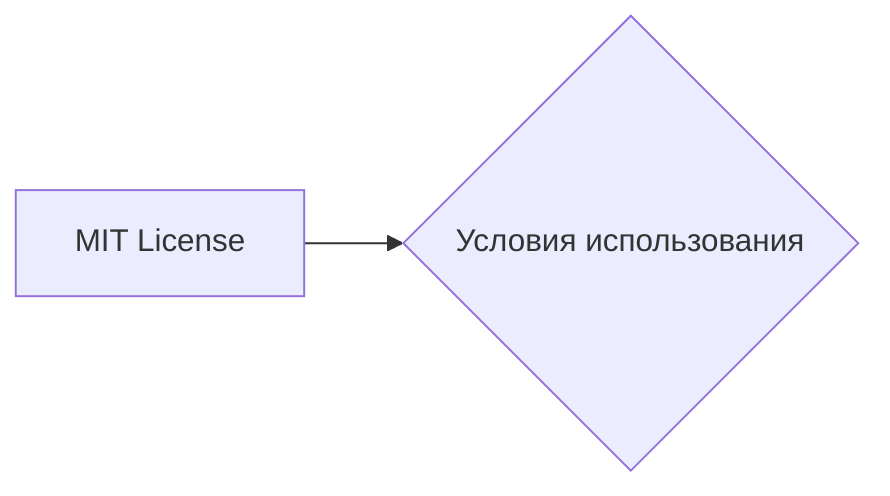

```MD
# Анализ кода

**1. <input code>**

```
    MIT License

    Copyright (c) Microsoft Corporation.

    Permission is hereby granted, free of charge, to any person obtaining a copy
    of this software and associated documentation files (the "Software"), to deal
    in the Software without restriction, including without limitation the rights
    to use, copy, modify, merge, publish, distribute, sublicense, and/or sell
    copies of the Software, and to permit persons to whom the Software is
    furnished to do so, subject to the following conditions:

    The above copyright notice and this permission notice shall be included in all
    copies or substantial portions of the Software.

    THE SOFTWARE IS PROVIDED "AS IS", WITHOUT WARRANTY OF ANY KIND, EXPRESS OR
    IMPLIED, INCLUDING BUT NOT LIMITED TO THE WARRANTIES OF MERCHANTABILITY,
    FITNESS FOR A PARTICULAR PURPOSE AND NONINFRINGEMENT. IN NO EVENT SHALL THE
    AUTHORS OR COPYRIGHT HOLDERS BE LIABLE FOR ANY CLAIM, DAMAGES OR OTHER
    LIABILITY, WHETHER IN AN ACTION OF CONTRACT, TORT OR OTHERWISE, ARISING FROM,
    OUT OF OR IN CONNECTION WITH THE SOFTWARE OR THE USE OR OTHER DEALINGS IN THE
    SOFTWARE
```

**2. <algorithm>**

Этот код не содержит алгоритма в традиционном смысле. Это лицензионное соглашение MIT, описывающее условия использования программного обеспечения.  Алгоритм отсутствует, так как код не представляет собой программу или набор инструкций, выполняющих вычисления или обработку данных.

**3. <mermaid>**



**4. <explanation>**

* **Импорты:**  Нет импортов. Этот код представляет собой лицензионное соглашение, а не фрагмент программы.
* **Классы:** Нет классов.
* **Функции:** Нет функций.
* **Переменные:** Нет переменных.
* **Возможные ошибки или области для улучшений:**  Нет ошибок и областей для улучшения, так как это не исполняемый код, а текст лицензии.

**Цепочка взаимосвязей с другими частями проекта:**

Лицензионное соглашение MIT используется в проектах для обозначения условий использования кода. Этот конкретный фрагмент, будучи частью файла `hypotez/src/ai/tiny_troupe/TinyTroupe/LICENSE`, указывает лицензию для всего проекта TinyTroupe.  Связь проявляется в том, что это заявление о лицензии непосредственно относится к файлам проекта, находящимся в указанном каталоге.

**Заключение:**

Данный код представляет собой лицензию MIT и не содержит алгоритмов, функций или классов в традиционном понимании. Он определяет условия использования, а не функциональность программы.