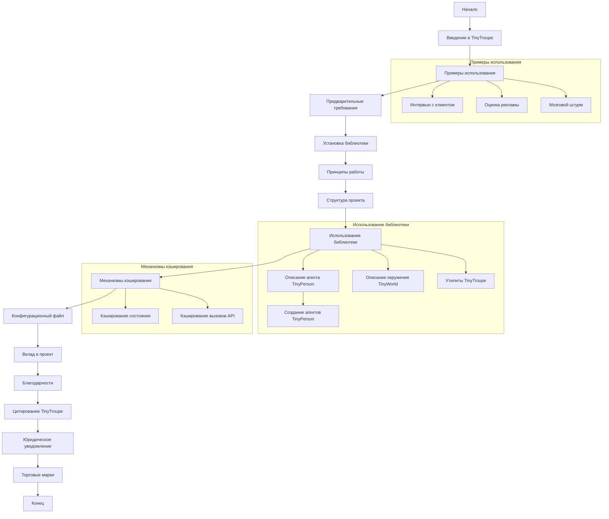

## АНАЛИЗ КОДА:

### 1. <алгоритм>

**Общее описание:**
`README.md` представляет собой подробное описание проекта `TinyTroupe`, библиотеки на Python для симуляции поведения людей с помощью LLM. Документ описывает цели проекта, его возможности, принципы работы, структуру, примеры использования, процесс установки, а также инструкции по внесению вклада и юридические аспекты.

**Пошаговая блок-схема:**

```mermaid
flowchart TD
    Start[Начало] --> Intro[Введение в TinyTroupe: цель, возможности, области применения]
    Intro --> Examples[Примеры использования: интервью, оценка рекламы, мозговой штурм]
    Examples --> Prerequisites[Предварительные требования: Python, API ключи]
    Prerequisites --> Installation[Установка: создание окружения, клонирование репозитория, установка]
    Installation --> Principles[Принципы работы: программный, аналитический, персона-ориентированный, многоагентный, утилитарный, ориентированный на эксперименты]
    Principles --> ProjectStructure[Структура проекта: `/tinytroupe`, `/tests`, `/examples`, `/data`, `/docs`]
    ProjectStructure --> Usage[Использование библиотеки: `TinyPerson`, `TinyWorld`, утилиты]
    Usage --> Caching[Кэширование: состояния симуляции, API вызовов]
     Caching --> Config[Конфигурационный файл `config.ini`: API type, модели, логи]
    Config --> Contributing[Вклад в проект: рекомендации, соглашение CLA]
    Contributing --> Acknowledgements[Благодарности: участники, вкладчики]
    Acknowledgements --> Citation[Как цитировать: библиография, текст]
    Citation --> LegalDisclaimer[Юридическое уведомление: использование только для исследований, ограничения]
    LegalDisclaimer --> Trademarks[Торговые марки: правила использования]
     Trademarks --> End[Конец]
     
    
    
    subgraph "Примеры использования"
        Examples --> Example1[Интервью с клиентом]
         Examples --> Example2[Оценка рекламы для TV]
         Examples --> Example3[Продуктовый brainstorming]
    end

     subgraph "Использование библиотеки"
        Usage --> TinyPerson[Описание `TinyPerson` - агента, способы создания]
        TinyPerson --> TinyPersonCreation[Примеры создания агентов: из примеров, через `TinyPersonFactory`]
        Usage --> TinyWorld[Описание `TinyWorld` - окружения, примеры использования]
        Usage --> Utilities[Утилиты: `TinyPersonFactory`, `TinyTool`, `TinyStory`, `TinyPersonValidator` и т.д.]
    end

    subgraph "Кэширование"
        Caching --> CachingState[Кэширование состояния симуляции: `control.begin()`, `control.checkpoint()`, `control.end()`]
        Caching --> CachingAPI[Кэширование вызовов LLM API:  `openai_utils.force_api_cache()`]
    end
    
```
**Примеры в блоках:**

- **Введение в TinyTroupe:** Описывается, что это библиотека для симуляции людей на основе LLM, приводятся примеры применения в рекламе, тестировании, обучении, управлении продуктами и т.д.
- **Примеры использования:**
    - **Интервью:** Моделируется диалог между бизнес-консультантом и банкиром для сбора информации.
    - **Оценка рекламы:** Анализируются различные варианты рекламных объявлений для выбора лучшего.
    - **Мозговой штурм:** Симулируется обсуждение новых функций для Microsoft Word.
- **Предварительные требования:** Необходимость Python 3.10+, Anaconda, Azure OpenAI или OpenAI API ключей.
- **Установка:** Инструкции по созданию conda окружения, клонированию репозитория и локальной установке.
- **Принципы работы:** Программный, аналитический, на основе персон, многоагентный, с множеством утилит, ориентированный на эксперименты.
- **Структура проекта:** Описываются папки `/tinytroupe`, `/tests`, `/examples`, `/data`, `/docs`.
- **Использование библиотеки:**
    - `TinyPerson`: создаются агенты с индивидуальными характеристиками. Приведены примеры создания через готовые билдеры и с помощью `TinyPersonFactory`.
    - `TinyWorld`: создаются окружения для взаимодействия агентов, пример общения между Lisa и Oscar.
    - **Утилиты:** Описываются вспомогательные механизмы для работы с агентами и симуляциями.
- **Кэширование:** Описываются механизмы кэширования состояния симуляции и вызовов LLM API для снижения затрат.
- **Конфигурационный файл:** Описывается роль `config.ini` в настройке параметров библиотеки.
- **Вклад в проект:** Инструкции по внесению вклада в проект, включая соглашение CLA и кодекс поведения.
- **Благодарности:** Перечисляются основные участники проекта и вкладчики.
- **Цитирование:** Указания, как цитировать TinyTroupe в научных работах.
- **Юридическое уведомление:** Заявление об ограничениях использования, ответственности пользователя и запрещенных видах использования.
- **Торговые марки:** Правила использования товарных знаков Microsoft и сторонних организаций.

### 2. <mermaid>



**Анализ зависимостей:**

Диаграмма `mermaid` показывает логическую последовательность разделов документа `README.md`. Каждый блок представляет собой ключевую тему,  которая раскрывает функциональность библиотеки. Зависимости выражены в виде последовательности блоков, где каждый блок опирается на предыдущий, создавая логичную структуру понимания проекта.

Например, раздел **"Примеры использования"** зависит от общего **"Введения в TinyTroupe"**, поскольку примеры иллюстрируют функциональность, описанную во введении. Аналогично, **"Установка библиотеки"** опирается на **"Предварительные требования"**, а раздел **"Использование библиотеки"** на **"Структуру проекта"**. Блок **"Механизмы кэширования"** зависит от **"Использование библиотеки"**, поскольку кэширование используется для ускорения работы библиотеки. Последние блоки, такие как **"Вклад в проект"**, **"Благодарности"**, **"Цитирование TinyTroupe"**, **"Юридическое уведомление"** и **"Торговые марки"**, зависят от понимания проекта в целом.

**Описание переменных:**

- `Start`, `End`: Начало и конец процесса.
- `Intro`: Введение в TinyTroupe.
- `Examples`: Примеры использования TinyTroupe.
- `Prerequisites`: Предварительные требования.
- `Installation`: Процесс установки.
- `Principles`: Принципы работы TinyTroupe.
- `ProjectStructure`: Структура проекта.
- `Usage`: Раздел об использовании библиотеки.
-   `TinyPerson`: Описание агента `TinyPerson`
-  `TinyPersonCreation`: Создание агентов
-  `TinyWorld`: Описание окружения `TinyWorld`
-  `Utilities`: Утилиты TinyTroupe
- `Caching`: Раздел о механизмах кэширования.
-  `CachingState`: Кэширование состояния
-  `CachingAPI`: Кэширование вызовов API
- `Config`: Конфигурационный файл.
- `Contributing`: Информация о вкладе в проект.
- `Acknowledgements`: Благодарности.
- `Citation`: Информация о цитировании.
- `LegalDisclaimer`: Юридическое уведомление.
- `Trademarks`: Раздел о торговых марках.
- `Example1`, `Example2`, `Example3`: Подразделы в разделе Examples, демонстрирующие разные примеры
   
### 3. <объяснение>

**Импорты:**

В предоставленном коде нет явных `import` операторов, так как это файл `README.md`, а не программный код. Однако, в описании подразумевается использование других модулей и пакетов из проекта `tinytroupe`, таких как `tinytroupe.examples`, `tinytroupe.factory`, `tinytroupe.control`, `tinytroupe.openai_utils`.

**Классы:**

- `TinyPerson`: Класс, представляющий собой симулируемого человека с набором характеристик, таких как возраст, профессия, личностные черты и цели.
- `TinyWorld`: Класс, представляющий собой окружение, в котором взаимодействуют агенты `TinyPerson`.
- `TinyPersonFactory`: Класс для создания агентов `TinyPerson` с помощью LLM.
- `TinyTool`, `TinyStory`, `TinyPersonValidator`, `ResultsExtractor`, `ResultsReducer`: Утилитарные классы для работы с симуляциями.

**Функции:**

- `create_lisa_the_data_scientist()`: Функция из `tinytroupe.examples` для создания агента, представляющего собой data scientist по имени Lisa.
- `generate_person()`: Метод класса `TinyPersonFactory` для создания агента на основе текстового описания.
- `listen()`, `see()`, `act()`: Методы класса `TinyPerson` для взаимодействия с окружением.
- `listen_and_act()`: Метод класса `TinyPerson`, объединяющий прослушивание и действие.
- `make_everyone_accessible()`: Метод класса `TinyWorld`, делающий всех агентов доступными для общения друг с другом.
- `run()`: Метод класса `TinyWorld` для запуска симуляции на определенное количество шагов.
- `control.begin()`, `control.checkpoint()`, `control.end()`: Функции для управления кэшированием состояния симуляции.
- `openai_utils.force_api_cache()`: Функция для включения кэширования LLM API вызовов.

**Переменные:**

- `lisa`, `oscar`: Экземпляры класса `TinyPerson`, представляющие собой конкретных агентов.
- `world`: Экземпляр класса `TinyWorld`, представляющий собой окружение для агентов.
- `factory`: Экземпляр класса `TinyPersonFactory` для создания агентов.
- `config.ini`: Файл конфигурации для настройки параметров библиотеки.
-  `CACHE_FILE_NAME`: Имя файла для кэширования состояния симуляции.

**Объяснение:**

-   `TinyTroupe` представляет собой библиотеку для создания симуляций людей, управляемых LLM. Библиотека предоставляет инструменты для создания агентов (`TinyPerson`), окружений (`TinyWorld`), а также вспомогательные механизмы для управления и анализа симуляций.
-   Основная идея `TinyTroupe` заключается в том, чтобы использовать LLM для моделирования поведения людей в различных сценариях с целью получения инсайтов и анализа.
-   Библиотека ориентирована на эксперименты, позволяя пользователям настраивать различные параметры и анализировать результаты.
-   Библиотека предоставляет множество утилит, включая возможность кэширования симуляций и вызовов LLM API, что повышает ее эффективность.
-   Проект находится в стадии активной разработки и открыт для вклада со стороны сообщества.

**Потенциальные ошибки или области для улучшения:**
- Документация указывает на то, что проект находится на ранней стадии разработки и API подвержен частым изменениям, что может создавать неудобства при использовании.
- Необходимо расширить количество примеров и улучшить документацию для более простого освоения библиотеки.
- Требуется более глубокая проработка механизмов памяти, аргументации и взаимодействия с внешним миром.
- Необходимо больше тестов, особенно функциональных для демонстрации новых сценариев.
- Важно стабилизировать API со временем и обеспечить большую консистентность.
- Поддержка других LLM помимо Azure OpenAI и OpenAI может быть полезна для более широкого использования.

**Взаимосвязи с другими частями проекта:**
-   `TinyTroupe` взаимодействует с LLM API (Azure OpenAI или OpenAI) для генерации поведения агентов.
-   Симуляции `TinyTroupe` используют файлы конфигурации `config.ini` для настройки параметров.
-   Результаты симуляций могут быть использованы для различных целей, таких как анализ данных, оценка рекламы, обучение и управление проектами.
-   Содержание и структура `README.md` напрямую связаны с структурой и содержимым пакета `tinytroupe` и других каталогов проекта (`/tests`, `/examples`, `/data`, `/docs`).