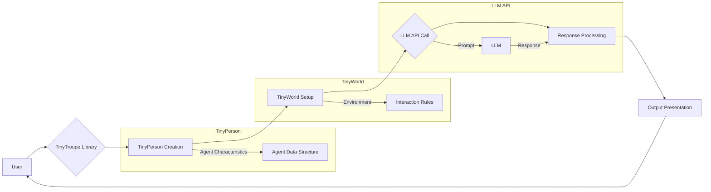

```MD
# TinyTroupe 🤠🤓🥸🧐

## <input code>

```
# TinyTroupe 🤠🤓🥸🧐
*LLM-powered multiagent persona simulation for imagination enhancement and business insights.*
… (rest of the code)
```

## <algorithm>

A detailed algorithm for the TinyTroupe library isn't readily apparent from the provided README.md file, which primarily focuses on describing the library's purpose, usage examples, and installation instructions. The README describes *how* to use the library, but not *how* it works internally.  The core logic of the TinyTroupe library is implemented in Python code (not included in the README). It's probable that the algorithm involves:

1. **Agent Creation (TinyPerson):** Defining characteristics (age, occupation, personality, etc.) of simulated agents using a configurable structure.  This would likely involve creating a data structure representing each agent.
2. **Environment Setup (TinyWorld):** Defining the context in which the agents operate (e.g., a chat room, a business meeting).  This would involve setting up the interactions and stimuli within that environment.
3. **Interaction Orchestration:**  Triggering agent interactions (e.g., asking questions, making statements).  This would likely involve a loop that iterates through agents, asking them to respond to each other, or the user.
4. **LLM Interaction:** Sending prompts (natural language) to a Large Language Model (e.g., GPT-4), leveraging the LLM's ability to simulate realistic agent behavior based on the defined personas.
5. **Response Processing:** Receiving a response from the LLM, parsing the response, and assigning actions (e.g., talking, thinking).
6. **Output Presentation:** Displaying the interaction logs, conversation outputs, or other relevant data to the user.

A significant portion of the algorithm relies on LLM processing, which isn't readily described in a step-by-step format.

## <mermaid>



This Mermaid diagram represents a high-level interaction.  It shows the flow of data and control, but lacks crucial details on how agent characteristics are defined in `TinyPerson`, how interaction rules are set in `TinyWorld`, and the specific format of the LLM's response processing.

## <explanation>

**1. Imports:**  The README doesn't show any import statements.  Import statements would likely be within the Python code itself, and would bring in libraries for interacting with the LLM (e.g., Azure OpenAI or OpenAI's Python client), data structures, etc. This would also include imports for the TinyPerson and TinyWorld classes as well as any other helper utility classes.

**2. Classes:**

*   **TinyPerson:** Represents a simulated person with characteristics.  The provided example code snippet demonstrates defining attributes like "age", "occupation", and "personality traits."  These attributes are likely used in constructing the prompts to the LLM.
*   **TinyWorld:**  Represents the environment in which `TinyPerson`s interact.  The examples show how to create a world and add `TinyPerson`s. This class controls interactions and how agents are manipulated to interact.


**3. Functions:**

The README outlines usage examples (e.g., `create_lisa_the_data_scientist`, `generate_person`) rather than defining them precisely. These functions would likely reside within Python modules and serve to create new agents, specify world properties, or manage the execution of simulations.


**4. Variables:**

Variables would hold data related to agents, environments, and the results of LLM interactions. The type would depend on their role. For example, environment settings would be strings, lists, dictionaries, or objects holding configuration data.

**5. Possible Errors and Improvements:**

*   **LLM Errors:** The code is vulnerable to errors returned by the LLM, such as API rate limits, connection problems, or model errors (especially if no content filtering is used). The error handling needs to be robust.
*   **Prompt Engineering:**  Crafting effective prompts is crucial for good simulation quality.  More detailed and specific prompts would improve agent behavior and prevent unintended results.
*   **Data Validation:** Mechanisms for validating the simulated agents' data and the outputs of LLM interactions would ensure the integrity of the simulation results.
*   **Scalability:** The design should consider how to scale the simulation to accommodate more agents and complex interactions.

**6. Relationships with other parts of the project:**

The library depends on external LLM APIs (Azure OpenAI or OpenAI).  The `config.ini` file allows customizing the LLM provider, model, API keys, etc.,  potentially providing configuration for other parts of the system.  Testing mechanisms are present, as indicated by the `/tests` directory, demonstrating a connection to testing frameworks. Examples in the `/examples` folder illustrate usage scenarios. The `data` directory might contain data needed for these examples.

**Overall:** The README provides a high-level overview of TinyTroupe, but the internal implementation details and specific algorithms are not fully described in this markdown file.