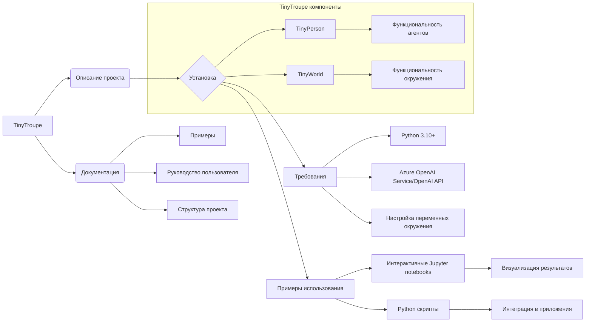

```MD
# Анализ кода TinyTroupe

## <input code>

```
# TinyTroupe 🤠🤓🥸🧐
*LLM-powered multiagent persona simulation for imagination enhancement and business insights.*
... (остальной текст README.md)
```

## <algorithm>

К сожалению, предоставленный код - это README.md файл, содержащий описание проекта, а не код программы.  Поэтому построить блок-схему алгоритма невозможно.  README.md описывает принципы работы, примеры использования и установку библиотеки TinyTroupe.

## <mermaid>



**Описание диаграммы:**

Диаграмма показывает взаимосвязи компонентов и зависимостей проекта TinyTroupe.  Главный узел - TinyTroupe. Зависимости (требования) описывают необходимое ПО для работы проекта, а также способы взаимодействия с Azure OpenAI Service и OpenAI API.  Описание проекта, установка, примеры, документация и структура проекта образуют общую архитектуру.  Внутри подграфа показаны основные классы TinyTroupe: `TinyPerson` (агенты) и `TinyWorld` (окружение), и их связи с функциональными возможностями.  Диаграмма отражает, что проект ориентирован на использование Jupyter notebooks для демонстрации и интерактивной работы с симуляцией.

## <explanation>

**Импорты:**

В коде нет импортов, так как он представляет собой README-файл. В коде, который будет использовать библиотеку, вероятно, будут импорты для классов `TinyPerson`, `TinyWorld` и других связанных модулей.

**Классы:**

Описание `TinyPerson` и `TinyWorld` в файле описывает абстракции, которые, по всей видимости, являются ключевыми классами библиотеки.  `TinyPerson` представляет собой искусственного агента с определенными характеристиками (личность, интересы, цели), а `TinyWorld` - окружение, в котором агенты взаимодействуют.


**Функции:**

README-файл описывает *возможности* библиотеки и примеры её применения, а не конкретные функции с аргументами и возвращаемыми значениями.  Примеры кода в README показывают примеры инициализации агентов, заданий им целей и взаимодействия, а не описание функций.


**Переменные:**

README содержит упоминание переменных окружения `AZURE_OPENAI_KEY`, `AZURE_OPENAI_ENDPOINT`, `OPENAI_API_KEY`.  Эти переменные используются для аутентификации в API Azure OpenAI Service или OpenAI.

**Возможные ошибки и улучшения:**

* **Отсутствие кода:** README не содержит кода, который можно проанализировать для выявления ошибок.
* **Недостаточная документация:**  Хотя README описывает возможности, не хватает детального описания API для программистов, которые хотят использовать библиотеку.
* **Неясная архитектура:** README не содержит подробного описания взаимосвязей между классами и модулями, что затрудняет понимание внутренней структуры.
* **Необходимость более полного README:**  Для более глубокого анализа необходимо предоставить сам код, а не только описание проекта.

**Связи с другими частями проекта:**

Библиотека TinyTroupe взаимодействует с LLM-API (Azure OpenAI или OpenAI) для генерации текста, а также, возможно, с другими библиотеками для работы с данными, например, для работы с Jupyter notebooks.  Структура проекта подразумевает существование файлов тестов (`tests`) и примеров (`examples`), что указывает на наличие тестового процесса и практических примеров использования библиотеки.  Также упоминается файл конфигурации `config.ini`, что предполагает настройку параметров.