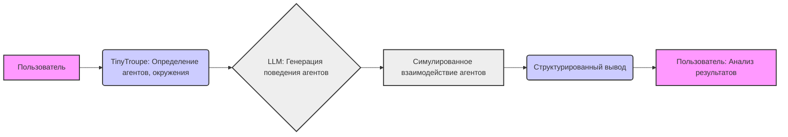

## TinyTroupe: Responsible AI FAQ

### 1. <алгоритм>

**Блок-схема:**

1.  **Начало**: Пользователь начинает взаимодействие с TinyTroupe, определяя цели симуляции.
    *   _Пример:_ Пользователь хочет изучить, как различные типы потребителей реагируют на новый продукт.
2.  **Определение агентов**: Пользователь задает параметры персонажей (`TinyPerson`), включая их характеристики (возраст, интересы, цели).
    *   _Пример:_ Создается `TinyPerson` с характеристиками "молодой", "интересуется технологиями", "цель - купить гаджет".
3.  **Определение окружения**: Пользователь описывает среду (`TinyWorld`), где будут взаимодействовать агенты.
    *   _Пример:_ Определяется среда как "виртуальный магазин электроники".
4.  **Запуск симуляции**: TinyTroupe начинает симуляцию, используя LLM (например, GPT-4) для генерации поведения агентов.
    *   _Пример:_ Агенты начинают "посещать" виртуальный магазин, просматривать товары, общаться.
5.  **Взаимодействие**: Агенты общаются друг с другом и/или с пользователем, генерируя мысли и реплики.
    *   _Пример:_ Агент спрашивает у другого агента мнение о новом гаджете.
6.  **Анализ вывода**: TinyTroupe предоставляет структурированный вывод, включая мысли агентов, их реплики и аналитические данные (например, суммаризацию разговоров).
    *   _Пример:_ Выводится JSON с мнениями агентов о продукте, их интересами и целями.
7.  **Оценка**: Пользователь анализирует выходные данные для достижения целей исследования.
    *   _Пример:_ Пользователь анализирует реакцию агентов на продукт, их возражения и интересы.
8.  **Завершение**: Симуляция завершена, и пользователь получает все необходимые данные.

**Поток данных:**

Пользователь → (Описание персонажей, окружения) → TinyTroupe → (Симуляция с использованием LLM) → (Мысли, реплики агентов) → (Структурированный вывод) → Пользователь

### 2. <mermaid>

**Объяснение `mermaid` диаграммы:**

*   **Пользователь**: Представляет пользователя, который взаимодействует с TinyTroupe.
*   **TinyTroupe: Определение агентов, окружения**: Представляет этап, где TinyTroupe настраивается с помощью входных данных пользователя.
*   **LLM: Генерация поведения агентов**: Представляет использование LLM для симуляции действий и поведения агентов.
*   **Симулированное взаимодействие агентов**: Обозначает этап, когда агенты взаимодействуют друг с другом и генерируют данные.
*   **Структурированный вывод**: Представляет результат работы TinyTroupe в структурированном формате для анализа.
*   **Пользователь: Анализ результатов**: Представляет заключительный этап, где пользователь анализирует полученные результаты.

**Зависимости:**

*   Диаграмма показывает последовательный поток данных от пользователя через различные этапы TinyTroupe к конечному анализу.
*   Главная зависимость - TinyTroupe зависит от LLM для генерации симуляций, а пользователи зависят от TinyTroupe для создания и анализа симуляций.

### 3. <объяснение>

#### Импорты:

В предоставленном тексте нет импортов, так как это файл `markdown` с описанием концепции. TinyTroupe использует внешние API (LLM) и, вероятно, внутри себя имеет модули, но в этом документе они не специфицированы.

#### Классы:

*   `TinyPerson`: Представляет собой класс для описания искусственных агентов, у которых есть атрибуты, такие как возраст, национальность, местоположение, интересы, работа и т.д. Его методы (не специфицированы в этом тексте) позволяют симулировать мысли и слова этих агентов. `TinyPerson` является основой симуляции и, вероятно, содержит методы для взаимодействия с LLM.
*   `TinyWorld`: Представляет собой класс для описания среды, в которой агенты взаимодействуют. Он может содержать данные о месте, времени и других параметрах, влияющих на симуляцию. Методы этого класса позволяют моделировать взаимодействие агентов в определенном окружении.

#### Функции:

В данном документе нет описания конкретных функций, так как это FAQ. Однако, можно предположить, что в коде TinyTroupe могут быть функции для:

*   Создания экземпляров `TinyPerson` и `TinyWorld`.
*   Запуска симуляции.
*   Генерации мыслей и реплик агентов с помощью LLM.
*   Извлечения структурированных данных из результатов симуляции.

#### Переменные:

В тексте документа явно не описываются конкретные переменные, но можно предположить, что в коде есть:

*   Переменные для хранения параметров персонажей (`TinyPerson`).
*   Переменные для хранения параметров окружения (`TinyWorld`).
*   Переменные для хранения промежуточных результатов симуляции.

#### Объяснение:

TinyTroupe – это экспериментальная библиотека на Python, которая позволяет имитировать людей с разными характерами, интересами и целями. Она использует LLM для генерации реалистичного поведения. Цель TinyTroupe – понимание поведения человека, а не прямая поддержка. Она предназначена для анализа, генерации синтетических артефактов, и исследования различных возможностей вычислительных когнитивных архитектур.

**Ключевые моменты:**

*   **Не является AI/ML моделью:** TinyTroupe использует внешние API, а не является моделью сама по себе.
*   **Цель:** Исследование и анализ поведения, а не реальное взаимодействие с пользователями.
*   **Настраиваемость:**  Персоны и окружение настраиваются под конкретные нужды.
*   **Вывод:**  Предоставляется структурированный вывод для дальнейшего анализа.
*   **Ограничения:** Не гарантируется соответствие реальному человеческому поведению и есть риск потенциально вредоносного вывода.
*   **Ответственность:** Пользователи, применяющие TinyTroupe в своих продуктах, должны реализовывать свои собственные меры безопасности.

**Цепочка взаимосвязей:**

1.  Пользователь описывает персонажей и окружение.
2.  TinyTroupe использует эти данные для симуляции.
3.  LLM генерирует поведение агентов на основе этих данных.
4.  Результаты симуляции анализируются пользователем.
5.  TinyTroupe также может быть использована для тестирования других AI систем, особенно в контексте вредоносного поведения.

**Потенциальные ошибки и улучшения:**

*   **Безопасность:** Текст подчеркивает необходимость пользовательских мер безопасности, так как TinyTroupe не ограничивает вредоносные выходы. Необходимы более строгие правила для обработки входных данных, а также механизмы для контроля выходных данных.
*   **Реализм:** TinyTroupe не гарантирует соответствие реальному человеческому поведению, что может быть ограничением для определенных видов исследований. Можно улучшить модели, чтобы приблизить их поведение к реальному.
*   **Интеграция:** Улучшить интеграцию с другими инструментами и API, включая улучшение структурирования вывода.
*   **Тестирование:** Разработка более обширных сценариев и unit-тестов для обеспечения надежности библиотеки.