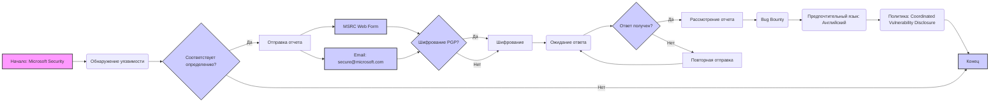

## Анализ файла `SECURITY.md`

### <алгоритм>

1. **Начало**: Документ начинается с общего заявления о серьезном отношении Microsoft к безопасности своих программных продуктов и сервисов, включая репозитории на GitHub.
   * _Пример_: Упоминание организаций GitHub: Microsoft, Azure, DotNet, AspNet и Xamarin.
2. **Обнаружение уязвимости**: Описывается, что делать, если пользователь обнаружил уязвимость, соответствующую определению Microsoft.
   * _Пример_: Ссылка на определение безопасности Microsoft: [https://aka.ms/security.md/definition](https://aka.ms/security.md/definition).
3. **Сообщение об уязвимости**:  Подчеркивается, что о найденных уязвимостях нельзя сообщать через публичные issue на GitHub.
    * _Пример_: Четкое указание, что не нужно использовать публичные issue на GitHub.
4. **Отправка отчета**: Указывается, куда именно следует отправлять отчет об уязвимости, включая ссылку на Microsoft Security Response Center (MSRC).
    * _Пример_: Ссылка для отправки отчета: [https://msrc.microsoft.com/create-report](https://aka.ms/security.md/msrc/create-report) и адрес электронной почты: `secure@microsoft.com`.
5. **Шифрование сообщения**: Предлагается шифровать сообщения с помощью PGP ключа, с предоставлением ссылки на ключ.
    * _Пример_: Ссылка на страницу PGP ключа: [https://aka.ms/security.md/msrc/pgp](https://aka.ms/security.md/msrc/pgp).
6. **Ожидание ответа**: Указывается, что ответ должен поступить в течение 24 часов, и при отсутствии ответа нужно отправить повторное письмо.
   * _Пример_: Инструкция о действиях, если не получен ответ в течение 24 часов.
7. **Предоставляемая информация**: Описывается, какую информацию нужно включить в отчет об уязвимости для быстрого рассмотрения.
    * _Пример_: Тип уязвимости, полный путь к файлам, местоположение кода, способ воспроизведения, proof-of-concept, воздействие уязвимости.
8. **Bug bounty**:  Упоминается программа Bug Bounty, где более подробные отчеты могут принести более высокое вознаграждение.
    * _Пример_: Ссылка на программу Bug Bounty: [https://aka.ms/security.md/msrc/bounty](https://aka.ms/security.md/msrc/bounty).
9. **Предпочтительный язык**:  Указывается, что предпочтительный язык для общения - английский.
    * _Пример_: Указание, что коммуникация должна быть на английском.
10. **Политика**: Указывается, что Microsoft придерживается принципа Coordinated Vulnerability Disclosure.
    * _Пример_: Ссылка на принцип: [https://aka.ms/security.md/cvd](https://aka.ms/security.md/cvd).
11. **Конец**: Конец документа.

### <mermaid>

**Зависимости в диаграмме:**

*   Диаграмма не имеет импортов, так как она является визуальным представлением процесса, описанного в текстовом файле `SECURITY.md`.
*   Каждый блок на диаграмме представляет собой шаг в процессе обнаружения и сообщения об уязвимости, а стрелки указывают на порядок выполнения шагов.
*   `A` - начало процесса.
*   `B` - шаг обнаружения потенциальной уязвимости.
*  `C` - Проверка, соответствует ли уязвимость определению Microsoft.
*   `D` -  шаг отправки отчета об уязвимости.
*   `E` -  конец процесса.
*   `F` - отправка отчета через веб-форму MSRC.
*   `G` -  отправка отчета по email.
*    `H` - Проверка, нужно ли использовать PGP шифрование.
*   `I` -  шаг применения шифрования.
*   `J` - шаг ожидания ответа.
*  `K` - Проверка, получен ли ответ.
*   `L` - шаг рассмотрения отчета об уязвимости.
*   `M` - шаг повторной отправки, если не получен ответ.
*   `N` - шаг про bug bounty.
*   `O` - шаг указания на предпочитаемый язык.
*   `P` - шаг указания на политику.

### <объяснение>

**Объяснение:**

*   **Файл `SECURITY.md`**: Этот файл является стандартным файлом безопасности, который часто встречается в репозиториях на GitHub. Он предназначен для того, чтобы информировать пользователей о том, как правильно сообщать об уязвимостях безопасности в проекте.
*   **Структура документа**: Документ разбит на разделы, которые описывают различные аспекты процесса отчетности об уязвимостях.
*   **Импорты**: В данном файле нет импортов, так как это обычный markdown-файл, а не код.
*   **Классы**: В файле нет классов, так как это обычный markdown-файл, а не код.
*   **Функции**: В файле нет функций, так как это обычный markdown-файл, а не код.
*   **Переменные**:  В файле нет переменных.
*   **Ключевые аспекты**:
    *   **Безопасность**: Подчеркивается важность безопасности и ответственность Microsoft за свои продукты.
    *   **Непубличное сообщение**: Обязательное требование сообщать об уязвимостях через MSRC, а не через публичные issue.
    *   **Инструкции**: Предоставляются четкие инструкции о том, как и куда отправлять отчеты, а также какую информацию следует предоставлять.
    *   **Ответственность**: Microsoft обязуется отвечать на сообщения об уязвимостях в течение 24 часов.
    *   **Bug Bounty**: Упоминается программа вознаграждений за найденные уязвимости.
    *   **Стандарты**: Указываются стандарты, которым следует Microsoft в отношении раскрытия уязвимостей.
* **Потенциальные ошибки или области для улучшения**:
   * **Отсутствие автоматизации**: Все процессы ручные, что может замедлить процесс.
   * **Зависимость от почты**: Зависимость от электронной почты может привести к пропуску писем, если есть проблемы с почтовыми серверами.
*   **Взаимосвязь с другими частями проекта**:
    *   Этот файл является частью метаданных проекта и напрямую не взаимодействует с кодом, но является важной частью процесса обеспечения безопасности проекта. Он косвенно связан с процессом разработки, поскольку информирует о том, как следует поступать в случае обнаружения уязвимостей, и стимулирует разработчиков и сообщество обеспечивать безопасность кода.

Этот анализ предоставляет полное понимание назначения и содержания файла `SECURITY.md`.