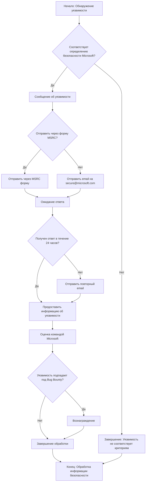

## Анализ файла `SECURITY.md`

### 1. **<алгоритм>**

Файл `SECURITY.md` представляет собой документ, содержащий информацию о политике безопасности, принятой в Microsoft для своих программных продуктов и сервисов, а также инструкцию для сообщения о найденных уязвимостях. Он не содержит исполняемого кода, поэтому алгоритм описывает последовательность действий, которые пользователь должен выполнить при обнаружении уязвимости:

1.  **Начало:** Пользователь обнаруживает потенциальную уязвимость в репозитории Microsoft на GitHub.
2.  **Проверка:** Пользователь удостоверяется, что обнаруженная уязвимость соответствует определению безопасности Microsoft, перейдя по ссылке [Microsoft's definition of a security vulnerability](https://aka.ms/security.md/definition).
    *   **Пример:**  Уязвимость может быть переполнением буфера, SQL-инъекцией или межсайтовым скриптингом.
3.  **Сообщение об уязвимости:**
    *   **Не использовать:** Не сообщать об уязвимостях через публичные GitHub Issues.
    *   **Предпочтительно:** Сообщить об уязвимости в Microsoft Security Response Center (MSRC) через форму [https://msrc.microsoft.com/create-report](https://aka.ms/security.md/msrc/create-report).
    *   **Альтернативно:** Отправить электронное письмо на [secure@microsoft.com](mailto:secure@microsoft.com), желательно зашифрованное ключом PGP, загруженным с [Microsoft Security Response Center PGP Key page](https://aka.ms/security.md/msrc/pgp).
4.  **Ожидание ответа:** Пользователь должен получить ответ в течение 24 часов.
5.  **Повторный запрос:** Если ответа не последовало в течение 24 часов, отправить повторный запрос по электронной почте.
6.  **Предоставление информации:**  В сообщении об уязвимости необходимо указать следующую информацию (по возможности):
    *   **Тип уязвимости:** (например, buffer overflow, SQL injection, cross-site scripting).
        *   **Пример:**  "SQL injection" или "Cross-Site Scripting (XSS)".
    *   **Полные пути к файлам:** Файлы исходного кода, связанные с уязвимостью.
        *   **Пример:**  "src/api/users.py", "src/database/queries.sql".
    *   **Местоположение кода:** Тег/ветка/коммит или прямой URL.
        *   **Пример:**  "main branch", "commit 1234abc".
    *   **Конфигурация:** Специальные настройки, необходимые для воспроизведения.
        *   **Пример:** "Необходима база данных PostgreSQL версии 12".
    *   **Инструкции:** Пошаговые инструкции для воспроизведения.
        *   **Пример:** "1. Открыть страницу /users/login. 2. Ввести вредоносный SQL запрос в поле username..."
    *   **Эксплойт:** Код для подтверждения наличия уязвимости (если возможно).
        *   **Пример:**  `' OR '1'='1'` для SQL-инъекции.
    *   **Влияние:** Последствия эксплуатации уязвимости злоумышленником.
        *   **Пример:** "Злоумышленник может получить доступ к данным всех пользователей."
7.  **Завершение:** Запрос обрабатывается командой безопасности Microsoft.
8.  **Баг Баунти:** Если уязвимость подпадает под программу Bug Bounty, пользователь может получить вознаграждение. Подробности по ссылке [Microsoft Bug Bounty Program](https://aka.ms/security.md/msrc/bounty).
9.  **Язык:** Предпочтительный язык общения - английский.
10. **Принцип:** Microsoft следует принципу Coordinated Vulnerability Disclosure.
11. **Конец:** Обработка информации о безопасности.

### 2. **<mermaid>**

**Объяснение зависимостей:**

Диаграмма не содержит импортированных модулей или классов. Она показывает логическую последовательность действий, которые пользователь должен предпринять при обнаружении уязвимости. Поток данных в данном контексте – это информация об уязвимости, которая передается от пользователя к команде безопасности Microsoft. Каждая "нода" (блок) в графе представляет шаг или действие.

*   `Начало: Обнаружение уязвимости`: Стартовая точка, когда пользователь обнаруживает проблему безопасности.
*   `Соответствует определению безопасности Microsoft?`: Логическая проверка, является ли проблема уязвимостью по критериям Microsoft.
*   `Сообщение об уязвимости`:  Общий шаг, подразумевающий процесс сообщения об уязвимости.
*   `Отправить через форму MSRC?`: Выбор способа отправки: через форму или email.
*   `Отправить через MSRC форму`: Отправка сообщения через специальную форму на сайте MSRC.
*   `Отправить email на secure@microsoft.com`: Отправка сообщения по электронной почте.
*   `Ожидание ответа`: Ожидание подтверждения от Microsoft.
*   `Получен ответ в течение 24 часов?`:  Проверка, получен ли ответ.
*   `Предоставить информацию об уязвимости`: Предоставление всех необходимых данных о найденной проблеме безопасности.
*   `Отправить повторный email`: Повторное уведомление, если первоначальный запрос остался без ответа.
*   `Оценка командой Microsoft`: Процесс анализа полученных данных.
*   `Уязвимость подпадает под Bug Bounty?`: Определение, подпадает ли уязвимость под программу вознаграждений.
*   `Вознаграждение`: Выплата награды, если это предусмотрено.
*   `Завершение обработки`: Завершение обработки запроса.
*   `Конец: Обработка информации безопасности`: Конечная точка процесса.
*    `Завершение: Уязвимость не соответствует критериям`: Конечная точка процесса, если уязвимость не соответствует критериям.

### 3. **<объяснение>**

Файл `SECURITY.md` не содержит исполняемого кода, поэтому нет импортов, классов, функций или переменных. Это текстовый документ, описывающий политику безопасности.

**Основные моменты:**

*   **Назначение:** Документ описывает процедуру сообщения об уязвимостях в программных продуктах Microsoft, размещенных на GitHub.
*   **Цель:** Обеспечить скоординированное раскрытие уязвимостей (Coordinated Vulnerability Disclosure) и предоставить механизм для безопасного сообщения о проблемах.
*   **Аудитория:** Разработчики, исследователи безопасности и пользователи, которые могут обнаружить уязвимости в репозиториях Microsoft на GitHub.
*   **Ключевые элементы:**
    *   **Инструкции:**  Пошаговые инструкции по сообщению об уязвимостях.
    *   **Каналы связи:** Ссылка на форму MSRC и адрес электронной почты для отчетов.
    *   **Требования к отчету:** Информация, которая должна быть включена в сообщение об уязвимости (тип, пути к файлам, код, инструкции).
    *   **Bug Bounty:** Информация о программе вознаграждения за найденные уязвимости.
    *   **Языковые предпочтения:**  Предпочтение английского языка для связи.
    *   **Принципы:** Соблюдение принципа Coordinated Vulnerability Disclosure.

**Потенциальные области для улучшения:**

*   Добавление более четких критериев оценки серьезности уязвимости.
*   Возможность предоставления обратной связи репортерам после рассмотрения их отчетов.

**Взаимосвязь с другими частями проекта:**

Этот файл является общим для всех репозиториев Microsoft на GitHub и не имеет прямой связи с конкретным кодом проекта. Он предоставляет общие правила безопасности для всех проектов Microsoft, поэтому не интегрируется напрямую в исполняемый код.