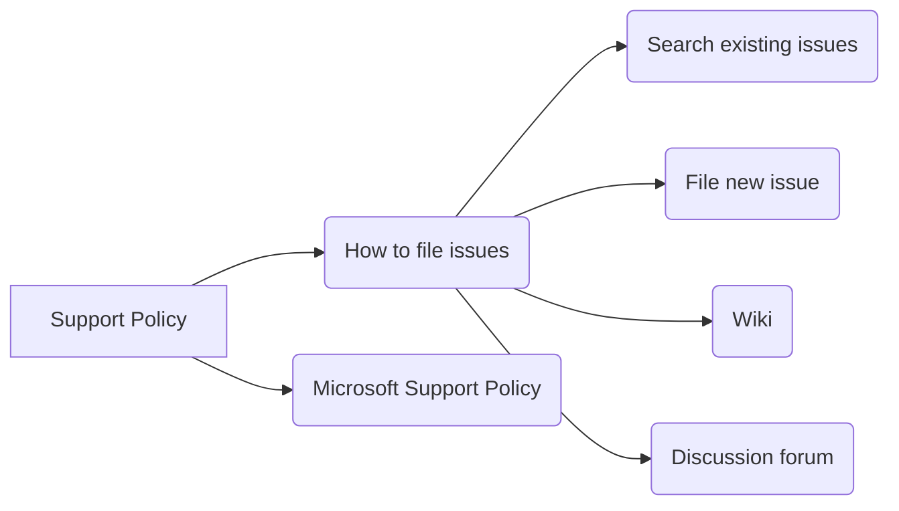

# <input code>

```
# Support

## How to file issues and get help  

This project uses GitHub Issues to track bugs and feature requests. Please search the existing 
issues before filing new issues to avoid duplicates.  For new issues, file your bug or 
feature request as a new Issue.

For help and questions about using this project, please consult our Wiki or post on our
Discussion forum, both right here on GitHub.

## Microsoft Support Policy  

Support for TinyTroupe is limited to the resources listed above.
```

# <algorithm>

Этот код представляет собой текстовый документ, описывающий политику поддержки проекта TinyTroupe.  Блок-схема в данном случае не применима, так как код не содержит алгоритма в виде последовательности действий.  Данные не перемещаются между функциями или классами.

# <mermaid>



# <explanation>

Этот документ (`.md`) представляет собой часть документации проекта `TinyTroupe`. Он описывает, как пользователи могут получить помощь или сообщить об ошибках.

* **Импорты:**  Здесь нет импортов, так как это текстовый документ, а не фрагмент кода на языке программирования.

* **Классы:**  Отсутствуют классы.

* **Функции:**  Нет функций.

* **Переменные:**  Нет переменных.

* **Описание:**
    * Раздел "How to file issues and get help" предоставляет пользователям инструкции по тому, как сообщать об ошибках и задавать вопросы, используя систему GitHub Issues и форум.
    * Раздел "Microsoft Support Policy" сообщает о том, что поддержка проекта `TinyTroupe` ограничена указанными ресурсами.

* **Возможные ошибки/улучшения:**
    * Документация могла бы быть более подробной, с примерами и конкретными инструкциями.
    * Возможно, нужно добавить ссылку на репозиторий GitHub, wiki и форум.
    * Было бы полезно уточнить, какие типы проблем рассматриваются, а какие — нет.
    * Возможно, стоит добавить ссылку на документацию по использованию.

* **Взаимосвязь с другими частями проекта:**
    Этот документ напрямую связан с проектом `TinyTroupe`, предоставляя информацию о том, как получить поддержку, и как сообщать об ошибках и пожеланиях.  Для более полного понимания  необходима информация о структуре проекта (файлы, папки, классы, функции) и, возможно, сам исходный код приложения.


**Важно**:  Для анализа кода в формате `.md` (или текстовом формате), в котором нет программного кода в привычном смысле,  необходимо  использовать подход, ориентированный на понимание контекста и роли документа в проекте.  Отсутствие импортов, классов или функций — это нормальное явление для таких документов.