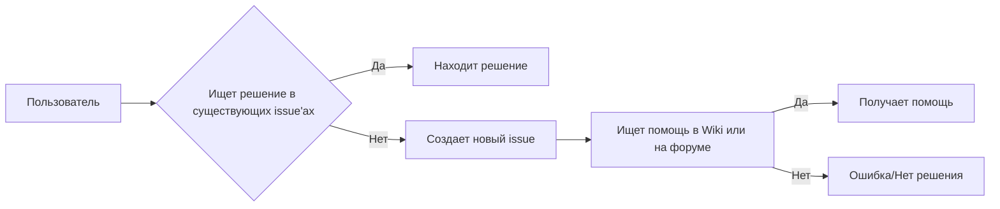

```MD
# Анализ кода из файла SUPPORT.md

**1. <input code>**

```
# Support

## How to file issues and get help  

This project uses GitHub Issues to track bugs and feature requests. Please search the existing 
issues before filing new issues to avoid duplicates.  For new issues, file your bug or 
feature request as a new Issue.

For help and questions about using this project, please consult our Wiki or post on our
Discussion forum, both right here on GitHub.

## Microsoft Support Policy  

Support for TinyTroupe is limited to the resources listed above.
```

**2. <algorithm>**

Этот код не содержит алгоритма в привычном понимании.  Он представляет собой текстовое описание процесса получения поддержки и помощи по проекту TinyTroupe. Алгоритм здесь описывается поведением пользователя (пользователь ищет решение, подает заявку, ищет информацию на Wiki или форуме).

* **Поиск решения:** Пользователь просматривает существующие issue'ы.
* **Создание новой задачи:** Если решение не найдено, пользователь создает новый issue для отслеживания бага или запроса новой функции.
* **Использование Wiki и форума:** Если нужна помощь, пользователь консультируется с Wiki или форумом GitHub.

**Пример:** Пользователь сталкивается с ошибкой.  Он ищет решение в существующих issue'ах. Решения не найдено. Тогда он создает новый issue с описанием ошибки.  Если проблема не решена, он обращается к Wiki или форуму за помощью.

**3. <mermaid>**



**4. <explanation>**

Этот файл `SUPPORT.md`  является частью документации проекта `TinyTroupe`. Он описывает политику поддержки проекта и инструкцию для пользователей по решению проблем.  

* **Импорты:** Нет импортов, так как это текстовый файл, а не программный код.
* **Классы:** Нет классов.
* **Функции:** Нет функций.
* **Переменные:** Нет переменных.
* **Возможные ошибки или области для улучшений:**

    * Не хватает ссылок на конкретные Wiki страницы и форумы, на которых нужно искать решение.  
    * Отсутствие конкретики в  описании процесса подачи issue — например, какие поля необходимо заполнить или какой формат использовать.


**Цепочка взаимосвязей:**

Файл `SUPPORT.md` напрямую связан с проектом `TinyTroupe` и всеми его пользователями, предоставляя инструкции по получению поддержки. Он находится в каталоге `hypotez/src/ai/tiny_troupe/TinyTroupe/`, т.е. является частью документации проекта.  Связь с другими частями проекта, скорее всего, косвенная — через GitHub репозиторий, где размещена эта документация.