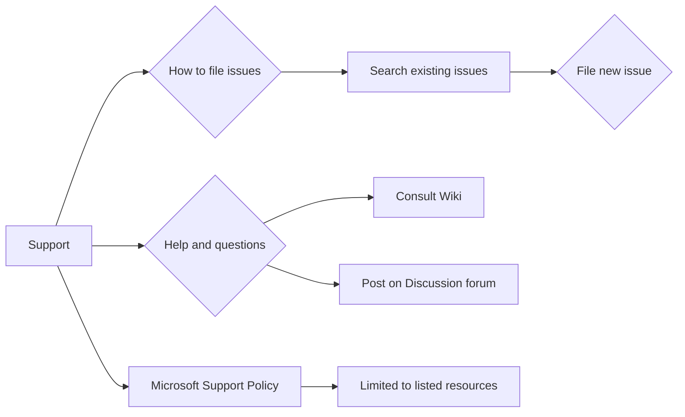

```MD
# Анализ файла SUPPORT.md

## <input code>

```
# Support

## How to file issues and get help  

This project uses GitHub Issues to track bugs and feature requests. Please search the existing 
issues before filing new issues to avoid duplicates.  For new issues, file your bug or 
feature request as a new Issue.

For help and questions about using this project, please consult our Wiki or post on our
Discussion forum, both right here on GitHub.

## Microsoft Support Policy  

Support for TinyTroupe is limited to the resources listed above.
```

## <algorithm>

Этот код представляет собой текстовый документ (README или файл справки), описывающий процесс получения поддержки для проекта TinyTroupe.  Блок-схема для этого случая не применима, так как нет алгоритма в традиционном понимании.  Данные (информация) не перемещаются между функциями или классами, а просто передаются в виде текста.


## <mermaid>



## <explanation>

**Импорты:**  Нет импортов, так как это текстовый файл, а не фрагмент кода программы.

**Классы:** Нет классов.

**Функции:** Нет функций.

**Переменные:** Нет переменных.

**Подробное объяснение:**

Файл `SUPPORT.md` описывает, как пользователи могут получить помощь и поддержку проекта `TinyTroupe`. Он содержит следующие разделы:

* **How to file issues and get help:**  Описание процесса подачи отчетов об ошибках и запросов на новые функции через GitHub Issues.  Также указаны ресурсы для получения помощи (Wiki и форум).
* **Microsoft Support Policy:**  Подтверждение политики ограниченного объема поддержки, доступной только через указанные выше ресурсы (GitHub Issues, Wiki и форум).

**Цепочка взаимосвязей с другими частями проекта:**

Этот файл является частью документации проекта `TinyTroupe`.  Его содержание предполагает, что существует проект на GitHub (GitHub Issues, Wiki, Discussion forum),  что и позволяет взаимодействовать с  пользователями.  Если  файл `SUPPORT.md` находится в каталоге `src/ai/tiny_troupe/TinyTroupe`, то он является частью документации для этого проекта.

**Возможные ошибки или области для улучшений:**

* **Недостаточно подробное описание:**  Можно было бы добавить более подробные инструкции по оформлению отчетов об ошибках.
* **Связь с проектом:**  Необходимо убедиться, что ссылки на Wiki и форум актуальны.  Снизить вероятность ошибки можно, например, добавив префикс `https://github.com/` к именам.


В целом, файл `SUPPORT.md` служит полезной инструкцией для пользователей, чтобы они знали, как взаимодействовать с проектом.