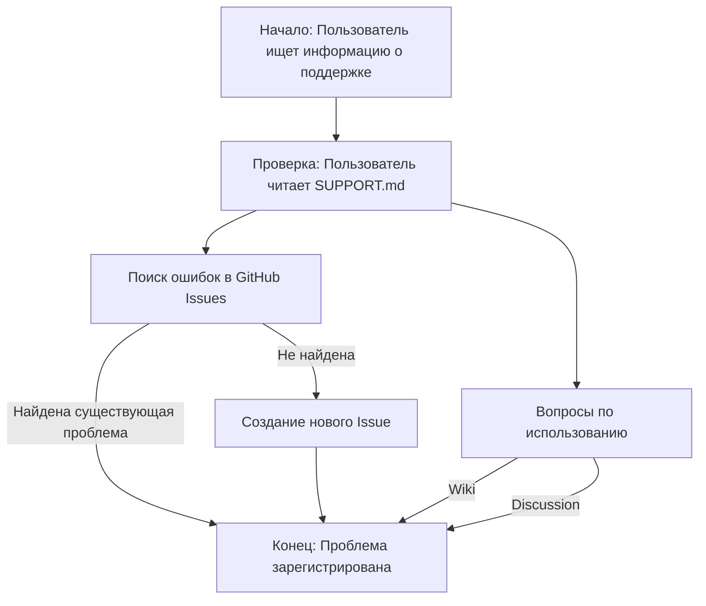

## Анализ файла `SUPPORT.md`

### 1. <алгоритм>

Данный файл `SUPPORT.md` не содержит исполняемого кода, а является текстовым файлом в формате Markdown, описывающим правила и ресурсы поддержки проекта. Его "алгоритм" можно описать следующим образом:

1. **Начало:** Пользователь ищет информацию о поддержке проекта.
2. **Проверка:** Пользователь читает текст в файле `SUPPORT.md`.
3. **Решение:** 
    * **Поиск ошибок:** Пользователь должен сначала поискать существующие баги в GitHub Issues.
    * **Создание ошибки:** Если баг не найден, пользователь создает новое Issue с описанием проблемы.
    * **Вопросы:** Если у пользователя возник вопрос, он должен обратиться к Wiki или на форум Discussion.
4. **Конец:** Пользователь получает помощь или сообщает об ошибке.

### 2. <mermaid>

**Объяснение `mermaid`:**

*   **`Start`:** Начальная точка процесса, когда пользователь ищет информацию о поддержке.
*   **`Check`:** Пользователь изучает файл `SUPPORT.md`, чтобы узнать, как получить поддержку.
*   **`Search`:** Пользователь ищет существующие Issues в GitHub, чтобы избежать дублирования.
*   **`CreateIssue`:** Пользователь создает новое Issue, если проблема не была найдена.
*  **`Questions`**: Пользователь ищет ответы на вопросы по использованию проекта.
*   **`Wiki`**: Обращение к Wiki для получения информации.
*   **`Discussion`**: Обращение к форуму Discussion для получения помощи.
*   **`End`:** Конечная точка процесса, когда пользователь получил поддержку или сообщил об ошибке.
*   Стрелки показывают поток действий пользователя.

### 3. <объяснение>

**Объяснение:**

Файл `SUPPORT.md` - это документ, предназначенный для помощи пользователям проекта TinyTroupe. Он предоставляет информацию о том, как правильно сообщать о проблемах (багах) и как получить помощь по использованию проекта.

**Импорты:**

В данном файле нет импортов, так как это текстовый файл.

**Классы:**

В данном файле нет классов.

**Функции:**

В данном файле нет функций.

**Переменные:**

В данном файле нет переменных.

**Подробное описание:**

*   **Разделы:** Файл разделен на несколько разделов, каждый из которых объясняет различные аспекты поддержки.
    *   "How to file issues and get help" - описывает процесс создания Issues и предоставления информации для получения помощи.
    *   "Microsoft Support Policy" - указывает, что поддержка TinyTroupe ограничена ресурсами, указанными выше (Issues, Wiki, форум Discussion).
*   **GitHub Issues:** Файл подчеркивает использование GitHub Issues для отслеживания ошибок и запросов функций. Пользователи должны сначала проверить существующие Issues, прежде чем создавать новые.
*   **Wiki и Discussion:** Для вопросов по использованию проекта пользователям предлагается обращаться к Wiki или на форум Discussion.
*   **Ограниченная поддержка:** Подчеркивается, что поддержка предоставляется только через перечисленные ресурсы.

**Потенциальные ошибки или области для улучшения:**

*   В настоящее время нет явных ошибок в файле. Он выполняет свою функцию предоставления информации о поддержке.
*  Можно было бы добавить ссылки на конкретные страницы GitHub (например, на страницу Issues, Wiki и Discussions). Это могло бы облегчить процесс поиска информации.
* Можно добавить контактную информацию для ситуаций, требующих более прямой связи, если это уместно.
*   Файл может быть расширен, если будут добавлены новые способы поддержки или информация о поддержке.

**Взаимосвязи с другими частями проекта:**

Файл `SUPPORT.md` не имеет прямой зависимости от кода проекта, однако его предназначение - помочь пользователям взаимодействовать с другими частями проекта, такими как:

*   **GitHub Issues:**  Позволяет пользователям сообщать об ошибках или предлагать улучшения.
*   **Wiki:**  Предоставляет документацию и руководства по использованию проекта.
*   **Discussion forum:**  Место, где пользователи могут задавать вопросы и обмениваться знаниями.

Таким образом, файл `SUPPORT.md` играет важную роль в обеспечении поддержки и обратной связи для проекта TinyTroupe.