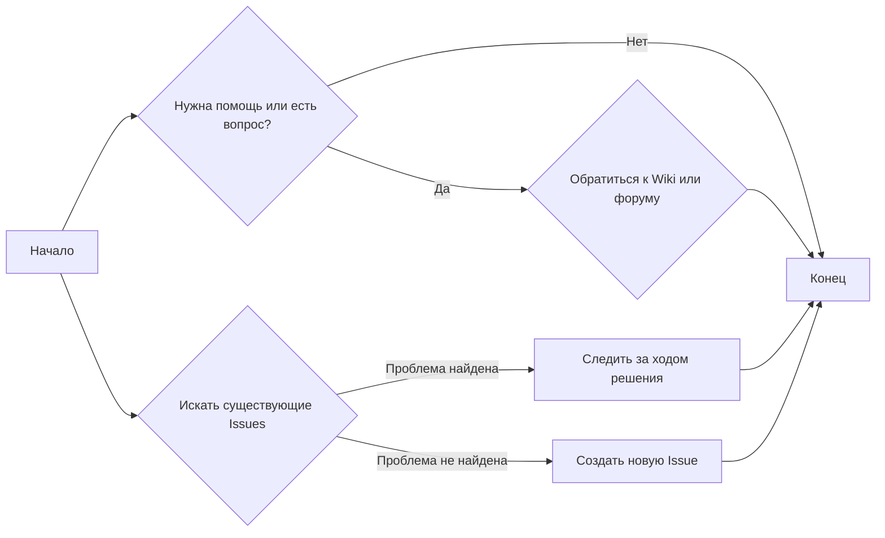

# Анализ кода `SUPPORT.md`

## <алгоритм>

1.  **Начало**: Пользователь хочет сообщить об ошибке, запросить функцию или получить помощь.
2.  **Поиск существующих Issues**: Пользователь ищет в GitHub Issues, чтобы избежать дублирования.
    *   **Пример**: Пользователь ищет по ключевым словам "неправильное отображение интерфейса" в разделе Issues.
3.  **Если проблема найдена**: Пользователь следит за ходом решения существующей issue.
    *   **Пример**: Пользователь подписан на issue о "проблеме с сохранением настроек" и получает уведомления об обновлениях.
4.  **Если проблема не найдена**: Пользователь создает новую issue.
    *   **Пример**: Пользователь создал issue "запрос на поддержку темного режима" с подробным описанием и примерами.
5.  **Для вопросов и помощи**: Пользователь обращается к Wiki или форуму обсуждений.
    *   **Пример**: Пользователь ищет в Wiki раздел "конфигурация пользователей" или задаёт вопрос на форуме "как добавить нового пользователя".
6.  **Поддержка Microsoft**: Пользователь понимает, что поддержка проекта ограничена ресурсами, указанными в пунктах 2-5.
7.  **Конец**: Пользователь получил информацию или поддержку.

## <mermaid>

**Зависимости:**

*   Нет прямых зависимостей, так как это Markdown файл, описывающий процесс поддержки. Однако, подразумевается зависимость от GitHub (Issues, Wiki, Discussion forum)

## <объяснение>

**Общая информация:**

Файл `SUPPORT.md` представляет собой Markdown файл, предназначенный для предоставления инструкций по обращению за поддержкой для проекта TinyTroupe. Он объясняет, как сообщать об ошибках, запрашивать новые функции и получать помощь.

**Разделы и их назначение:**

*   **`# Support`**: Заголовок, указывающий на назначение файла.
*   **`## How to file issues and get help`**: Раздел, описывающий процесс подачи issues и получения помощи.
    *   Объясняет, что GitHub Issues используется для отслеживания ошибок и запросов на функции.
    *   Призывает пользователей искать существующие issues, чтобы избежать дублирования.
    *   Описывает процесс создания новой issue, если не найдено существующего решения.
    *   Указывает на Wiki и форум обсуждений как источники для помощи и ответов на вопросы.
*   **`## Microsoft Support Policy`**: Раздел, описывающий политику поддержки проекта.
    *   Уточняет, что поддержка ограничена ресурсами, перечисленными выше.
*   **Текст**: Текст в файле написан в повелительном тоне и является инструкцией для пользователей проекта.

**Импорты:**

В данном случае импорты отсутствуют, так как это Markdown файл.

**Классы:**

В данном файле отсутствуют классы, так как это Markdown файл.

**Функции:**

В данном файле отсутствуют функции, так как это Markdown файл.

**Переменные:**

В данном файле отсутствуют переменные, так как это Markdown файл.

**Потенциальные ошибки или области для улучшения:**

*   **Недостаток конкретики**: Раздел о политике поддержки Microsoft слишком общий. Можно было бы добавить более конкретные детали о том, на какую поддержку могут рассчитывать пользователи.
*   **Нет шаблонов**: Отсутствуют ссылки на шаблоны для создания issues или запросов. Было бы полезно предоставить пользователям готовые шаблоны, чтобы упростить и стандартизировать процесс.
*   **Ссылки на ресурсы**: Добавить прямые ссылки на разделы Wiki и форум обсуждений.

**Взаимосвязи с другими частями проекта:**

Этот файл напрямую не взаимодействует с кодом проекта. Однако он является важным элементом для поддержания и развития проекта, поскольку предоставляет пользователям инструкции по предоставлению обратной связи и получению помощи. Это, в свою очередь, позволяет разработчикам улучшать проект на основе информации от пользователей.