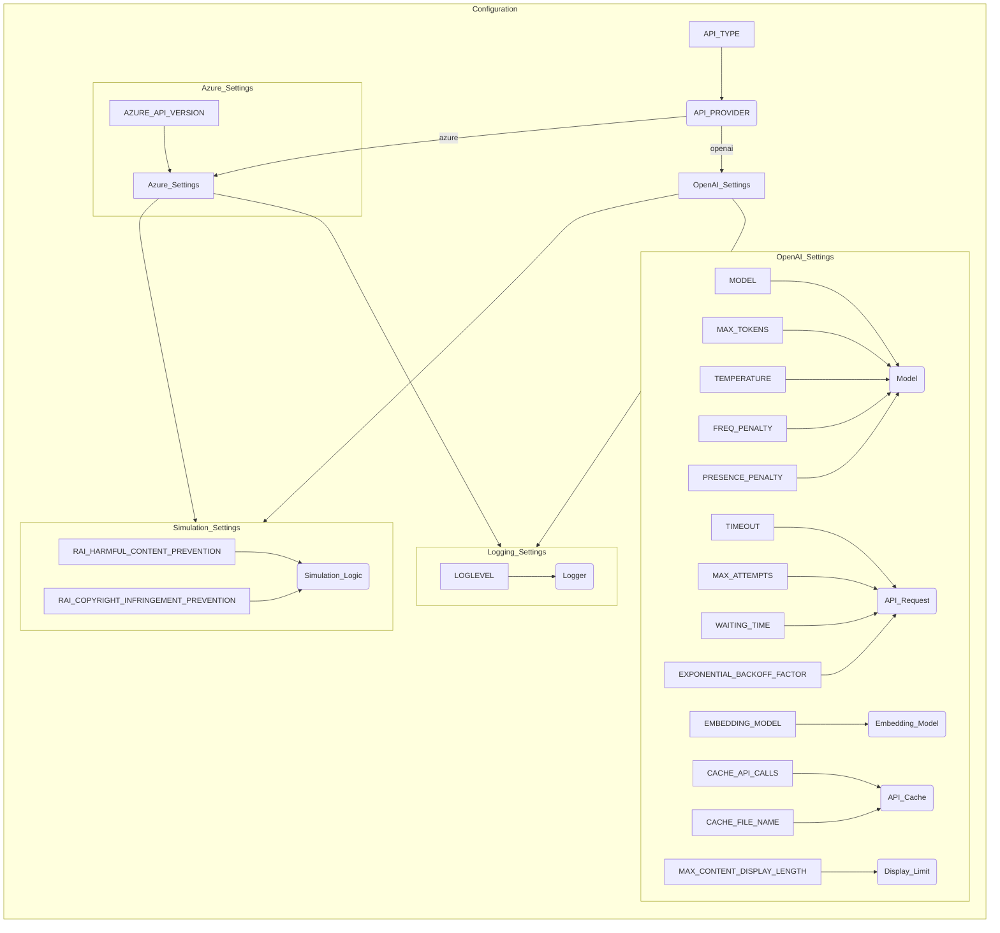

## Анализ конфигурационного файла `config.ini`

### 1. <алгоритм>

**Общая схема работы:**

Файл `config.ini` представляет собой конфигурационный файл, содержащий настройки для различных аспектов работы программы, которая, по всей видимости, использует API OpenAI (или Azure OpenAI), а также имеет логику симуляции и ведения журнала. Конфигурационный файл делится на секции: `OpenAI`, `Simulation` и `Logging`.

**Секция `OpenAI`:**

1.  **Определение типа API:**
    *   Читается параметр `API_TYPE`, определяющий, какой API использовать: `openai` или `azure`.
    *   Пример: `API_TYPE=openai`.
2.  **Настройка для Azure (если используется):**
    *   Если `API_TYPE=azure`, то используется параметр `AZURE_API_VERSION`, задающий версию API Azure.
    *   Пример: `AZURE_API_VERSION=2023-05-15`.
3.  **Параметры модели:**
    *   Читаются параметры модели, такие как `MODEL`, `MAX_TOKENS`, `TEMPERATURE`, `FREQ_PENALTY`, `PRESENCE_PENALTY`, `TIMEOUT`, `MAX_ATTEMPTS`, `WAITING_TIME`, `EXPONENTIAL_BACKOFF_FACTOR`.
    *   Пример: `MODEL=gpt-4o`, `MAX_TOKENS=4000`, `TEMPERATURE=0.3`.
4.  **Параметры эмбеддингов:**
    *   Определяется модель для эмбеддингов `EMBEDDING_MODEL`.
    *   Пример: `EMBEDDING_MODEL=text-embedding-3-small`.
5.  **Настройки кэширования:**
    *   Определяется, нужно ли кэшировать вызовы API через `CACHE_API_CALLS` и задается имя файла для кэша `CACHE_FILE_NAME`.
    *   Пример: `CACHE_API_CALLS=False`, `CACHE_FILE_NAME=openai_api_cache.pickle`.
6.  **Ограничение длины отображаемого контента:**
    *   Устанавливается максимальная длина отображаемого контента через `MAX_CONTENT_DISPLAY_LENGTH`.
    *   Пример: `MAX_CONTENT_DISPLAY_LENGTH=1024`.

**Секция `Simulation`:**

1.  **Настройки предотвращения:**
    *   Определяются настройки для предотвращения вредоносного контента (`RAI_HARMFUL_CONTENT_PREVENTION`) и нарушения авторских прав (`RAI_COPYRIGHT_INFRINGEMENT_PREVENTION`).
    *   Пример: `RAI_HARMFUL_CONTENT_PREVENTION=True`, `RAI_COPYRIGHT_INFRINGEMENT_PREVENTION=True`.

**Секция `Logging`:**

1.  **Настройка уровня логирования:**
    *   Определяется уровень логирования через параметр `LOGLEVEL` (может быть `ERROR`, `WARNING`, `INFO`, `DEBUG`).
    *   Пример: `LOGLEVEL=ERROR`.

### 2. <mermaid>

**Анализ зависимостей:**

*   **`API_TYPE`** определяет, какой провайдер API будет использоваться (`openai` или `azure`), что влияет на дальнейшие настройки.
*   **`OpenAI_Settings`**: Содержит параметры, специфичные для OpenAI API, такие как модель, максимальное количество токенов, температуру, штрафы, тайм-ауты, количество попыток, время ожидания, фактор экспоненциального отката, модель эмбеддингов, кэширование API и ограничение отображаемого контента.
*   **`Azure_Settings`**: Содержит специфические настройки для Azure OpenAI API, такие как версия API.
*   **`Simulation_Settings`**: Содержит настройки для симуляции, включающие предотвращение вредоносного контента и нарушения авторских прав.
*   **`Logging_Settings`**: Содержит настройку уровня логирования для отладки и мониторинга.

### 3. <объяснение>

**Импорты:**

Данный файл `config.ini` не содержит импортов, так как это конфигурационный файл. Однако, его параметры будут использоваться в коде Python (или другом языке), который будет импортировать и использовать библиотеки, специфичные для OpenAI (например, `openai` или `azure-openai`).
*  **`openai`** : Этот пакет используется для взаимодействия с API OpenAI.
*  **`azure-openai`**: Этот пакет используется для взаимодействия с Azure OpenAI API.

**Классы:**

В данном файле нет классов. Он содержит только настройки.

**Функции:**

В данном файле нет функций.

**Переменные:**

*   `API_TYPE`: Строка, определяющая тип API (`openai` или `azure`).
*   `AZURE_API_VERSION`: Строка, определяющая версию Azure API (используется, только если `API_TYPE=azure`).
*   `MODEL`: Строка, определяющая название модели OpenAI (например, `gpt-4o`).
*   `MAX_TOKENS`: Целое число, определяющее максимальное количество токенов в запросе.
*   `TEMPERATURE`: Число с плавающей точкой, определяющее температуру (рандомизацию) генерации текста.
*   `FREQ_PENALTY`: Число с плавающей точкой, определяющее штраф за повторение слов.
*   `PRESENCE_PENALTY`: Число с плавающей точкой, определяющее штраф за использование новых слов.
*   `TIMEOUT`: Целое число, определяющее время ожидания ответа от API (в секундах).
*   `MAX_ATTEMPTS`: Целое число, определяющее максимальное количество попыток повторить запрос к API.
*   `WAITING_TIME`: Целое число, определяющее время ожидания между попытками (в секундах).
*  `EXPONENTIAL_BACKOFF_FACTOR`: Число для увеличения времени ожидания между попытками, если API не отвечает.
*   `EMBEDDING_MODEL`: Строка, определяющая модель для эмбеддингов (например, `text-embedding-3-small`).
*   `CACHE_API_CALLS`: Булево значение, определяющее, нужно ли кэшировать вызовы API.
*   `CACHE_FILE_NAME`: Строка, определяющая имя файла для кэширования API (например, `openai_api_cache.pickle`).
*   `MAX_CONTENT_DISPLAY_LENGTH`: Целое число, определяющее максимальную длину отображаемого контента.
*   `RAI_HARMFUL_CONTENT_PREVENTION`: Булево значение, определяющее, нужно ли предотвращать вредоносный контент.
*   `RAI_COPYRIGHT_INFRINGEMENT_PREVENTION`: Булево значение, определяющее, нужно ли предотвращать нарушение авторских прав.
*   `LOGLEVEL`: Строка, определяющая уровень логирования (`ERROR`, `WARNING`, `INFO`, `DEBUG`).

**Цепочка взаимосвязей с другими частями проекта:**

1.  **Инициализация:** Этот файл `config.ini` загружается при запуске программы, чтобы настроить параметры API, симуляции и логирования.
2.  **API:** Значения из `config.ini` (например, `MODEL`, `API_TYPE`) используются при создании экземпляров классов для работы с OpenAI или Azure API.
3.  **Симуляция:** Настройки, связанные с предотвращением вредоносного контента и нарушений авторских прав, влияют на работу соответствующих модулей симуляции.
4.  **Логирование:** Настройка `LOGLEVEL` определяет уровень детализации журнала, что влияет на то, какие сообщения будут записаны.

**Потенциальные ошибки и области для улучшения:**

1.  **Отсутствие проверок:** Файл `config.ini` не содержит проверок на корректность значений. Необходимо добавить валидацию при чтении параметров из файла.
2.  **Жестко заданные значения:** Значения по умолчанию могут быть недостаточно гибкими. Возможно, следует предоставить возможность переопределения настроек через переменные окружения.
3.  **Отсутствие документации:** Необходимо добавить подробное описание для каждого параметра в файле `config.ini` для лучшего понимания.
4.  **Разные версии API:** Использование Azure API Version жёстко задано. Необходимо либо добавить возможность гибко изменять это значение через конфигурацию, либо убедиться, что приложение всегда работает с заданной версией.

В целом, файл `config.ini` предоставляет гибкий способ настройки различных параметров программы. Однако, необходимо добавить валидацию и гибкость для более надежной работы.