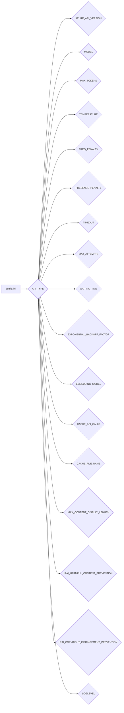

# <input code>

```ini
#
# OpenAI or Azure OpenAI Service
#

# Default options: openai, azure
API_TYPE=openai

# Check Azure's documentation for updates here:
# https://learn.microsoft.com/en-us/azure/ai-services/openai/chatgpt-quickstart?tabs=command-line&pivots=programming-language-python
AZURE_API_VERSION=2023-05-15

#
# Model parameters
#

MODEL=gpt-4o
MAX_TOKENS=4000
TEMPERATURE=0.3
FREQ_PENALTY=0.0
PRESENCE_PENALTY=0.0
TIMEOUT=60
MAX_ATTEMPTS=5
WAITING_TIME=1
EXPONENTIAL_BACKOFF_FACTOR=5

EMBEDDING_MODEL=text-embedding-3-small 

CACHE_API_CALLS=False
CACHE_FILE_NAME=openai_api_cache.pickle

MAX_CONTENT_DISPLAY_LENGTH=1024

[Simulation]
RAI_HARMFUL_CONTENT_PREVENTION=True
RAI_COPYRIGHT_INFRINGEMENT_PREVENTION=True


[Logging]
LOGLEVEL=ERROR
# ERROR
# WARNING
# INFO
# DEBUG
```

# <algorithm>

Этот код представляет собой конфигурационный файл (`.ini`) для приложения, взаимодействующего с API OpenAI или Azure OpenAI.  Алгоритм работы заключается в определении настроек для взаимодействия с API, например, выбора модели, количества токенов, и т.д.  Сам по себе файл не выполняет каких-либо действий, он лишь задаёт параметры.  

Так как это конфигурационный файл, блок-схема будет простым списком параметров:

1. Определение типа API (`API_TYPE`)
2. Определение версии API Azure (`AZURE_API_VERSION`)
3. Настройка параметров модели (`MODEL`, `MAX_TOKENS`, `TEMPERATURE`, `FREQ_PENALTY`, `PRESENCE_PENALTY`, `TIMEOUT`, `MAX_ATTEMPTS`, `WAITING_TIME`, `EXPONENTIAL_BACKOFF_FACTOR`)
4. Настройка параметров встраивания (`EMBEDDING_MODEL`)
5. Включение/отключение кэширования API вызовов (`CACHE_API_CALLS`), имя файла кэша (`CACHE_FILE_NAME`)
6. Максимальная длина отображаемого контента (`MAX_CONTENT_DISPLAY_LENGTH`)
7. Параметры моделирования (`RAI_HARMFUL_CONTENT_PREVENTION`, `RAI_COPYRIGHT_INFRINGEMENT_PREVENTION`)
8. Уровень ведения журнала (`LOGLEVEL`)

Данные не передаются между функциями или классами, так как это конфигурационный файл, а не исполняемый код.  Файл просто определяет значения, которые будут использоваться другими частями приложения.


# <mermaid>



# <explanation>

Этот файл `.ini` является конфигурационным файлом для приложения, которое взаимодействует с API OpenAI. Он определяет параметры, используемые при взаимодействии с API, такие как тип API, модель, количество токенов и другие настройки.

**Импорты:**
Нет импортов, т.к. это конфигурационный файл, не содержащий выполнимый код.  Взаимодействие с OpenAI происходит через вызовы API, но их реализация и параметры взаимодействия определяются в другом месте.


**Классы:**
Нет классов, т.к. это конфигурационный файл.


**Функции:**
Нет функций, т.к. это конфигурационный файл.


**Переменные:**
Все значения в файле `.ini` являются переменными, которые представляют настройки.  Например, `API_TYPE`, `MODEL`, `MAX_TOKENS` и т.д.  Типы переменных – строки (`str`), числа (`int`, `float`) и логические значения (`bool`).


**Возможные ошибки и улучшения:**

* **Документация:** Добавленная документация в файле (комментарии) хороша, но может быть ещё более расширенной.  Описывать каждый параметр и значение должно быть понятнее (например, что означает `TEMPERATURE=0.3` и каковы возможные значения).
* **Валидация данных:**  В идеале, приложение, использующее этот файл, должно проверять корректность значений конфигурации.  Например, убеждаться, что `MAX_TOKENS` не отрицательное число, что `TEMPERATURE` находится в допустимом диапазоне.

**Связь с другими частями проекта:**

Этот файл, вероятно, используется в другом Python-коде проекта, где будут вызовы API OpenAI или Azure OpenAI.  Этот код будет считывать значения из файла `.ini` для настройки своих вызовов API.  Например, приложение может использовать `configparser` для считывания настроек из `config.ini`.


В целом, файл имеет понятный формат и хорошо документирован.