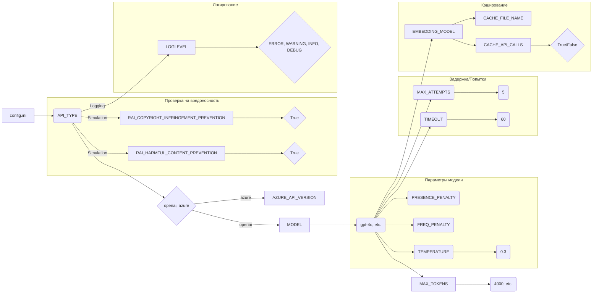

```MD
# Анализ конфигурационного файла config.ini

## <input code>

```ini
#
# OpenAI or Azure OpenAI Service
#

# Default options: openai, azure
API_TYPE=openai

# Check Azure's documentation for updates here:
# https://learn.microsoft.com/en-us/azure/ai-services/openai/chatgpt-quickstart?tabs=command-line&pivots=programming-language-python
AZURE_API_VERSION=2023-05-15


#
# Model parameters
#

MODEL=gpt-4o
MAX_TOKENS=4000
TEMPERATURE=0.3
FREQ_PENALTY=0.0
PRESENCE_PENALTY=0.0
TIMEOUT=60
MAX_ATTEMPTS=5
WAITING_TIME=1
EXPONENTIAL_BACKOFF_FACTOR=5

EMBEDDING_MODEL=text-embedding-3-small 

CACHE_API_CALLS=False
CACHE_FILE_NAME=openai_api_cache.pickle

MAX_CONTENT_DISPLAY_LENGTH=1024

[Simulation]
RAI_HARMFUL_CONTENT_PREVENTION=True
RAI_COPYRIGHT_INFRINGEMENT_PREVENTION=True


[Logging]
LOGLEVEL=ERROR
# ERROR
# WARNING
# INFO
# DEBUG
```

## <algorithm>

Этот файл представляет собой конфигурационный файл (`.ini`) для приложения, вероятно, использующего OpenAI API или Azure OpenAI API.  Блок-схема  не подходит для такого формата.  Конфигурационный файл просто определяет настройки, которые будут использованы приложением.

## <mermaid>



## <explanation>

**1. Импорты:**

В данном случае нет импортов в традиционном понимании. Файл `config.ini` содержит конфигурационные параметры, которые будут загружены и обработаны отдельной частью программы.

**2. Классы:**

Нет определенных классов. Файл содержит набор пар "ключ-значение" (параметры конфигурации).

**3. Функции:**

Нет функций в данном файле. Он не содержит программного кода для выполнения действий.  Этот файл описывает конфигурацию, которая будет использоваться для управления поведением программного кода.


**4. Переменные:**

Все значения, представленные в формате ключ=значение, являются переменными.  Типы переменных вычисляются из контекста.  Например, `API_TYPE` - строка, `MAX_TOKENS` - целое число.

**5. Возможные ошибки и улучшения:**

* **Неявная типизация:**  Тип данных переменных не указан явно. Это может привести к ошибкам при парсинге, если приложение не обрабатывает значения соответствующим образом.  Это некритично для INI файлов.
* **Дополнения:**  Не указан механизм, который считывает и использует эти настройки.  Необходимо предусмотреть обработчик INI-файлов для извлечения данных.

**6. Взаимосвязи с другими частями проекта:**

Этот конфигурационный файл (`config.ini`) будет прочитан и обработан другой частью приложения (вероятно, Python-скриптом). Этот скрипт будет интерпретировать значения из INI файла и устанавливать соответствующие параметры для взаимодействия с OpenAI API или Azure OpenAI API.

**Примеры использования этих параметров:**

* `API_TYPE` определяет, с каким API (OpenAI или Azure) работать.
* `MODEL` указывает, какой модель OpenAI использовать.
* `MAX_TOKENS` ограничивает количество токенов, которые может сгенерировать модель.
* `TIMEOUT` задает максимальное время ожидания ответа от API.
* `LOGLEVEL` определяет уровень подробности сообщений об ошибках.

Этот файл необходим для гибкого управления параметрами приложения без изменения его исходного кода.