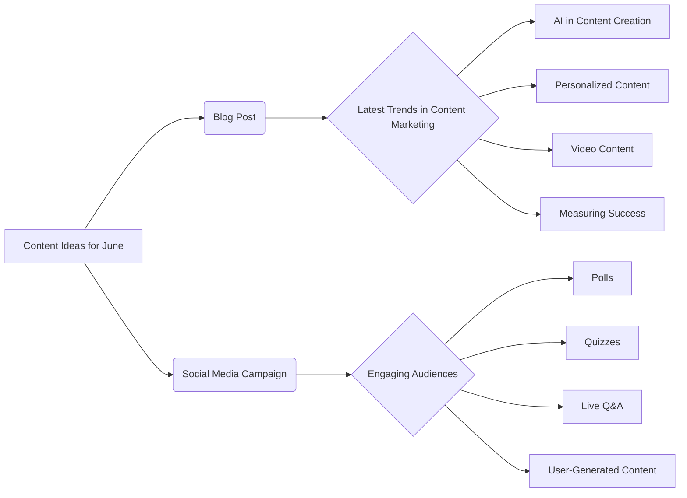

```MD
# Анализ кода

## <input code>

```
## Content Ideas for June

### 1. Blog Post: Latest Trends in Content Marketing

**Objective:** To inform our audience about the latest trends in content marketing and how they can leverage these trends to improve their own strategies.

**Key Points to Cover:**
- The rise of AI in content creation
- The importance of personalized content
- The growing influence of video content
- How to measure the success of content marketing efforts

### 2. Social Media Campaign: Engaging Audiences Through Interactive Content

**Objective:** To increase audience engagement on social media platforms by using interactive content such as polls, quizzes, and live Q&A sessions.

**Key Elements:**
- Create a series of polls related to industry topics
- Develop fun and informative quizzes that relate to our brand
- Host live Q&A sessions with industry experts
- Encourage user-generated content by asking followers to share their experiences and tag our brand
```

## <algorithm>

Этот код не содержит исполняемого кода. Это текстовый документ, описывающий идеи для контент-планирования на июнь. Алгоритм отсутствует.  Данные организованы в виде списка пунктов, описывающих темы и задачи.  Нет последовательности действий, только описание задач.


## <mermaid>



## <explanation>

**Импорты:** Нет импортов, так как код представляет собой текстовый документ, а не код программы.

**Классы:** Нет классов.

**Функции:** Нет функций.

**Переменные:** Нет переменных.

**Возможные ошибки или области для улучшений:**

Документ не содержит ошибок, но может быть улучшен.  Было бы полезно добавить более конкретные детали для каждой идеи, например:
* **Целевая аудитория** для каждой идеи.
* **Ожидаемый результат** (количество просмотров, лайков, комментариев).
* **Бюджет** на реализацию каждой идеи.
* **Планируемые даты** начала и завершения реализации.

**Цепочка взаимосвязей с другими частями проекта:**

Этот документ представляет собой планирование контента.  Его результат будет использоваться в других частях проекта, связанных с маркетингом и коммуникацией. Например, этот документ может повлиять на работу отделов:
* **Контент-маркетинга:**  Определит темы и направления работы.
* **Социальных медиа:** Послужит основой для создания постов и кампаний.
* **Рекламного отдела:** Может быть использован при планировании рекламных кампаний.
* **Отдела аналитики:**  Для отслеживания эффективности контент-кампаний.

В целом, этот документ является важным этапом планирования и должен быть детализирован для эффективной работы.