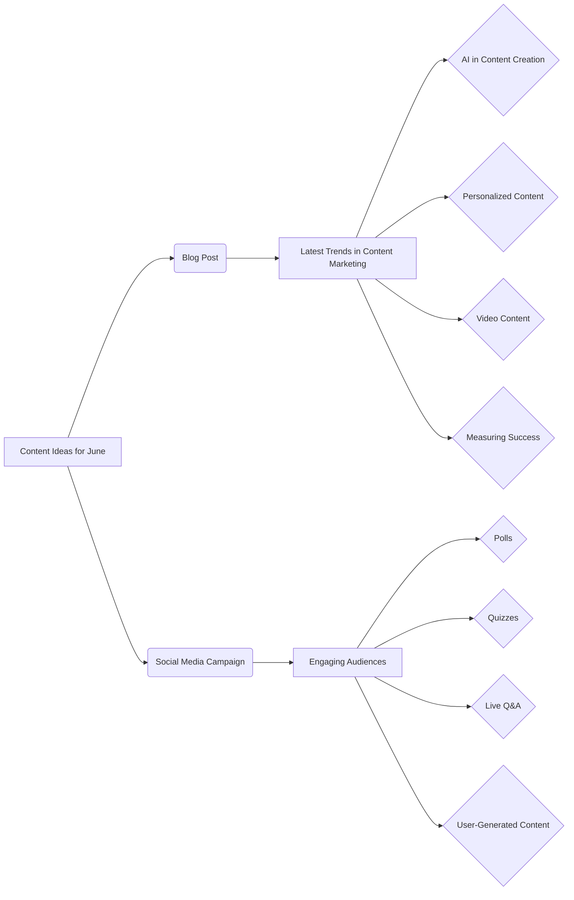

```MD
# Анализ кода

## <input code>

```
## Content Ideas for June

### 1. Blog Post: Latest Trends in Content Marketing

**Objective:** To inform our audience about the latest trends in content marketing and how they can leverage these trends to improve their own strategies.

**Key Points to Cover:**
- The rise of AI in content creation
- The importance of personalized content
- The growing influence of video content
- How to measure the success of content marketing efforts

### 2. Social Media Campaign: Engaging Audiences Through Interactive Content

**Objective:** To increase audience engagement on social media platforms by using interactive content such as polls, quizzes, and live Q&A sessions.

**Key Elements:**
- Create a series of polls related to industry topics
- Develop fun and informative quizzes that relate to our brand
- Host live Q&A sessions with industry experts
- Encourage user-generated content by asking followers to share their experiences and tag our brand
```

## <algorithm>

Этот код не является программным кодом, а представляет собой текстовый документ с идеями для контент-планирования.  Поэтому алгоритма в традиционном понимании нет.  Документ просто структурированно излагает предложения по созданию контента.

## <mermaid>



## <explanation>

Этот код не является программным кодом, а скорее документом с текстовыми инструкциями.  Он описывает идеи для создания контента для следующего месяца (июня).  В нём нет импортов, классов, функций или переменных в программистском смысле.  Вместо этого это список предложений по темам статей для блога и кампаний в социальных сетях.

**Импорты:** Нет импортов, поскольку это не код.

**Классы:** Нет классов.

**Функции:** Нет функций.

**Переменные:** Нет переменных.

**Возможные ошибки/улучшения:**

* Не хватает конкретики:  Документ описывает общие идеи. Для практической реализации нужно разработать более детальный план, включая конкретные темы для блога, дизайн опросов/викторин, график проведения Q&A сессий и т.д.
* Отсутствие стратегии измерения успеха:  Документ упоминает о необходимости измерения результатов, но не конкретизирует, как это будет сделано.  Необходимо определить метрики, которые будут использоваться для оценки успеха каждой инициативы.
* Не указан целевой сегмент аудитории: Полезно определить, на кого нацелена каждая из кампаний, чтобы адаптировать контент к их интересам и потребностям.

**Взаимосвязи с другими частями проекта:**  Этот документ является частью процесса планирования контента.  Его результаты будут влиять на другие аспекты работы, такие как распределение ресурсов, создание графиков и планирование задач.