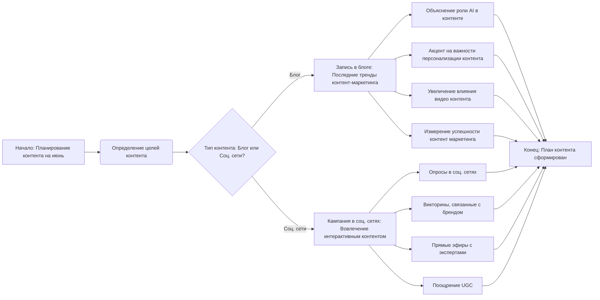

## Анализ кода: Идеи контента на июнь

### 1. <алгоритм>

**Описание:** Этот код представляет собой текстовый документ в формате Markdown, который содержит идеи для контента на июнь. Он разделен на две основные части:

1.  **Запись в блоге:**
    *   **Цель:** Информировать аудиторию о последних тенденциях в контент-маркетинге.
    *   **Ключевые моменты:**
        *   Рост искусственного интеллекта в создании контента (AI).
        *   Важность персонализированного контента.
        *   Растущее влияние видеоконтента.
        *   Как измерить успех усилий по контент-маркетингу.
2.  **Кампания в социальных сетях:**
    *   **Цель:** Повысить вовлеченность аудитории в социальных сетях с помощью интерактивного контента.
    *   **Ключевые элементы:**
        *   Создание серии опросов по отраслевым темам.
        *   Разработка забавных и информативных викторин, связанных с брендом.
        *   Проведение сессий вопросов и ответов в прямом эфире с отраслевыми экспертами.
        *   Поощрение пользовательского контента, предлагая подписчикам делиться своим опытом и отмечать бренд.

**Пример логических блоков:**

1.  **Блок "Запись в блоге":**
    *   *Входные данные:* Текст, описывающий цель и ключевые моменты статьи.
    *   *Процесс:* Анализ текущих тенденций контент-маркетинга и их структурирование.
    *   *Выходные данные:* Структурированное описание темы блога.
2.  **Блок "Кампания в социальных сетях":**
    *   *Входные данные:* Текст, описывающий цель и ключевые элементы кампании.
    *   *Процесс:* Генерация идей для интерактивного контента в соц. сетях.
    *   *Выходные данные:* Описание типов контента для социальных сетей.

### 2. <mermaid>

**Разбор зависимостей:**

Диаграмма представляет собой поток создания контент-плана, начиная с определения целей и разделения на два типа контента: блог и социальные сети.

*   `A[Начало: Планирование контента на июнь]` -  Начальная точка процесса.
*   `B(Определение целей контента)` - Первый шаг, определение целей для контента на месяц.
*   `C{Тип контента: Блог или Соц. сети?}` - Условный блок, который разделяет путь на контент для блога или социальных сетей.
*   `D[Запись в блоге: Последние тренды контент-маркетинга]` - Блок, представляющий контент для блога.
*   `E[Объяснение роли AI в контенте]` - Детализация блога.
*   `F[Акцент на важности персонализации контента]` - Детализация блога.
*  `G[Увеличение влияния видео контента]` - Детализация блога.
* `H[Измерение успешности контент маркетинга]` - Детализация блога.
*   `I[Кампания в соц. сетях: Вовлечение интерактивным контентом]` - Блок, представляющий контент для социальных сетей.
*   `J[Опросы в соц. сетях]` - Детализация кампании.
*   `K[Викторины, связанные с брендом]` - Детализация кампании.
*   `L[Прямые эфиры с экспертами]` - Детализация кампании.
*   `M[Поощрение UGC]` - Детализация кампании.
*   `N[Конец: План контента сформирован]` - Конечная точка процесса.

### 3. <объяснение>

*   **Импорты:** В данном случае, импортов нет, так как это текстовый документ, а не программный код.
*   **Классы:** Нет классов, так как это не код.
*   **Функции:** Нет функций.
*   **Переменные:** Нет переменных в обычном смысле. Однако, заголовки (например, "Blog Post" и "Social Media Campaign") можно рассматривать как именованные разделы.

**Дополнительные пояснения:**

*   **Цепочка взаимосвязей с другими частями проекта:** Этот документ является частью контент-плана проекта. Он может быть использован как входные данные для создания реальных материалов (статей, публикаций в социальных сетях и т.д.). Данные идеи могут быть связаны с другими частями проекта, например, с инструментами аналитики для отслеживания успеха контента или с инструментами для создания и распространения контента.
*   **Потенциальные ошибки или области для улучшения:**
    *   Документ не содержит конкретных дат. Необходимо указать точные даты реализации каждого пункта плана.
    *   Нет информации о целевой аудитории. Следует более точно определить, для кого предназначен этот контент.
    *   Нет четких KPI (ключевых показателей эффективности) для каждой задачи.
    *   Нет конкретных призывов к действию.
    *   Нет ссылок на сторонние ресурсы или примеры.
*   **Общая оценка:** Представленный документ является хорошей отправной точкой для создания контент-плана. Он определяет основные темы и типы контента, но требует дополнительной детализации и проработки. Документ является простым примером плана контента и может быть легко расширен и доработан для конкретных потребностей.