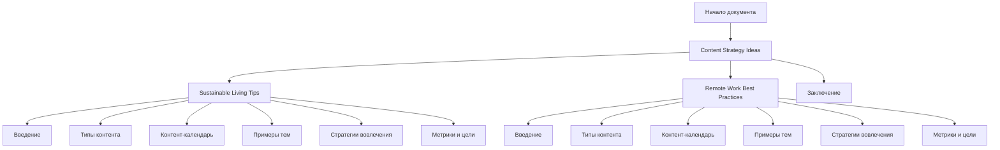

## ИНСТРУКЦИЯ:

Анализируй предоставленный код подробно и объясни его функциональность. Ответ должен включать три раздела:

1. **<алгоритм>**: Опиши рабочий процесс в виде пошаговой блок-схемы, включая примеры для каждого логического блока, и проиллюстрируй поток данных между функциями, классами или методами.
2. **<mermaid>**: Напиши код для диаграммы в формате `mermaid`, проанализируй и объясни все зависимости,
    которые импортируются при создании диаграммы.
    **ВАЖНО!** Убедитесь, что все имена переменных, используемые в диаграмме `mermaid`,
    имеют осмысленные и описательные имена. Имена переменных вроде `A`, `B`, `C`, и т.д., не допускаются!

    **Дополнительно**: Если в коде есть импорт `import header`, добавьте блок `mermaid` flowchart, объясняющий `header.py`:
    ```mermaid
    flowchart TD
        Start --> Header[<code>header.py</code><br> Determine Project Root]

        Header --> import[Import Global Settings: <br><code>from src import gs</code>]
    ```

3. **<объяснение>**: Предоставьте подробные объяснения:
   - **Импорты**: Их назначение и взаимосвязь с другими пакетами `src.`.
   - **Классы**: Их роль, атрибуты, методы и взаимодействие с другими компонентами проекта.
   - **Функции**: Их аргументы, возвращаемые значения, назначение и примеры.
   - **Переменные**: Их типы и использование.
   - Выделите потенциальные ошибки или области для улучшения.

Дополнительно, постройте цепочку взаимосвязей с другими частями проекта (если применимо).

Это обеспечивает всесторонний и структурированный анализ кода.
## Формат ответа: `.md` (markdown)
**КОНЕЦ ИНСТРУКЦИИ**

## <алгоритм>

Представленный код не является исполняемым кодом Python, а представляет собой контентную стратегию в формате Markdown. Следовательно, здесь нет функций, классов или потоков данных, которые можно было бы проиллюстрировать блок-схемой. Однако, можно описать структуру документа и его разделы как алгоритмический процесс:

1.  **Начало**: Документ начинается с названия "Content Strategy Ideas".

2.  **Раздел 1: Sustainable Living Tips**:
    *   **Введение**: Объясняется важность устойчивого образа жизни и цели контента.
    *   **Типы контента**: Определяются форматы контента (статьи, видео, посты в соц. сетях).
    *   **Контент-календарь**: Описывается частота публикаций (еженедельно, раз в две недели, ежедневно).
    *   **Примеры тем**: Приводятся примеры тем для контента (сокращение отходов, эко-товары, устойчивый образ жизни).
    *   **Стратегии вовлечения**: Описываются способы вовлечения аудитории (интерактивный контент, пользовательский контент, коллаборации).
    *   **Метрики и цели**: Перечисляются метрики для отслеживания успеха (трафик сайта, вовлечение в соц. сетях, рост аудитории).

3.  **Раздел 2: Remote Work Best Practices**:
    *   **Введение**: Объясняется рост популярности удаленной работы и цель контента.
    *   **Типы контента**: Определяются форматы контента (блог-посты, вебинары, инфографики).
    *   **Контент-календарь**: Описывается частота публикаций (еженедельно, ежемесячно, раз в две недели).
    *   **Примеры тем**: Приводятся примеры тем для контента (советы по продуктивности, баланс работы и жизни, эффективная коммуникация).
    *   **Стратегии вовлечения**: Описываются способы вовлечения аудитории (интерактивный контент, пользовательский контент, коллаборации).
    *   **Метрики и цели**: Перечисляются метрики для отслеживания успеха (трафик сайта, вовлечение в соц. сетях, рост аудитории).

4.  **Заключение**: Обобщение контентных стратегий и призыв к действию.

## <mermaid>



**Анализ зависимостей:**

*   Диаграмма показывает общую структуру документа контентной стратегии.
*   `ContentStrategy` является верхним уровнем, разделяясь на два основных блока: `SustainableLiving` и `RemoteWork`.
*   Каждый из этих блоков имеет свои подразделы, описывающие структуру контента, стратегии и цели.
*   В конце документа идет раздел `Conclusion`, обобщающий содержание.

В данной диаграмме нету импортируемых модулей.

## <объяснение>

**Общая структура:**

Документ представляет собой план контент-стратегии, разделенный на две основные темы: "Sustainable Living Tips" (Советы по устойчивому образу жизни) и "Remote Work Best Practices" (Лучшие практики удаленной работы). Каждая из этих тем структурирована схожим образом, включая введение, определение типов контента, календарь публикаций, примеры тем, стратегии вовлечения и метрики с целями.

**Раздел 1: Sustainable Living Tips**

*   **Введение**: Объясняет важность устойчивого образа жизни и цель предоставления ценных советов.
*   **Типы контента**:
    *   **Статьи**: Подробные материалы об устойчивом образе жизни.
        *   *Пример:* Статья о преимуществах сокращения отходов.
    *   **Видео**: Практические советы в видеоформате.
        *   *Пример:* Обзор эко-продуктов.
    *   **Посты в социальных сетях**: Короткие, распространяемые советы.
        *   *Пример:* "Используйте многоразовые сумки!"
*   **Контент-календарь**:
    *   **Еженедельные статьи**: 1 статья в неделю.
    *   **Видео раз в две недели**: 1 видео в 2 недели.
    *   **Ежедневные посты в социальных сетях**: 1 пост в день.
*   **Примеры тем**:
    *   **Сокращение отходов**: Как уменьшить пластиковые отходы, компостирование, использование многоразовых продуктов.
    *   **Эко-товары**: Обзоры эко-продуктов для дома, одежды, натуральных чистящих средств.
    *   **Устойчивый образ жизни**: Уменьшение углеродного следа, создание устойчивого дома, растительное питание.
*   **Стратегии вовлечения**:
    *   **Интерактивный контент**: Викторины, опросы.
    *   **Пользовательский контент**: Поощрение пользователей делиться своими советами.
    *   **Коллаборации**: Партнерство с инфлюенсерами.
*   **Метрики и цели**:
    *   **Трафик сайта**: Отслеживание посещений сайта.
    *   **Вовлечение в соц. сетях**: Отслеживание лайков, репостов, комментариев.
    *   **Рост аудитории**: Отслеживание числа подписчиков.
    *   **Цели**: Увеличение трафика на 25% за 6 месяцев, рост аудитории в соц. сетях на 50% за год.

**Раздел 2: Remote Work Best Practices**

*   **Введение**: Объясняет рост популярности удаленной работы и цель предоставления советов по ее организации.
*   **Типы контента**:
    *   **Блог-посты**: Информативные статьи об удаленной работе.
        *   *Пример:* Пост о создании домашнего офиса.
    *   **Вебинары**: Живые и записанные вебинары от экспертов.
        *   *Пример:* Вебинар о тайм-менеджменте.
    *   **Инфографики**: Наглядное представление ключевых советов.
        *   *Пример:* Инфографика о том, как избежать выгорания на удаленной работе.
*   **Контент-календарь**:
    *   **Еженедельные блог-посты**: 1 пост в неделю.
    *   **Ежемесячные вебинары**: 1 вебинар в месяц.
    *   **Инфографики раз в две недели**: 1 инфографика в 2 недели.
*   **Примеры тем**:
    *   **Советы по продуктивности**: Создание продуктивной рабочей обстановки, тайм-менеджмент.
    *   **Баланс работы и жизни**: Как устанавливать границы, важность перерывов.
    *   **Эффективная коммуникация**: Правила виртуальных встреч, письменная коммуникация.
*   **Стратегии вовлечения**:
    *   **Интерактивный контент**: Опросы, сессии вопросов и ответов.
    *   **Пользовательский контент**: Поощрение обмена опытом.
    *   **Коллаборации**: Партнерство с инфлюенсерами.
*   **Метрики и цели**:
    *   **Трафик сайта**: Отслеживание посещений сайта.
    *   **Вовлечение в соц. сетях**: Отслеживание лайков, репостов, комментариев.
    *   **Рост аудитории**: Отслеживание числа подписчиков.
    *   **Цели**: Увеличение трафика на 30% за 6 месяцев, рост аудитории в соц. сетях на 40% за год.

**Заключение**

Документ заканчивается обобщением контентных стратегий и призывом к действию.

**Потенциальные ошибки и области для улучшения:**

*   **Конкретика:** Не хватает конкретики в некоторых местах. Например, "ежедневные посты" могут быть более конкретизированы (например, "3 поста в день в разное время").
*   **Измеримость**:  Метрики следует сделать еще более измеримыми. Например, вместо "увеличение трафика на 25%" можно было бы добавить конкретные цели по количеству посещений или просмотров страниц.
*   **Платформы**: Не указано, на каких именно социальных платформах будет размещаться контент.
*   **Анализ конкурентов**: Отсутствует анализ конкурентов. Было бы полезно изучить контент конкурентов в этих нишах и отстроится от них.
*   **Персонализация:** Необходимо более четко определить целевую аудиторию. Для разных групп пользователей могут потребоваться разные подходы.
*   **SEO:** Нет упоминания о SEO-оптимизации контента.

**Взаимосвязь с другими частями проекта:**

Данный документ является планом действий и не имеет прямых взаимосвязей с кодом или другими компонентами проекта. Однако, эта контент-стратегия может быть интегрирована с веб-сайтом или CRM для отслеживания метрик, а также использоваться контент-менеджерами для организации работы.

В целом, документ является хорошим началом для создания контент-стратегии, но требует доработки для обеспечения более конкретных и измеримых результатов.