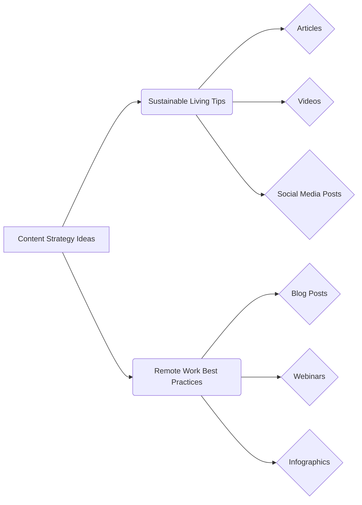

```MD
# Анализ кода: Content Strategy Ideas

**1. <input code>**

```
# Content Strategy Ideas

## 1. Sustainable Living Tips

### Introduction
... (Текст стратегии по устойчивому образу жизни)

## 2. Remote Work Best Practices

### Introduction
... (Текст стратегии по удаленной работе)
```

**2. <algorithm>**

(Здесь алгоритм отсутствует, так как код представляет собой текстовое описание стратегии контент-маркетинга, а не программный код.)

**3. <mermaid>**



**4. <explanation>**

Этот код не содержит программного кода, это текстовое описание двух контент-стратегий: для продвижения устойчивого образа жизни и для продвижения удаленной работы.  В документе описаны цели, типы контента, календарь публикаций, примерные темы, стратегии вовлечения аудитории и метрики для оценки эффективности.

* **Импорты:** Отсутствуют, так как это не программный код.

* **Классы:** Отсутствуют, так как это не программный код.

* **Функции:** Отсутствуют, так как это не программный код.

* **Переменные:** Отсутствуют, так как это не программный код.


**Возможные ошибки или области для улучшений:**

* Отсутствие конкретики. Документ содержит общие рекомендации, но не содержит конкретных дат, каналов, KPI, целевой аудитории.
* Нехватка подробностей.  Недостаточно информации о том, как будет создаваться контент, какие инструменты будут использоваться, как будет происходить продвижение.
* Отсутствие плана по тестированию и оптимизации.  Нет указаний на то, как будет анализироваться эффективность стратегий, какие изменения будут внесены на основе данных.


**Цепочка взаимосвязей с другими частями проекта (если применимо):**

Этот документ является *частью* более крупного проекта по маркетинговой стратегии.  Он описывает конкретные способы продвижения  устойчивого образа жизни и удаленной работы, которые могут быть интегрированы в общий маркетинговый план.  Необходимо указать контекст проекта, чтобы лучше понять место данного документа.  Например, к какому продукту или бренду относится эта стратегия контента?  В чем заключается общая маркетинговая цель?

**Заключение:**

Документ представляет собой качественное описание плана контент-стратегии для двух направлений, но требует большей конкретики и деталей для практической реализации.