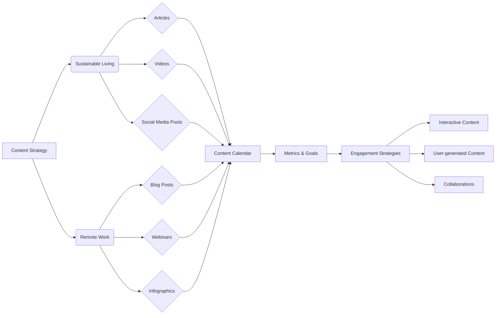

# Анализ кода: Стратегии контент-маркетинга

**1. <input code>**

```
# Content Strategy Ideas

## 1. Sustainable Living Tips

### Introduction
... (остальной текст)

## 2. Remote Work Best Practices

### Introduction
... (остальной текст)

### Conclusion
... (остальной текст)
```

**2. <algorithm>**

Этот код не содержит алгоритма в традиционном понимании, это текст, описывающий стратегии контент-маркетинга для двух тем: устойчивого образа жизни и удаленной работы.  Пошаговая блок-схема не применима.  Данные представляют собой структурированный план действий, а не набор инструкций для выполнения.

**Пример использования данных:**  Маркетинговый отдел использует этот документ, чтобы создать контент-календарь, определить типы контента (статьи, видео, посты в соцсетях) и т.д.  Эти данные не "перемещаются" между функциями/классами, а используются для планирования и создания контента.

**3. <mermaid>**



**Объяснение диаграммы:**

Диаграмма описывает структуру контент-стратегий.  `Content Strategy` - это общий корень, разветвляющийся на две темы:  `Sustainable Living` и `Remote Work`.  Далее, каждая тема разбита на типы контента (`Articles`, `Videos`, `Social Media Posts` для устойчивого образа жизни и `Blog Posts`, `Webinars`, `Infographics` для удаленной работы).  Все типы контента попадают в `Content Calendar` и влияют на `Metrics & Goals`, а также `Engagement Strategies`.  Связи иллюстрируют, как элементы связаны между собой в общем процессе планирования и создания контента.  Взаимосвязи между частями проекта не указаны, так как код представляет собой текстовое описание, а не программный код.


**4. <explanation>**

* **Импорты:** Нет импортов, код представляет собой текстовый документ.
* **Классы:** Нет классов, код описывает стратегии контент-маркетинга.
* **Функции:** Нет функций, код представляет собой описание стратегии, а не программу.
* **Переменные:** Нет переменных, код представляет собой описание контент-плана.
* **Возможные ошибки или области для улучшений:**  Это не код, а план контент-стратегии.  Возможные ошибки или улучшения относятся к качеству описания:
    *  Нехватка конкретики.  Необходимы более детальные указания по конкретным темам, типам контента, частоте публикаций и т.д.
    *  Недостаточная проработка метрик.  Нужно более подробно определить, какие метрики будут использоваться для оценки эффективности стратегии.
    *  Отсутствие связи с другими частями проекта.


**Цепочка взаимосвязей с другими частями проекта:**

Данный документ является частью более крупного проекта контент-маркетинга.  Он предоставляет план действий для создания контента и его продвижения.  Взаимосвязь с другими частями проекта (например, отделы маркетинга, SEO, дизайна) будет происходить через обсуждение, согласование и реализацию стратегии.